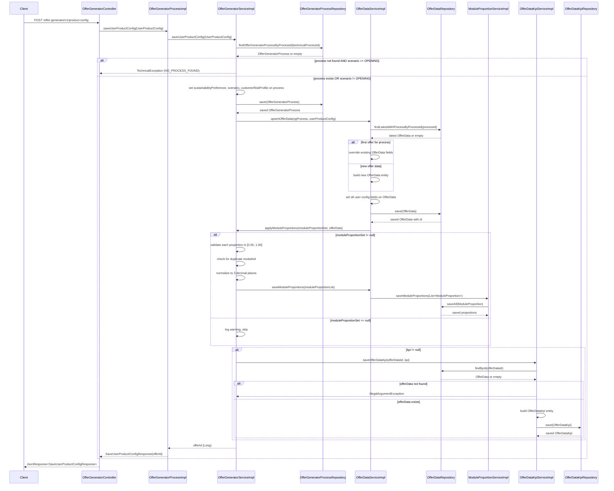

# Chain — OfferGeneratorController · POST /product-config

<!-- scaffold — phase 1 -->

- **Action point** — `OfferGeneratorController` (wpfe-am / ucc-offer-generator)
- **Kind** — rest-controller
- **Source** — `ucc-offer-generator/src/main/java/coba/wtp/wpfe/ucc/offer/generator/controller/OfferGeneratorController.java`
- **Handler** — `saveUserProductConfigData(SaveUserProductConfigRequest)` — `.../OfferGeneratorController.java:64`
- **Trigger** — `POST /offer-generator/v1/product-config`
- **Preconditions** — `@Valid` on request body; no explicit security annotation observed
- **First hop** — `OfferGeneratorProcess.saveUserProductConfig()` (wpfe-am / ucc-offer-generator)

<!-- analysis — phase 2 -->

## Story

As a **retail customer configuring their investment portfolio in the offer generator flow**, I want my product configuration — module proportions, risk profile, sustainability preference and scenario type — to be persisted so that the system can generate an accurate investment offer based on my choices.

- **Given** a valid `technicalProcessId` (which may reference an existing process or be new for non-opening scenarios)
- **When** `POST /offer-generator/v1/product-config` is called with module proportions, product line selection, risk-return profile and optional KPI data
- **Then** the system persists the user's configuration across four database tables — `OFFER_GENERATOR_PROCESS`, `OFFER_DATA`, `MODULE_PROPORTION` and optionally `OFFER_DATA_KPI` — and returns the generated offer ID
- **Unless** the scenario is OPENING but no process exists yet — rejected with a technical exception before any write

## Chain

Branch 1 · primary
  OfferGeneratorController.saveUserProductConfigData()
  → OfferGeneratorProcessImpl.saveUserProductConfig(UserProductConfig)
    → OfferGeneratorServiceImpl.saveUserProductConfig(UserProductConfig)
      → OfferGeneratorProcessRepository.findOfferGeneratorProcessByProcessId(String)
        ⇒ [db]  OFFER_GENERATOR_PROCESS
      → OfferGeneratorProcessRepository.save(OfferGeneratorProcess)
        ⇒ [db]  OFFER_GENERATOR_PROCESS
      → OfferDataServiceImpl.upsertOfferData(OfferGeneratorProcess, UserProductConfig)
        → OfferDataRepository.findLatestWithProcessByProcessId(String)
          ⇒ [db]  OFFER_DATA
        → OfferDataRepository.save(OfferData)
          ⇒ [db]  OFFER_DATA
      → OfferDataServiceImpl.applyModuleProportions(Set<ModelContractProportion>, OfferData)
        → ModuleProportionServiceImpl.saveModuleProportions(List<ModuleProportion>)
          ⇒ [db]  MODULE_PROPORTION
      → OfferDataKpiServiceImpl.saveOfferDataKpi(Long, KeyPerformanceIndicator)
        → OfferDataRepository.findById(Long)
          ⇒ [db]  OFFER_DATA
        → OfferDataKpiRepository.save(OfferDataKpi)
          ⇒ [db]  OFFER_DATA_KPI

- **Terminals reached** — `db` (OFFER_GENERATOR_PROCESS, via OfferGeneratorProcessRepository), `db` (OFFER_DATA, via OfferDataRepository), `db` (MODULE_PROPORTION, via ModuleProportionRepository), `db` (OFFER_DATA_KPI, via OfferDataKpiRepository)

## Diagrams

### Process flow — primary

```mermaid
flowchart LR
  A(["POST /offer-generator/v1/product-config"]) --> B["OfferGeneratorController.saveUserProductConfigData"]
  B --> C["OfferGeneratorProcessImpl.saveUserProductConfig"]
  C --> D["OfferGeneratorServiceImpl.saveUserProductConfig"]
  D --> E{process exists?}
  E -- no, scenario=OPENING --> F(["throw NO_PROCESS_FOUND"])
  E -- yes or scenario!=OPENING --> G["Set sustainabilityPreference, scenario, customerRiskProfile on process"]
  G --> H["Save OfferGeneratorProcess to DB"]
  H --> I["Upsert OfferData"]
  I --> J{first offer for process?}
  J -- yes --> K["Override existing latest OfferData"]
  J -- no --> L["Create new OfferData entity"]
  K --> M["Set all user config fields on OfferData"]
  L --> M
  M --> N["Save OfferData to DB"]
  N --> O{"moduleProportions != null?"}
  O -- yes --> P["Validate each proportion in [0.00, 1.00]"]
  P --> Q["Check for duplicate moduleId"]
  Q --> R["Normalize proportions to 3 decimal places"]
  R --> S["Clear existing ModuleProportions from OfferData"]
  S --> T["Save new ModuleProportion entities to DB"]
  O -- no --> U["Log warning, skip module proportions"]
  T --> V{"kpi != null?"}
  V -- yes --> W["Validate OfferData exists by ID"]
  W --> X["Build OfferDataKpi entity from KPI data"]
  X --> Y["Save OfferDataKpi to DB"]
  V -- no --> Z(["Return offerId in SaveUserProductConfigResponse"])
  U --> Z
  Y --> Z
  F --> Z
```



### Sequence — primary



## Journey

When the **POST /offer-generator/v1/product-config** trigger fires, the request enters at step 1 to persist a customer's product configuration — module proportions, risk-return profile, sustainability preference and scenario type — into the offer generator data store. Once that completes, the flow moves to step 2 because the process entity must exist before any offer data can be written. From there, step 3 takes over to apply the user's full configuration across multiple entities, and so on through every hop until all writes succeed or a rejection is returned.

1. **OfferGeneratorController.saveUserProductConfigData()** (wpfe-am / ucc-offer-generator)

   **Source.** `ucc-offer-generator/src/main/java/coba/wtp/wpfe/ucc/offer/generator/controller/OfferGeneratorController.java:64`

   **Role.** Receives the REST request, validates it with Spring's `@Valid`, converts the inner DTO to a domain record (`UserProductConfig.from()`), and delegates to the process layer. Returns the response wrapped in a `JsonResponse`.

   **Preconditions.** Request body must pass Bean Validation: `technicalProcessId` present, `quotaOffensiveInvestment` between 0.000 and 1.000 (3 decimal places), `investmentVolume` at least 100000, `riskReturnProfile` between 1 and 7, `customerRiskProfile` between 1 and 7, `maximumStockQuota`, `maximumCurrencyQuota` and `neutralRiskQuota` each between 0 and 100.

   **Effect.** Converts `JsonRequest<SaveUserProductConfigRequest>` into a `UserProductConfig` record via the static factory method at line 65-67, then calls the process layer.

   **Downstream.** `OfferGeneratorProcessImpl.saveUserProductConfig(UserProductConfig)` — the single entry point for all persistence logic.

2. **OfferGeneratorProcessImpl.saveUserProductConfig()** (wpfe-am / ucc-offer-generator)

   **Source.** `ucc-offer-generator/src/main/java/coba/wtp/wpfe/ucc/offer/generator/process/impl/OfferGeneratorProcessImpl.java:93`

   **Role.** Thin process-layer pass-through. Delegates to the service layer for business logic, then wraps the returned offer ID in a `SaveUserProductConfigResponse`.

   **Effect.** Returns `ProcessResponse<SaveUserProductConfigResponse>` carrying the generated offer ID.

   **Downstream.** `OfferGeneratorServiceImpl.saveUserProductConfig(UserProductConfig)` — where all persistence and validation actually happens.

3. **OfferGeneratorServiceImpl.saveUserProductConfig()** (wpfe-am / ucc-offer-generator)

   **Source.** `ucc-offer-generator/src/main/java/coba/wtp/wpfe/ucc/offer/generator/service/impl/OfferGeneratorServiceImpl.java:108`

   **Role.** Orchestrates the full save operation across four database tables. Manages process lookup-or-creation, offer data upsert, module proportion application and optional KPI persistence — all within a single `@Transactional` boundary.

   **Steps.**

   - **3.1 Look up or create OfferGeneratorProcess** · `OfferGeneratorServiceImpl.java:110`
     **Role.** Queries the process repository for an existing entity by `technicalProcessId`. If not found and the scenario is OPENING, throws a technical exception (OPENING requires a pre-existing process). If not found but scenario is MODIFICATION or NON_CUSTOMER, creates a new empty process with just the process ID.
     **On failure.** Throws `TechnicalException` with code NO_PROCESS_FOUND when scenario == OPENING and no process exists.
     **Effect.** Ensures an `OfferGeneratorProcess` entity exists before any further writes.

   - **3.2 Set user preferences on process** · `OfferGeneratorServiceImpl.java:122-124`
     **Role.** Persists three fields onto the process entity: `sustainabilityPreference`, `scenario` and `customerRiskProfile`. These are global settings that apply to all offers under this process, not just one.

   - **3.3 Save OfferGeneratorProcess** · `OfferGeneratorServiceImpl.java:125`
     **Role.** Writes (or updates) the process entity via JPA. This is a db write terminal — the first of four.
     **Terminal — db.** OFFER_GENERATOR_PROCESS table, via `OfferGeneratorProcessRepository.save()`.

   - **3.4 Upsert OfferData** · `OfferGeneratorServiceImpl.java:127`
     **Role.** Delegates to `offerDataService.upsertOfferData()` which either overrides the latest offer data for this process (if it is the first offer) or creates a new offer data row. Sets twenty fields from the user config onto the entity, then saves via JPA.
     **Terminal — db.** OFFER_DATA table, via `OfferDataRepository.save()`.

   - **3.5 Apply module proportions** · `OfferGeneratorServiceImpl.java:129`
     **Role.** Delegates to `offerDataService.applyModuleProportions()` which validates each proportion is in [0.00, 1.00], normalizes to three decimal places, checks for duplicate module IDs (throwing on duplicates), clears existing proportions from the offer data, and saves new `ModuleProportion` entities. If the set is null, logs a warning and skips — no error thrown.
     **Terminal — db.** MODULE_PROPORTION table, via `ModuleProportionRepository.saveAll()`.

   - **3.6 Save KPI data (conditional)** · `OfferGeneratorServiceImpl.java:131-132`
     **Role.** If the request carries a non-null `KeyPerformanceIndicator`, validates that the offer data entity exists by ID, builds an `OfferDataKpi` entity from the four KPI fields (`expectedReturn`, `expectedPerformance`, `expectedVolatility`, `sharpeRatio`) and saves it.
     **On failure.** Throws `IllegalArgumentException` if the offer data row does not exist (a programming error — the just-saved entity should always be present).
     **Terminal — db.** OFFER_DATA_KPI table, via `OfferDataKpiRepository.save()`.

   **Downstream.** Returns the `offerId` (Long) to the process layer.

4. **OfferGeneratorProcessImpl.saveUserProductConfig()** (return path)

   **Source.** `ucc-offer-generator/src/main/java/coba/wtp/wpfe/ucc/offer/generator/process/impl/OfferGeneratorProcessImpl.java:96`

   **Role.** Wraps the returned offer ID in a `SaveUserProductConfigResponse(offerId)` and returns it as a `ProcessResponse`.

5. **OfferGeneratorController.saveUserProductConfigData()** (return path)

   **Source.** `ucc-offer-generator/src/main/java/coba/wtp/wpfe/ucc/offer/generator/controller/OfferGeneratorController.java:67`

   **Role.** Wraps the process response in a `JsonResponseBuilder.buildJsonResultResponse()` and returns it as the HTTP response body.

   **Terminal — external.** The JSON response is sent back to the caller over HTTP. No further outbound calls are made.

## Data reached

- **db — OFFER_GENERATOR_PROCESS, via `OfferGeneratorProcessRepository` (wpfe-am / ucc-offer-generator)**
  - Business problem solved — As the **offer generator service**, I need the customer's process entity to persist their global settings (sustainability preference, scenario type and risk profile) so that all offers under this session share a common parent record. Therefore we query `OFFER_GENERATOR_PROCESS` via `OfferGeneratorProcessRepository.findOfferGeneratorProcessByProcessId(processId)` for an existing row; if none exists and the scenario is not OPENING, we create one with just the process ID. Then we persist the updated entity back (`sustainabilityPreference`, `scenario`, `customerRiskProfile`), so that subsequent reads of the process see the latest configuration — citing `OfferGeneratorServiceImpl.java:110-125`.
  - **Query** — `findOfferGeneratorProcessByProcessId(processId)` — read-only lookup; followed by a write via `save()`.
  - **Argument**
    ```json
    {
      "processId": "a3f8b2c1-4d5e-6f7a-8b9c-0d1e2f3a4b5c"
    }
    ```
    `processId` ← request body, from `SaveUserProductConfigRequest.technicalProcessId()`.
  - **Response fields used** — `processId`, `influence`, `sustainabilityPreference`, `scenario`, `customerRiskProfile`, `offerDataList` (from entity `OfferGeneratorProcess.java`).
  - **Write fields** — `sustainabilityPreference`, `scenario`, `customerRiskProfile` are updated on the fetched entity before save.

- **db — OFFER_DATA, via `OfferDataRepository` (wpfe-am / ucc-offer-generator)**
  - Business problem solved — As the **offer generator service**, I need to persist the customer's product configuration details — module quotas, investment volume, product line selection and strategy — so that an offer can be generated from this data. Therefore we query `OFFER_DATA` via `OfferDataRepository.findLatestWithProcessByProcessId(processId)` for the latest row; if it is the first offer we override it, otherwise we create a new row. Then we set twenty fields from the user config and save — citing `OfferDataServiceImpl.java:52-80`.
  - **Query** — `findLatestWithProcessByProcessId(processId)` — JPQL query joining to `offerGeneratorProcess`, ordered by creation date descending, limited to one row.
  - **Argument**
    ```json
    {
      "processId": "a3f8b2c1-4d5e-6f7a-8b9c-0d1e2f3a4b5c"
    }
    ```
    `processId` ← from the process entity's ID.
  - **Response fields used** — `id`, `firstOfferForTheProcess`, `quotaOffensiveInvestment`, `investmentVolume`, `productLine`, `productLineMandateName`, `lowerVolumeApprovalPerson`, `riskReturnProfile`, `productLineStrategyId`, `productLineStrategyName`, `furtherAgreements`, `furtherAgreementsApprovalPerson`, `furtherAgreementsApprovalDate`, `maximumStockQuota`, `maximumCurrencyQuota`, `neutralRiskQuota`, `productLineMandate`.
  - **Write fields** — All twenty fields above are set on the entity before save.

- **db — MODULE_PROPORTION, via `ModuleProportionRepository` (wpfe-am / ucc-offer-generator)**
  - Business problem solved — As the **offer generator service**, I need to persist the customer's chosen module allocation percentages so that the generated offer reflects their exact portfolio composition. Therefore we clear existing proportions from the offer data and save new `ModuleProportion` entities, each carrying a moduleId and its normalized proportion value — citing `OfferDataServiceImpl.java:84-120`.
  - **Query** — `saveAll(List<ModuleProportion>)` — bulk write of one or more rows.
  - **Argument**
    ```json
    [
      { "moduleId": "MOD_001", "proportion": 0.350 },
      { "moduleId": "MOD_002", "proportion": 0.420 }
    ]
    ```
    `moduleId` ← from `ModelContractProportion.moduleId()` in the request; `proportion` ← normalized to three decimal places, validated in [0.00, 1.00].
  - **Validation** — Each proportion is checked for range [0.00, 1.00] and rounded HALF_UP to scale 3. Duplicate moduleIds within the same request throw a `TechnicalException`.

- **db — OFFER_DATA_KPI, via `OfferDataKpiRepository` (wpfe-am / ucc-offer-generator)**
  - Business problem solved — As the **offer generator service**, I need to persist the customer's Key Performance Indicator projections (expected return, performance, volatility and Sharpe ratio) so that they are available for display in the offer overview. Therefore we create an `OfferDataKpi` entity linked one-to-one with the just-saved `OfferData` row and save it — citing `OfferDataKpiServiceImpl.java:40-56`.
  - **Query** — `save(OfferDataKpi)` — single-row insert or update.
  - **Argument**
    ```json
    {
      "offerDataId": 42,
      "expectedReturn": 0.075,
      "expectedPerformance": 12500.00,
      "expectedVolatility": 0.150,
      "sharpeRatio": 0.500
    }
    ```
    `offerDataId` ← the ID returned from the OfferData save; KPI fields ← from `KeyPerformanceIndicator` in the request body (optional).
  - **Conditional** — This write only occurs when `userProductConfig.kpi() != null`. If absent, no KPI row is created.

## Acceptance Criteria

1. **Valid configuration for an existing process** — Given a `technicalProcessId` that references an existing `OFFER_GENERATOR_PROCESS` row and a valid request body (all fields within their declared ranges), when `POST /offer-generator/v1/product-config` is called, then the process entity's sustainabilityPreference, scenario and customerRiskProfile are updated, offer data is upserted with all twenty config fields, module proportions are saved (if non-null) and an offer ID is returned in the response body.
   - Evidence: `OfferGeneratorServiceImpl.java:108-134` — the full method body shows each write path.
   - How to: call the endpoint with a known processId that exists, include module proportions within [0.00, 1.00], and verify from a query log that all four tables receive writes; assert on the response JSON for a non-null `offerId`.

2. **OPENING scenario without existing process is rejected** — Given a request where `scenario` is OPENING but no `OFFER_GENERATOR_PROCESS` row exists for the given `technicalProcessId`, when the endpoint is called, then a `TechnicalException` with code NO_PROCESS_FOUND is thrown before any database write occurs.
   - Evidence: `OfferGeneratorServiceImpl.java:113-114` — the `if (userProductConfig.scenario().equals(ScenarioEnum.OPENING))` branch throws `noProcessFoundException()`.
   - How to: call the endpoint with a new UUID as `technicalProcessId` and `scenario=OPENING`; confirm from logs that NO_PROCESS_FOUND is logged and no INSERT occurs on any table.

3. **MODIFICATION or NON_CUSTOMER scenario creates process if missing** — Given a request where `scenario` is MODIFICATION or NON_CUSTOMER and no existing process row exists, when the endpoint is called, then a new `OFFER_GENERATOR_PROCESS` row is created with only the `processId`, followed by normal offer data persistence.
   - Evidence: `OfferGeneratorServiceImpl.java:115-118` — the `else` branch of the OPENING check calls `OfferGeneratorProcessBuilder.anOfferGeneratorProcess().withProcessId(...).build()`.
   - How to: call with a new processId and `scenario=MODIFICATION`; confirm from query log that an INSERT into OFFER_GENERATOR_PROCESS occurs with only PROCESS_ID populated.

4. **Null module proportions are skipped, not errored** — Given a request where `moduleProportions` is null or absent, when the endpoint is called, then a warning is logged and no MODULE_PROPORTION rows are written; the rest of the flow (process update, offer data upsert) proceeds normally.
   - Evidence: `OfferDataServiceImpl.java:86-90` — the `if (moduleProportionSet == null)` branch logs a warning and returns early without calling `saveModuleProportions`.
   - How to: call with valid config but omit moduleProportions; confirm from query log that OFFER_GENERATOR_PROCESS, OFFER_DATA are written but MODULE_PROPORTION is not.

5. **Duplicate moduleId in proportions throws** — Given a request where two or more `ModelContractProportion` entries share the same `moduleId`, when the endpoint is called, then a `TechnicalException` with message "Duplicate moduleId X found in module proportions" is thrown before any MODULE_PROPORTION rows are written.
   - Evidence: `OfferDataServiceImpl.java:96-102` — `seenModuleIds.add(moduleId)` returns false on duplicate, triggering the exception.
   - How to: call with two proportion entries having the same moduleId; confirm from logs that TechnicalException is thrown and no MODULE_PROPORTION INSERT occurs.

6. **Proportion outside [0.00, 1.00] throws** — Given a request where any `moduleProportion` value is below 0.00 or above 1.00, when the endpoint is called, then a `TechnicalException` with message "Proportion X for moduleId Y is out of range [0.00, 1.00]" is thrown before any MODULE_PROPORTION rows are written.
   - Evidence: `OfferDataServiceImpl.java:132-138` — the `normalizeAndValidate()` method checks `compareTo(BigDecimal.ZERO) < 0 || compareTo(BigDecimal.ONE) > 0`.
   - How to: call with a proportion of 1.50; confirm from logs that TechnicalException is thrown and no MODULE_PROPORTION INSERT occurs.

7. **KPI data persisted only when present** — Given a request where `kpi` is null, when the endpoint is called, then no OFFER_DATA_KPI row is created. Given a non-null kpi, when the endpoint is called, then an OfferDataKpi entity with expectedReturn, expectedPerformance, expectedVolatility and sharpeRatio is saved linked to the offer data.
   - Evidence: `OfferGeneratorServiceImpl.java:131-132` — the `if (userProductConfig.kpi() != null)` guard; `OfferDataKpiServiceImpl.java:40-56` — the full save method building the entity from KPI fields.
   - How to: call once with kpi data and once without; confirm from query log that OFFER_DATA_KPI receives an INSERT only on the first call.

## Business Takeaways

- **What this does for the business** — persists a customer's complete product configuration (module allocations, risk profile, sustainability preference, scenario type and optional KPI projections) across four database tables in a single transactional operation, enabling the system to generate an accurate investment offer based on their choices.
- **Depends on** — JPA persistence layer (four local database tables: OFFER_GENERATOR_PROCESS, OFFER_DATA, MODULE_PROPORTION, OFFER_DATA_KPI); no external API calls.
- **Ingredients** — `technicalProcessId` (request body), module proportions with validated percentages, product line selection, risk-return profile (1–7), customer risk profile (1–7), optional KPI data.
- **Preparation** — validate request fields against declared ranges; look up or create the process entity; set global preferences on it.
- **Dish** — `offerId` in a JSON response body, or a NO_PROCESS_FOUND rejection when OPENING without an existing process.

---

## Cross-cutting rules

- One chain file per trigger — endpoint, schedule, listener, runner or mount — never per class.
- No tables, anywhere. Lists only, at most one sub-bullet level.
- No Open questions section: `UNKNOWN` is written inline, where the missing fact belongs, with a one-line reason. `## Business Takeaways` is the terminal section.
- Every claim about behaviour cites a `file:line`. A claim with no path is not checkable.
- Every acronym is expanded on first use, or marked `UNKNOWN`. `MnC` is **Map and Call**.
- Every class is attributed to its repository, and a shared class to its shared module too:
  `PersonApiClient (wpfe-shared / person)`.
- No host, no `BASE_URL` — path templates and parameters only.
- A discarded response field is named, not summarised away.
- Cross-links use a relative path plus a target-file anchor, never a bare same-document anchor.
  **A heading containing an em dash produces a double hyphen in its anchor** — `## Step 1 — Prepare`
  becomes `#step-1--prepare`, and getting it wrong produces a link that silently goes nowhere.
