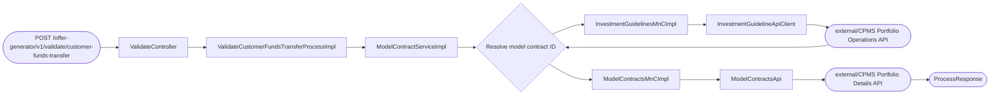
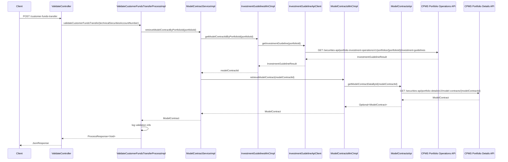

# Chain — ValidateController · POST /customer-funds-transfer

<!-- scaffold — phase 1 -->

- **Action point** — `ValidateController` (wpfe-am / ucc-offer-generator)
- **Kind** — rest-controller
- **Source** — `ucc-offer-generator/src/main/java/coba/wtp/wpfe/ucc/offer/generator/controller/ValidateController.java`
- **Handler** — `validateCustomerFundsTransfer(String)` — `.../ValidateController.java:152`
- **Trigger** — `POST /offer-generator/v1/validate/customer-funds-transfer`
- **Preconditions** — none observed (no @Valid on request body)
- **First hop** — `ValidateCustomerFundsTransferProcess.validateCustomerFundsTransfer()` (wpfe-am / ucc-offer-generator)

<!-- analysis — phase 2 -->

## Story

As a **retail customer initiating a deposit or withdrawal**, I want the system to confirm that my account has an active model contract on file so that the funds transfer can be validated against it.

- **Given** a `technicalSecuritiesAccountNumber` identifying the customer's portfolio
- **When** `POST /offer-generator/v1/validate/customer-funds-transfer` is called with that number
- **Then** the system resolves the associated model contract from CPMS and returns a validation result
- **Unless** no model contract exists for the given account — rejected before any transfer proceeds

## Chain

```text
Branch 1 · primary
  ValidateController
  → ValidateCustomerFundsTransferProcessImpl
  → ModelContractServiceImpl
  → InvestmentGuidelinesMnCImpl
  → InvestmentGuidelineApiClient
  ⇒ [external]  CPMS Portfolio Operations API — investment guidelines lookup

Branch 2 · diverges at ModelContractServiceImpl
  → ModelContractsMnCImpl
  → ModelContractsApi
  ⇒ [external]  CPMS Portfolio Details API — model contract retrieval
```

- **Terminals reached** — `external` (CPMS Portfolio Operations API, via `wpfe-shared / wpfe-shared-cpms`),
  `external` (CPMS Portfolio Details API, via `wpfe-shared / wpfe-shared-cpms`)

## Diagrams

### Process flow — primary



### Sequence — primary



## Journey

When **the frontend calls the funds transfer validation endpoint**, the request enters at **step 1** to handle **a customer deposit or withdrawal validation**. Once that completes, the flow moves to **step 2** because **the process layer orchestrates the model contract lookup**. From there, **step 3** takes over to **resolve the model contract ID from CPMS investment guidelines**, and so on through every hop until a terminal is reached.

1. **ValidateController.validateCustomerFundsTransfer()** (wpfe-am / ucc-offer-generator)

   **Source.** `ucc-offer-generator/src/main/java/coba/wtp/wpfe/ucc/offer/generator/controller/ValidateController.java:152`

   **Role.** Accepts a POST request carrying the customer's technical securities account number and delegates to the validation process. The handler extracts only `technicalSecuritiesAccountNumber` from the request body — no other fields are consumed.

   **Preconditions.** None observed (no `@Valid` annotation on the request body).

   **Effect.** Passes the raw account number string to the process layer; wraps the returned `ProcessResponse<Void>` in a `JsonResponse` for the caller.

   **Downstream.** `ValidateCustomerFundsTransferProcess.validateCustomerFundsTransfer(String)`

2. **ValidateCustomerFundsTransferProcessImpl.validateCustomerFundsTransfer()** (wpfe-am / ucc-offer-generator)

   **Source.** `ucc-offer-generator/src/main/java/coba/wtp/wpfe/ucc/offer/generator/process/impl/ValidateCustomerFundsTransferProcessImpl.java:27`

   **Role.** Orchestrates the funds transfer validation by looking up the customer's model contract from CPMS. Currently a stub — logs the account number and resolved contract ID, then returns an empty `ProcessResponse<Void>` without performing any actual deposit/withdrawal checks.

   **On failure.** If `modelContractService.retrieveModelContractByPortfolioId()` throws (e.g., no contract found), the exception propagates as a technical error — there is no catch block in this method.

   **Effect.** Logs: "Validating customer funds transfer for technical securities account number: {accountNumber}, model contract ID: {contractId}".

   **Downstream.** `ModelContractService.retrieveModelContractByPortfolioId(String)`

3. **ModelContractServiceImpl.retrieveModelContractByPortfolioId()** (wpfe-am / ucc-offer-generator)

   **Source.** `ucc-offer-generator/src/main/java/coba/wtp/wpfe/ucc/offer/generator/service/impl/ModelContractServiceImpl.java:148`

   **Role.** Resolves the model contract associated with a customer's portfolio in two steps. First, it calls CPMS investment guidelines to obtain the `modelContractId` linked to the given portfolio ID (technical securities account number). Then it fetches the full `ModelContract` object by that ID from the CPMS model contracts API.

   **On failure.** If no model contract is found for the resolved `contractId`, a `TechnicalExceptionFactory.createAndLogTechnicalException()` is thrown with message "No Model Contract found for contractId={contractId}". This propagates up as an HTTP error to the caller.

   **Effect.** Returns a fully-populated `ModelContract` object carrying its ID, proportions, properties (product line, risk profile, fee structure, etc.), and offensive assets share.

   **Downstream.** Branches into two external calls:
   - `InvestmentGuidelinesMnC.getModelContractIdByPortfolioId(String)` — resolves the contract ID
   - `ModelContractsMnC.retrieveModelContract(String)` — fetches the full contract details

4. **InvestmentGuidelinesMnCImpl.getModelContractIdByPortfolioId()** (wpfe-shared / wpfe-shared-cpms)

   **Source.** `wpfe-shared/wpfe-shared-cpms/src/main/java/coba/wtp/wpfe/shared/cpms/mnc/impl/InvestmentGuidelinesMnCImpl.java:24`

   **Role.** Maps the portfolio ID to an investment guideline lookup and extracts the model contract ID from the CPMS response. This is the bridge between the local service layer and the external CPMS Portfolio Operations API.

   **Effect.** Returns a `String` — the `modelContractId` extracted from `InvestmentGuidelineResult.getInvestmentGuidelines().getModelContractId()`.

   **Downstream.** `InvestmentGuidelineApiClient.getInvestmentGuideline(String)`

5. **InvestmentGuidelineApiClient.getInvestmentGuideline()** (wpfe-shared / wpfe-shared-cpms)

   **Source.** `wpfe-shared/wpfe-shared-cpms/src/main/java/coba/wtp/wpfe/shared/cpms/api/investmentguidlines/InvestmentGuidelineApiClientImpl.java:35`

   **Role.** Performs the outbound HTTP GET to CPMS Portfolio Operations API. Pseudonymizes the portfolio ID via `PseudonymService` before building the request URL, then executes a REST call and returns the deserialized `InvestmentGuidelineResult`.

   **On failure.** Catches any exception during the REST exchange and wraps it in a `TechnicalExceptionFactory.createAndLogTechnicalException()` with message "Exception during: GET /portfolios/{portfolioId}/investment-guidelines api call". No retry — fatal propagation.

   **Terminal — external**

6. **ModelContractsMnCImpl.retrieveModelContract()** (wpfe-shared / wpfe-shared-cpms)

   **Source.** `wpfe-shared/wpfe-shared-cpms/src/main/java/coba/wtp/wpfe/shared/cpms/mnc/impl/ModelContractsMnCImpl.java:148`

   **Role.** Fetches a single model contract by its ID from CPMS. Calls the API client, then maps the raw `coba.wtp.wpfe.shared.cpms.api.model.v2.portfoliodetails.ModelContract` response into the domain `ModelContract` object — extracting properties (product line strategy, target markets, fee structure, sustainability categories), proportions (module allocations with current values), and offensive assets share.

   **Effect.** Returns an `Optional<ModelContract>` — present when a contract exists for the given ID, empty otherwise. The mapping is extensive: over 30 property definitions are resolved from the CPMS response's flat property list into typed domain fields.

   **Downstream.** `ModelContractsApi.getModelContractDataById(String)`

7. **ModelContractsApi.getModelContractDataById()** (wpfe-shared / wpfe-shared-cpms)

   **Source.** `wpfe-shared/wpfe-shared-cpms/src/main/java/coba/wtp/wpfe/shared/cpms/api/modelcontracts/ModelContractsApiClient.java:63`

   **Role.** Performs the outbound HTTP GET to CPMS Portfolio Details API for a specific model contract. Builds the URL by appending `{modelContractId}` to the base `MODEL_CONTRACTS_PATH` (`/securities-api/portfolio-details/v2/model-contracts`) and executes a REST call.

   **On failure.** Catches any exception during the REST exchange and wraps it in a `TechnicalExceptionFactory.createAndLogTechnicalException()` with message "Exception during: GET /model-contracts/{modelContractId} api call". No retry — fatal propagation.

   **Terminal — external**

## Data reached

- **external — CPMS Portfolio Operations API, via `InvestmentGuidelineApiClient` (wpfe-shared / wpfe-shared-cpms)**
  - Business problem solved — As the **model contract resolution process**, I need the model contract ID associated with a customer's portfolio to be able to look up the full contract details. Therefore we call this API at `GET /securities-api/portfolio-investment-operations/v1/portfolios/{portfolioId}/investment-guidelines` to retrieve the investment guideline data for the given portfolio. Then we extract only `modelContractId` from the response, so we can use it as a key to fetch the complete contract (`InvestmentGuidelinesMnCImpl.java:26`). The portfolio ID is pseudonymized before being sent — `PseudonymService.retrievePseudonym()` transforms the technical securities account number into a CPMS-compatible identifier.

  - **Request path**
    ```json
    {
      "portfolioId": "{pseudonymizedPortfolioNumber}"
    }
    ```
    `portfolioId` — pseudonymized portfolio ID, origin: the request body's `technicalSecuritiesAccountNumber`, transformed by `PseudonymService.retrievePseudonym()` at `InvestmentGuidelineApiClientImpl.java:62`.

  - **Request body** — none (GET request).

  - **Response fields used**
    ```json
    {
      "investmentGuidelines": {
        "modelContractId": "mc-12345-abcde"
      }
    }
    ```
    `investmentGuidelines.modelContractId` → the model contract ID consumed by `ModelContractServiceImpl.retrieveModelContractByPortfolioId()` at line 149. Example value inferred from DTO definition.

  - **Response fields discarded** — all other fields in `InvestmentGuidelineResult`, including any investment strategy allocations, risk parameters, or guideline metadata — only the contract ID is extracted (`InvestmentGuidelinesMnCImpl.java:26`).

- **external — CPMS Portfolio Details API (model-contracts endpoint), via `ModelContractsApi` (wpfe-shared / wpfe-shared-cpms)**
  - Business problem solved — As the **model contract resolution process**, I need the full model contract details for a customer's portfolio to be able to validate that a funds transfer is associated with an active, properly configured investment strategy. Therefore we call this API at `GET /securities-api/portfolio-details/v2/model-contracts/{modelContractId}` to retrieve the complete contract record. Then we map over 30 property definitions from the response into typed domain fields — product line strategy, target markets, fee structure, sustainability categories, module proportions — so that downstream validation logic can inspect every aspect of the customer's investment setup (`ModelContractsMnCImpl.java:148-152`).

  - **Request path**
    ```json
    {
      "modelContractId": "mc-12345-abcde"
    }
    ```
    `modelContractId` — origin: resolved from the CPMS Portfolio Operations API response in step 5 above.

  - **Request body** — none (GET request).

  - **Response fields used**
    ```json
    {
      "modelContractId": "mc-12345-abcde",
      "properties": [
        {"definitionId": "coba-asset-management-product-line-strategy", "value": "001"},
        {"definitionId": "coba-target-markets-minimum-risk-profile", "value": "3"},
        {"definitionId": "coba-profile-costs-fee-model-name", "value": "PROFIL_A"}
      ],
      "proportions": [
        {"moduleId": "mod-001", "currentValue": 45.5},
        {"moduleId": "mod-002", "currentValue": 30.0},
        {"moduleId": "mod-003", "currentValue": 24.5}
      ]
    }
    ```
    `modelContractId` → returned as-is, consumed by caller at `ModelContractsMnCImpl.java:150`. Example value inferred from DTO definition.
    `properties[*].definitionId` and `properties[*].value` → mapped into typed domain fields (product line, target markets, fee structure, etc.) via `mapModelContractProperties()` at `ModelContractsMnCImpl.java:238-310`. Over 30 property definitions are resolved.
    `proportions[*].moduleId` and `proportions[*].currentValue` → mapped into `List<ModelContractProportion>` via `ModelContractProportion::from()` at `ModelContractsMnCImpl.java:234`, representing the customer's module allocation percentages.

  - **Response fields discarded** — all raw API-level metadata not mapped to domain fields, including any CPMS-internal versioning or audit timestamps present in the response payload.

## Acceptance Criteria

1. **Valid account with existing model contract** — Given a `technicalSecuritiesAccountNumber` that maps to an active investment guideline in CPMS, when `POST /offer-generator/v1/validate/customer-funds-transfer` is called, then the system resolves the model contract ID from the Portfolio Operations API, fetches the full contract from the Portfolio Details API, logs the validation info, and returns a successful `ProcessResponse<Void>` with HTTP 200.
   - Evidence: `ValidateCustomerFundsTransferProcessImpl.java:27-35`, `ModelContractServiceImpl.java:148-160`
   - How to: call the endpoint with a valid account number known to have an investment guideline in CPMS; confirm from logs that both external calls succeed and the response body is `{"success": true}`.

2. **No model contract found for account** — Given a `technicalSecuritiesAccountNumber` whose investment guidelines do not reference any model contract (or the portfolio has no guidelines at all), when `POST /offer-generator/v1/validate/customer-funds-transfer` is called, then the request fails with a technical exception and HTTP 500.
   - Evidence: `ModelContractServiceImpl.java:154-158` — throws `TechnicalExceptionFactory.createAndLogTechnicalException()` with message "No Model Contract found for contractId={contractId}" when `modelContractsMnC.retrieveModelContract(contractId)` returns empty Optional.
   - How to: call the endpoint with an account number that has no investment guideline in CPMS, or whose guideline references a non-existent model contract ID; confirm from logs that a TechnicalException is thrown and logged, and the HTTP response is 500.

3. **CPMS Portfolio Operations API outage** — Given `InvestmentGuidelineApiClient.getInvestmentGuideline()` returns a 5xx error, when `POST /offer-generator/v1/validate/customer-funds-transfer` is called, then the request fails with no retry and the model contract lookup is never attempted.
   - Evidence: `InvestmentGuidelineApiClientImpl.java:43-50` — catches any exception during the REST exchange and wraps it in a TechnicalException; no `@Retryable` or surrounding catch block exists at higher layers (`InvestmentGuidelinesMnCImpl.java:24`, `ModelContractServiceImpl.java:149`).
   - How to: stub the CPMS Portfolio Operations API endpoint to return 503 and confirm the validation call surfaces a 5xx with no subsequent call to the Portfolio Details API.

4. **CPMS Portfolio Details API outage** — Given `ModelContractsApi.getModelContractDataById()` returns a 5xx error after the contract ID is successfully resolved, when `POST /offer-generator/v1/validate/customer-funds-transfer` is called, then the request fails with no retry and the validation result is not returned.
   - Evidence: `ModelContractsApiClient.java:73-80` — catches any exception during the REST exchange and wraps it in a TechnicalException; no surrounding catch block exists at higher layers (`ModelContractsMnCImpl.java:148`, `ModelContractServiceImpl.java:152`).
   - How to: stub the CPMS Portfolio Details API endpoint to return 503 for the model-contracts path, confirm the validation call fails with a TechnicalException.

5. **Stub behavior — no actual funds transfer validation** — The current implementation does not perform any deposit/withdrawal amount checks, balance validations, or regulatory compliance checks; it only resolves and logs the model contract.
   - Evidence: `ValidateCustomerFundsTransferProcessImpl.java:28` — comment "TODO: Implement actual validation logic in a follow-up ticket"; method returns `new ProcessResponse<>()` unconditionally after logging.
   - How to: call the endpoint with any valid account number and confirm the response body is an empty success regardless of the account's balance, available funds, or transfer amount. The contract ID resolution is the only substantive behavior.

## Business Takeaways

- **What this does for the business** — confirms that a customer initiating a deposit or withdrawal has an active model contract on file in CPMS, resolving it through two sequential external API calls: first to identify which contract belongs to the portfolio, then to fetch its full configuration. Currently returns success as soon as the contract is found; actual funds transfer validation logic (amount checks, balance verification) is not yet implemented.
- **Depends on** — CPMS Portfolio Operations API (external, investment guidelines lookup for contract ID resolution); CPMS Portfolio Details API (external, model contract retrieval with full property and proportion data)
- **Ingredients** — `technicalSecuritiesAccountNumber` (request body), pseudonymized via `PseudonymService`
- **Preparation** — pseudonymize the account number, resolve investment guidelines to get the contract ID, fetch the complete model contract from CPMS
- **Dish** — `ProcessResponse<Void>` (empty success) or a TechnicalException if no contract is found


