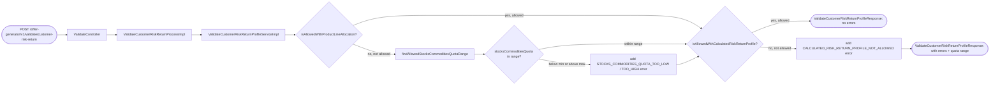
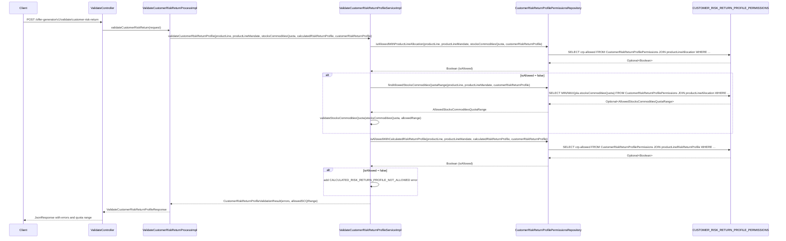

# Chain — ValidateController · POST /customer-risk-return

<!-- scaffold — phase 1 -->

- **Action point** — `ValidateController` (wpfe-am / ucc-offer-generator)
- **Kind** — rest-controller
- **Source** — `ucc-offer-generator/src/main/java/coba/wtp/wpfe/ucc/offer/generator/controller/ValidateController.java`
- **Handler** — `validateCustomerRiskReturn(ValidateCustomerRiskReturnProfileRequest)` — `.../ValidateController.java:117`
- **Trigger** — `POST /offer-generator/v1/validate/customer-risk-return`
- **Preconditions** — `@Valid` on request body; no explicit security annotation observed
- **First hop** — `ValidateCustomerRiskReturnProcess.validateCustomerRiskReturn()` (wpfe-am / ucc-offer-generator)

<!-- analysis — phase 2 -->

## Story

As an **advisor or customer in the offer-generation flow**, I want my risk-return profile and stocks-commodities quota validated against the fixed configuration so that only compliant allocations are accepted.

- **Given** a product line, its optional mandate, a stocks-commodities quota (0–100), a calculated risk-return profile (1–7) and a customer risk-return profile (1–7)
- **When** `POST /offer-generator/v1/validate/customer-risk-return` is called with those values
- **Then** the system checks whether the allocation is permitted for that product line, mandate and quota range, and whether the calculated risk-return profile is allowed for the customer's own profile
- **Unless** no configuration row exists in `CUSTOMER_RISK_RETURN_PROFILE_PERMISSIONS` matching the combination — a technical exception is thrown instead of a validation error

## Chain

```text
Branch 1 · primary
  ValidateController
  → ValidateCustomerRiskReturnProcessImpl
  → ValidateCustomerRiskReturnProfileServiceImpl
    → validateAllocationAndCollectErrors()
      → CustomerRiskReturnProfilePermissionsRepository.isAllowedWithProductLineAllocation()
      ⇒ [db]  CUSTOMER_RISK_RETURN_PROFILE_PERMISSIONS (product line allocation check)
      → CustomerRiskReturnProfilePermissionsRepository.findAllowedStocksCommoditiesQuotaRange()
      ⇒ [db]  CUSTOMER_RISK_RETURN_PROFILE_PERMISSIONS (quota range lookup)
    → validateCalculatedRiskReturnProfileAndCollectErrors()
      → CustomerRiskReturnProfilePermissionsRepository.isAllowedWithCalculatedRiskReturnProfile()
      ⇒ [db]  CUSTOMER_RISK_RETURN_PROFILE_PERMISSIONS (calculated risk profile check)
  ⇒ [none]  response assembled in memory
```

- **Terminals reached** — `db` (`CUSTOMER_RISK_RETURN_PROFILE_PERMISSIONS`, via `CustomerRiskReturnProfilePermissionsRepository`), `none` (response assembly, pure computation)

## Diagrams

### Process flow — primary



### Sequence — primary



## Journey

When **the trigger fires**, the request enters at **[step 1]** to handle a customer risk-return profile validation. Once that completes, the flow moves to **[step 2]** because the controller delegates business logic to the process layer. From there, **[step 3]** takes over to perform the actual validation against fixed configuration, and so on through every hop until a response is assembled.

1. **ValidateController.validateCustomerRiskReturn** (wpfe-am / ucc-offer-generator)

   **Source.** `ucc-offer-generator/src/main/java/coba/wtp/wpfe/ucc/offer/generator/controller/ValidateController.java:107`

   **Role.** Receives the HTTP POST carrying a `ValidateCustomerRiskReturnProfileRequest` wrapped in a `JsonRequest`, extracts the data payload, and delegates to the process layer for validation.

   **Preconditions.** `@Valid` on request body — Spring validates that `stocksCommoditiesQuota` is between 0 and 100, `calculatedRiskReturnProfile` and `customerRiskReturnProfile` are each between 1 and 7. No explicit security annotation observed.

   **Downstream.** `ProcessResponse<ValidateCustomerRiskReturnProfileResponse>` returned as a JSON response via `JsonResponseBuilder.buildJsonResultResponse()`.

2. **ValidateCustomerRiskReturnProcessImpl.validateCustomerRiskReturn** (wpfe-am / ucc-offer-generator)

   **Source.** `ucc-offer-generator/src/main/java/coba/wtp/wpfe/ucc/offer/generator/process/impl/ValidateCustomerRiskReturnProcessImpl.java:35`

   **Role.** Extracts the five fields from the request DTO (`productLine`, `productLineMandate`, `stocksCommoditiesQuota`, `calculatedRiskReturnProfile`, `customerRiskReturnProfile`) and passes them to the service layer. Assembles a `ValidateCustomerRiskReturnProfileResponse` from the returned validation result.

   **Resolved via.** constructor injection of `ValidateCustomerRiskReturnProfileService` (line 24).

3. **ValidateCustomerRiskReturnProfileServiceImpl.validateCustomerRiskReturnProfile** (wpfe-am / ucc-offer-generator)

   **Source.** `ucc-offer-generator/src/main/java/coba/wtp/wpfe/ucc/offer/generator/service/impl/ValidateCustomerRiskReturnProfileServiceImpl.java:45`

   **Role.** Orchestrates two independent validation checks against the fixed configuration in `CUSTOMER_RISK_RETURN_PROFILE_PERMISSIONS`: first, whether the customer's stocks-commodities quota allocation is permitted for the given product line and mandate; second, whether the calculated risk-return profile is allowed relative to the customer's own risk-return profile. Collects any errors into a set and returns both the error set and the allowed quota range.

   **Steps.**

   - **3.1 Validate allocation — check if stocks-commodities quota is permitted** · `ValidateCustomerRiskReturnProfileServiceImpl.java:60`

     **Role.** Calls `validateAllocationAndCollectErrors()` to verify that a configuration row exists in `CUSTOMER_RISK_RETURN_PROFILE_PERMISSIONS` matching the product line, mandate, quota value and customer risk-return profile. If no such row exists, throws a technical exception. If a row exists but marks the allocation as not allowed (`allowed = false`), retrieves the allowed min/max quota range and checks whether the submitted quota falls within it.

     **On failure.** `orElseThrow()` on the repository call — if no configuration row matches the product line, mandate, quota and customer profile combination, a `TechnicalExceptionFactory.createAndLogTechnicalException()` is thrown with a descriptive message. This is a fatal error, not a validation rejection.

   - **3.2 Validate calculated risk-return profile** · `ValidateCustomerRiskReturnProfileServiceImpl.java:87`

     **Role.** Calls `validateCalculatedRiskReturnProfileAndCollectErrors()` to verify that the customer's calculated (aggregated) risk-return profile is permitted relative to their own declared risk-return profile. Queries the permissions table via a join on `productLineRiskReturnProfile` rather than `productLineAllocation`.

     **On failure.** Same pattern — if no configuration row matches, throws a technical exception. If a row exists but marks the combination as not allowed, adds a `CALCULATED_RISK_RETURN_PROFILE_NOT_ALLOWED` error to the set instead of throwing.

4. **ValidateCustomerRiskReturnProfileServiceImpl.validateAllocationAndCollectErrors** (wpfe-am / ucc-offer-generator)

   **Source.** `ucc-offer-generator/src/main/java/coba/wtp/wpfe/ucc/offer/generator/service/impl/ValidateCustomerRiskReturnProfileServiceImpl.java:60`

   **Role.** Performs the allocation check in two sub-steps:

   - **4.1 Check if allocation is permitted** · `ValidateCustomerRiskReturnProfileServiceImpl.java:65`

     **Role.** Calls `permissionsRepository.isAllowedWithProductLineAllocation()` with product line, mandate, quota and customer profile. The repository query joins `CustomerRiskReturnProfilePermissions` to its `productLineAllocation` association and checks for a matching row where the stocks-commodities quota equals the submitted value.

     **Terminal — db** · `CUSTOMER_RISK_RETURN_PROFILE_PERMISSIONS` via `isAllowedWithProductLineAllocation()`

     **On failure.** `orElseThrow()` — no configuration row found means a technical exception is thrown. The error message includes all four lookup parameters, making it actionable for operations.

   - **4.2 If not allowed, retrieve the quota range and validate** · `ValidateCustomerRiskReturnProfileServiceImpl.java:75`

     **Role.** When the allocation check returns `false`, calls `findAllowedStocksCommoditiesQuotaRange()` to get the min/max bounds for this product line, mandate and customer profile. Then calls `validateStocksCommoditiesQuota()` to compare the submitted quota against those bounds.

     **Terminal — db** · `CUSTOMER_RISK_RETURN_PROFILE_PERMISSIONS` via `findAllowedStocksCommoditiesQuotaRange()`

   - **4.3 Compare quota against min/max bounds** · `ValidateCustomerRiskReturnProfileServiceImpl.java:105`

     **Role.** If the allowed range has both min and max values, compares the submitted `stocksCommoditiesQuota` against each. If below min, adds `STOCKS_COMMODITIES_QUOTA_TOO_LOW`. If above max, adds `STOCKS_COMMODITIES_QUOTA_TOO_HIGH`. If either bound is null, logs a warning and returns without adding errors.

5. **ValidateCustomerRiskReturnProfileServiceImpl.validateCalculatedRiskReturnProfileAndCollectErrors** (wpfe-am / ucc-offer-generator)

   **Source.** `ucc-offer-generator/src/main/java/coba/wtp/wpfe/ucc/offer/generator/service/impl/ValidateCustomerRiskReturnProfileServiceImpl.java:87`

   **Role.** Checks whether the customer's calculated risk-return profile is permitted for their declared profile. Queries via a join on `productLineRiskReturnProfile` (not `productLineAllocation`) to find a configuration row matching product line, mandate, calculated profile and customer profile.

   - **5.1 Check if calculated profile is allowed** · `ValidateCustomerRiskReturnProfileServiceImpl.java:92`

     **Role.** Calls `permissionsRepository.isAllowedWithCalculatedRiskReturnProfile()`. The repository query joins to the `productLineRiskReturnProfile` association and checks for a matching row.

     **Terminal — db** · `CUSTOMER_RISK_RETURN_PROFILE_PERMISSIONS` via `isAllowedWithCalculatedRiskReturnProfile()`

     **On failure.** Same technical exception pattern as the allocation check — no configuration row means a fatal error. If a row exists but marks it not allowed, adds `CALCULATED_RISK_RETURN_PROFILE_NOT_ALLOWED` to the errors set.

6. **ValidateCustomerRiskReturnProcessImpl (response assembly)** (wpfe-am / ucc-offer-generator)

   **Source.** `ucc-offer-generator/src/main/java/coba/wtp/wpfe/ucc/offer/generator/process/impl/ValidateCustomerRiskReturnProcessImpl.java:40`

   **Role.** Wraps the `CustomerRiskReturnProfileValidationResult` (errors set + allowed quota range) into a `ValidateCustomerRiskReturnProfileResponse` and returns it as a `ProcessResponse`. Pure computation, no further calls.

7. **ValidateController (response assembly)** (wpfe-am / ucc-offer-generator)

   **Source.** `ucc-offer-generator/src/main/java/coba/wtp/wpfe/ucc/offer/generator/controller/ValidateController.java:109`

   **Role.** Wraps the `ProcessResponse` into a `JsonResponse` via `JsonResponseBuilder.buildJsonResultResponse()` and returns it as JSON. Pure computation.

## Data reached

- **db — CUSTOMER_RISK_RETURN_PROFILE_PERMISSIONS, via `CustomerRiskReturnProfilePermissionsRepository` (wpfe-am / ucc-offer-generator)**
  - Business problem solved — As the **validation service**, I need to know whether a customer's stocks-commodities quota allocation and calculated risk-return profile are permitted for their declared profile under the given product line. Therefore we query `CUSTOMER_RISK_RETURN_PROFILE_PERMISSIONS` via four distinct repository methods to retrieve configuration rows that define what allocations are allowed per product line, mandate and risk profile combination.

  - **Query: isAllowedWithProductLineAllocation**
    ```sql
    SELECT crp.allowed FROM CustomerRiskReturnProfilePermissions crp
      JOIN crp.productLineAllocation pla
      WHERE pla.productLine = :productLine
        AND (pla.productLineMandate IS NULL OR pla.productLineMandate = :productLineMandate)
        AND pla.stocksCommoditiesQuota = :stocksCommoditiesQuota
        AND crp.customerRiskReturnProfile = :customerRiskReturnProfile
    ```
    Arguments:
    - `productLine` ← request body, enum value (e.g. `"GLOBAL_STOCKS"`)
    - `productLineMandate` ← request body, nullable enum or null
    - `stocksCommoditiesQuota` ← request body, BigDecimal 0–100 (e.g. `45.50`)
    - `customerRiskReturnProfile` ← request body, Integer 1–7 (e.g. `3`)

    Response fields used — `crp.allowed` (Boolean). The query returns a single Boolean indicating whether this exact quota value is permitted for the given customer profile.

  - **Query: findAllowedStocksCommoditiesQuotaRange**
    ```sql
    SELECT MIN(pla.stocksCommoditiesQuota) as minStocksCommoditiesQuota,
           MAX(pla.stocksCommoditiesQuota) as maxStocksCommoditiesQuota
      FROM CustomerRiskReturnProfilePermissions crp
        JOIN crp.productLineAllocation pla
      WHERE pla.productLine = :productLine
        AND (pla.productLineMandate IS NULL OR pla.productLineMandate = :productLineMandate)
        AND crp.customerRiskReturnProfile = :customerRiskReturnProfile
        AND crp.allowed = true
    ```
    Arguments:
    - `productLine` ← request body, enum value (e.g. `"GLOBAL_STOCKS"`)
    - `productLineMandate` ← request body, nullable enum or null
    - `customerRiskReturnProfile` ← request body, Integer 1–7 (e.g. `3`)

    Response fields used — `minStocksCommoditiesQuota` and `maxStocksCommoditiesQuota` (BigDecimal). These define the inclusive range of permitted quota values for this product line and customer profile.

  - **Query: isAllowedWithCalculatedRiskReturnProfile**
    ```sql
    SELECT crp.allowed FROM CustomerRiskReturnProfilePermissions crp
      JOIN crp.productLineRiskReturnProfile plr
      WHERE plr.productLine = :productLine
        AND (plr.productLineMandate IS NULL OR plr.productLineMandate = :productLineMandate)
        AND plr.riskReturnProfile = :calculatedRiskReturnProfile
        AND crp.customerRiskReturnProfile = :customerRiskReturnProfile
    ```
    Arguments:
    - `productLine` ← request body, enum value (e.g. `"GLOBAL_STOCKS"`)
    - `productLineMandate` ← request body, nullable enum or null
    - `calculatedRiskReturnProfile` ← request body, Integer 1–7 (e.g. `4`)
    - `customerRiskReturnProfile` ← request body, Integer 1–7 (e.g. `3`)

    Response fields used — `crp.allowed` (Boolean). The query returns a single Boolean indicating whether the calculated profile is permitted for this customer's own declared profile.

## Acceptance Criteria

1. **Allocation permitted — no errors** — Given a request where a configuration row exists in `CUSTOMER_RISK_RETURN_PROFILE_PERMISSIONS` with `allowed = true` matching the product line, mandate, quota value and customer risk-return profile, when the calculated risk-return profile is also allowed (or has no configuration row), then the response contains an empty errors set and the allowed stocks-commodities quota range.
   - Evidence: `ValidateCustomerRiskReturnProfileServiceImpl.java:65` — `isAllowedWithProductLineAllocation()` returns true; `ValidateCustomerRiskReturnProfileServiceImpl.java:92` — `isAllowedWithCalculatedRiskReturnProfile()` returns true
   - How to: insert a configuration row with `allowed = true`, call the endpoint, and assert that `errors` is empty in the response.

2. **Allocation not permitted — quota within range** — Given a request where no matching allocation row has `allowed = true`, but a valid min/max quota range exists for the product line and customer profile, when the submitted `stocksCommoditiesQuota` falls between those bounds (inclusive), then only errors from the calculated risk-return profile check are present in the response.
   - Evidence: `ValidateCustomerRiskReturnProfileServiceImpl.java:75-82` — quota range lookup; `ValidateCustomerRiskReturnProfileServiceImpl.java:105-116` — comparison logic
   - How to: insert a configuration row with `allowed = false`, set min=30 and max=60, submit a quota of 45, and assert that no STOCKS_COMMODITIES_QUOTA error is present.

3. **Allocation not permitted — quota below minimum** — Given the same setup as criterion 2 but with a submitted `stocksCommoditiesQuota` below the configured min, then the response includes a `STOCKS_COMMODITIES_QUOTA_TOO_LOW` error.
   - Evidence: `ValidateCustomerRiskReturnProfileServiceImpl.java:110`
   - How to: set min=30, submit quota=20, and assert that exactly one error of type `STOCKS_COMMODITIES_QUOTA_TOO_LOW` is present in the response errors set.

4. **Allocation not permitted — quota above maximum** — Given the same setup as criterion 2 but with a submitted `stocksCommoditiesQuota` above the configured max, then the response includes a `STOCKS_COMMODITIES_QUOTA_TOO_HIGH` error.
   - Evidence: `ValidateCustomerRiskReturnProfileServiceImpl.java:114`
   - How to: set max=60, submit quota=75, and assert that exactly one error of type `STOCKS_COMMODITIES_QUOTA_TOO_HIGH` is present in the response errors set.

5. **Calculated risk-return profile not allowed** — Given a request where the calculated risk-return profile has no matching configuration row with `allowed = true`, then the response includes a `CALCULATED_RISK_RETURN_PROFILE_NOT_ALLOWED` error regardless of whether the allocation check passed.
   - Evidence: `ValidateCustomerRiskReturnProfileServiceImpl.java:97`
   - How to: insert an allocation row with `allowed = true` but no matching calculated risk-return profile row, call the endpoint, and assert that exactly one error of type `CALCULATED_RISK_RETURN_PROFILE_NOT_ALLOWED` is present.

6. **No configuration found — technical exception** — Given a request where no row in `CUSTOMER_RISK_RETURN_PROFILE_PERMISSIONS` matches the product line, mandate, quota value and customer risk-return profile combination for the allocation check, then a `TechnicalExceptionFactory.createAndLogTechnicalException()` is thrown with all four parameters in the error message.
   - Evidence: `ValidateCustomerRiskReturnProfileServiceImpl.java:67-73`
   - How to: call the endpoint with a product line and quota value that have no matching configuration row, and confirm from logs that a technical exception was logged containing all four parameter values.

7. **No calculated risk-return profile config — technical exception** — Given a request where no row in `CUSTOMER_RISK_RETURN_PROFILE_PERMISSIONS` matches the product line, mandate, calculated risk-return profile and customer risk-return profile combination for the calculated profile check, then a `TechnicalExceptionFactory.createAndLogTechnicalException()` is thrown.
   - Evidence: `ValidateCustomerRiskReturnProfileServiceImpl.java:94-100`
   - How to: call the endpoint with a product line and calculated risk-return profile that have no matching configuration row, and confirm from logs that a technical exception was logged containing all four parameter values.

8. **Null quota range bounds — silent skip** — Given an allocation check where `findAllowedStocksCommoditiesQuotaRange()` returns a range with either min or max as null, then the validation silently skips the quota comparison and no STOCKS_COMMODITIES_QUOTA error is added.
   - Evidence: `ValidateCustomerRiskReturnProfileServiceImpl.java:105-108`
   - How to: insert a configuration row where the MIN/MAX query returns NULL for one bound, call the endpoint with an out-of-range quota, and confirm that no STOCKS_COMMODITIES_QUOTA error is present.

## Business Takeaways

- **What this does for the business** — validates that a customer's stocks-commodities quota allocation and calculated risk-return profile are permitted under the fixed configuration stored in `CUSTOMER_RISK_RETURN_PROFILE_PERMISSIONS`, rejecting non-compliant allocations with specific error codes so the advisor can correct them before proceeding.
- **Depends on** — the `CUSTOMER_RISK_RETURN_PROFILE_PERMISSIONS` table (read-only, configuration-driven)
- **Ingredients** — `productLine` (request), `productLineMandate` (nullable request), `stocksCommoditiesQuota` (0–100, request), `calculatedRiskReturnProfile` (1–7, request), `customerRiskReturnProfile` (1–7, request)
- **Preparation** — query the permissions table for allocation configuration and calculated risk-return profile configuration
- **Dish** — `errors[]` (zero or more of: STOCKS_COMMODITIES_QUOTA_TOO_LOW, STOCKS_COMMODITIES_QUOTA_TOO_HIGH, CALCULATED_RISK_RETURN_PROFILE_NOT_ALLOWED) + `allowedStocksCommoditiesQuotaRange { min, max }`

- **Two independent checks** — the allocation check (quota-based) and the calculated risk-return profile check (profile-based) are performed sequentially; both must pass for a clean response.
- **Configuration-driven** — all validation rules come from `CUSTOMER_RISK_RETURN_PROFILE_PERMISSIONS`; no business logic is hardcoded beyond the comparison operators.
- **Fatal on missing config** — if no configuration row matches the allocation lookup, the system throws a technical exception rather than returning a validation error. This means missing configuration is treated as an operational problem, not a customer data problem.

