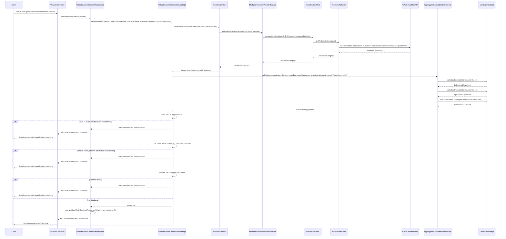

# Chain — ValidateController · POST /model-contract

<!-- scaffold — phase 1 -->

- **Action point** — `ValidateController` (wpfe-am / ucc-offer-generator)
- **Kind** — rest-controller
- **Source** — `ucc-offer-generator/src/main/java/coba/wtp/wpfe/ucc/offer/generator/controller/ValidateController.java`
- **Handler** — `validateModelContract(ValidateModelContractRequest)` — `.../ValidateController.java:103`
- **Trigger** — `POST /offer-generator/v1/validate/model-contract`
- **Preconditions** — none observed (no @Valid on request body)
- **First hop** — `ValidateModelContractProcess.validateModelContract()` (wpfe-am / ucc-offer-generator)

<!-- analysis — phase 2 -->

## Story

As an **advisor assembling a model contract in the offer generator**, I want my proposed module weightings validated against CPMS-defined slider limits and structural rules so that only compliant configurations are persisted.

- **Given** a product line, its mandate (if applicable), an offensive asset share, an entire investment amount, and a set of module proportions
- **When** `POST /offer-generator/v1/validate/model-contract` is called with those parameters
- **Then** the system fetches the full module hierarchy from CPMS, calculates aggregates for every module in the proposal, and checks each against its slider limits and group constraints
- **Unless** a violation is found — the response carries `isValid: false` and a list of specific errors identifying which modules or classes breach their limits

## Chain

Branch 1 · primary
  ValidateController
  → ValidateModelContractProcessImpl
  → ValidateModelContractServiceImpl
  → ModulesService
  → ModulesHierarchyProviderService
  → ModulesDataMnC
  → ModulesApiClient
  ⇒ [external]  CPMS modules data API (wpfe-shared / wpfe-shared-cpms)

Branch 2 · diverges at ValidateModelContractServiceImpl
  → AggregatesCalculationService
  → LimitsService
  ⇒ [none]  pure computation, no outbound calls

- **Terminals reached** — `external` (CPMS modules data API, via `wpfe-shared / wpfe-shared-cpms`), `none` (pure computation in `AggregatesCalculationServiceImpl` and `LimitsServiceImpl`)

## Diagrams

### Process flow — primary

```mermaid
flowchart LR
  A(["POST /offer-generator/v1/validate/model-contract"]) --> B[ValidateController]
  B --> C[ValidateModelContractProcessImpl]
  C --> D[ValidateModelContractServiceImpl]
  D --> E[ModulesService]
  E --> F[ModulesHierarchyProviderService]
  F --> G[ModulesDataMnC]
  G --> H[ModulesApiClient]
  H --> I([external/CPMS modules data API])
  D --> J[AggregatesCalculationServiceImpl]
  J --> K[LimitsServiceImpl]
  K --> L([pure computation / none])
  D --> M{"sum of proportions = 1?"}
  M -- no, alternative investments absent --> N([MODULE_WEIGHTINGS_SUM_NOT_EQUAL_TO_ONE])
  M -- yes or alt present --> O{"alternative investments present?"}
  O -- no --> P[validate offensive share match]
  O -- yes --> Q{"entireInvestmentAmount >= 500,000?"}
  Q -- no --> R([ALTERNATIVE_INVESTMENT_BELOW_MINIMUM])
  Q -- yes --> S[calculate effective offensive asset share]
  P --> T{for each asset category}
  S --> T
  T --> U{"offensive strategy and no alternative investments?"}
  U -- yes --> V{"weighting sum = offensive share?"}
  V -- no --> W([MODULE_WEIGHTINGS_SUM_IN_OFFENSIVE_ASSET_CATEGORIES_NOT_EQUAL_TO_OFFENSIVE_ASSET_SHARE])
  U -- no --> X{for each module class in category}
  V -- yes --> X
  X --> Y{"module relative value in range?"}
  Y -- no --> Z([MODULE_RELATIVE_VALUE_NOT_IN_RANGE])
  Y -- yes --> AA{"alternative investments present and under group limit?"}
  AA -- yes --> AB([MODULE_WEIGHT_UNDER_LIMIT_WITHIN_GROUP_LIMIT])
  AA -- no --> AC{"sum of module relative values <= upper limit?"}
  AC -- no --> AD([MODULE_RELATIVE_VALUES_SUM_MORE_THAN_MODULE_CLASS_UPPER_LIMIT])
  AC -- yes --> AE{"sum >= lower limit?"}
  AE -- no --> AF([MODULE_RELATIVE_VALUES_SUM_LESS_THAN_MODULE_CLASS_LOWER_LIMIT])
  AE -- yes --> AG([ValidateModelContractResponse])
```



### Sequence — primary



## Journey

When the **offer generator UI submits a proposed model contract configuration**, the request enters at step 1 to validate that every module weighting falls within CPMS-defined slider limits and structural constraints. Once the module hierarchy is fetched, the flow moves to step 3 because aggregates must be calculated before any limit check can run.

Below is each step in call order — what it does, why it exists, how it handles failure, and what passes the baton forward.

1. **ValidateController.validateModelContract** (wpfe-am / ucc-offer-generator)

   **Source.** `ucc-offer-generator/src/main/java/coba/wtp/wpfe/ucc/offer/generator/controller/ValidateController.java:103`

   **Role.** Receives the model contract proposal — product line, mandate, offensive asset share, entire investment amount, and a set of module weight proportions — and delegates to the validation process.

   **Preconditions.** None observed; no `@Valid` annotation on the request body.

   **Effect.** Wraps the `ProcessResponse<ValidateModelContractResponse>` into a `JsonResponse` for the HTTP layer.

2. **ValidateModelContractProcessImpl.validateModelContract** (wpfe-am / ucc-offer-generator)

   **Source.** `ucc-offer-generator/src/main/java/coba/wtp/wpfe/ucc/offer/generator/process/impl/ValidateModelContractProcessImpl.java:30`

   **Role.** Converts the request's `Set<ModelContractProportion>` into a `Map<String, BigDecimal>` keyed by module ID or technical ID, then calls the service layer with all five parameters.

   **Downstream.** A `ProcessResponse<ValidateModelContractResponse>` carrying either an empty violations list (valid) or one or more errors.

3. **ValidateModelContractServiceImpl.validateModelContract** (wpfe-am / ucc-offer-generator)

   **Source.** `ucc-offer-generator/src/main/java/coba/wtp/wpfe/ucc/offer/generator/service/impl/ValidateModelContractServiceImpl.java:60`

   **Role.** Orchestrates the full validation: fetches the module hierarchy from CPMS, calculates aggregates for every proposed weighting, then runs a series of limit checks against each module and module class in the proposal.

   **Steps.**

   3.1 **Fetch — modules matching the proposal** · `ModulesServiceImpl.java:82`

       **Source.** `ucc-offer-generator/src/main/java/coba/wtp/wpfe/ucc/offer/generator/service/impl/ModulesServiceImpl.java:82`

       **Role.** Calls `modulesHierarchyProviderService.retrieveModulesHierarchy()` for the given product line and mandate, then filters the returned hierarchy to only those modules whose ID or technical ID appears in the proposal's proportion map. Sets default limits on any module class that lacks them.

       **Effect.** A filtered `List<AssetCategory>` containing only the modules the user proposed, each with its full hierarchy (asset classes → module classes → modules) and guaranteed non-null slider limits.

   3.2 **Calculate — aggregates for every proposed module** · `AggregatesCalculationServiceImpl.java:60`

       **Source.** `ucc-offer-generator/src/main/java/coba/wtp/wpfe/ucc/offer/generator/service/impl/AggregatesCalculationServiceImpl.java:60`

       **Role.** Builds a complete aggregate tree (module → module class → asset class → asset category) with proportions and absolute values derived from the proposal's weightings multiplied by the entire investment amount. Also calculates slider limits for every module using `LimitsService`.

       **Effect.** A `CalculatedAggregates` object carrying per-module, per-class, and per-category aggregates ready for limit comparison.

   3.3 **Check — sum of proportions equals one** · `ValidateModelContractServiceImpl.java:75`

       **Source.** `ucc-offer-generator/src/main/java/coba/wtp/wpfe/ucc/offer/generator/service/impl/ValidateModelContractServiceImpl.java:109`

       **Role.** Sums all proportion values from the proposal map and checks whether the total equals exactly 1.0 (using `compareTo(ONE) == 0`). This rule applies only when no alternative investment modules are present in the hierarchy.

       **On failure.** Returns immediately with a single error: `MODULE_WEIGHTINGS_SUM_NOT_EQUAL_TO_ONE` on module ID `null`.

   3.4 **Check — alternative investment minimum threshold** · `ValidateModelContractServiceImpl.java:82`

       **Source.** `ucc-offer-generator/src/main/java/coba/wtp/wpfe/ucc/offer/generator/service/impl/ValidateModelContractServiceImpl.java:82`

       **Role.** When the hierarchy contains an alternative investment asset category (investment strategy = NOT_APPLICABLE), verifies that the entire investment amount is at least 500,000. This is a hard floor before any further validation proceeds.

       **On failure.** Returns immediately with `ALTERNATIVE_INVESTMENT_BELOW_MINIMUM` on module ID `null`. No other checks run after this rejection.

   3.5 **Calculate — effective offensive asset share** · `ValidateModelContractServiceImpl.java:96`

       **Source.** `ucc-offer-generator/src/main/java/coba/wtp/wpfe/ucc/offer/generator/service/impl/ValidateModelContractServiceImpl.java:96`

       **Role.** When alternative investments are present, scales down the user-provided offensive asset share by multiplying it with the ratio of liquid investment to entire investment amount. This adjusted value is used in step 3.6 for the offensive share match check.

   3.6 **Check — offensive asset category weighting matches offensive share** · `ValidateModelContractServiceImpl.java:102`

       **Source.** `ucc-offer-generator/src/main/java/coba/wtp/wpfe/ucc/offer/generator/service/impl/ValidateModelContractServiceImpl.java:102`

       **Role.** For each asset category whose investment strategy is OFFENSIVE, sums the weightings of all modules in that category and compares against the (possibly adjusted) offensive asset share. The comparison accounts for scale difference: the offensive share is 0–100 while weightings are 0–1, so it divides by 100 before comparing.

       **On failure.** Adds `MODULE_WEIGHTINGS_SUM_IN_OFFENSIVE_ASSET_CATEGORIES_NOT_EQUAL_TO_OFFENSIVE_ASSET_SHARE` for the asset category ID. The loop continues to check other categories but skips further module-class checks for this category (`continue`).

   3.7 **Check — module relative value within slider range** · `ValidateModelContractServiceImpl.java:129`

       **Source.** `ucc-offer-generator/src/main/java/coba/wtp/wpfe/ucc/offer/generator/service/impl/ValidateModelContractServiceImpl.java:129`

       **Role.** For every module aggregate in the proposal, normalizes its proportion of entire investment and compares it against the normalized slider limits (lower and upper) from `SliderLimits`. The normalization uses a fixed scale and rounding mode. If either limit is null, defaults to 0 and 1 respectively.

       **On failure.** Adds `MODULE_RELATIVE_VALUE_NOT_IN_RANGE` for the module ID.

   3.8 **Check — alternative investment group lower limit** · `ValidateModelContractServiceImpl.java:142`

       **Source.** `ucc-offer-generator/src/main/java/coba/wtp/wpfe/ucc/offer/generator/service/impl/ValidateModelContractServiceImpl.java:142`

       **Role.** When alternative investments are present, checks whether any module's relative value falls below its slider lower limit but remains at or above the group lower limit defined in `SliderLimits.groupLowerLimit`. This catches modules that are within their individual range but violate a group constraint.

       **On failure.** Adds `MODULE_WEIGHT_UNDER_LIMIT_WITHIN_GROUP_LIMIT` for the module class ID (not the module ID).

   3.9 **Check — module class sum below upper limit** · `ValidateModelContractServiceImpl.java:157`

       **Source.** `ucc-offer-generator/src/main/java/coba/wtp/wpfe/ucc/offer/generator/service/impl/ValidateModelContractServiceImpl.java:157`

       **Role.** Sums the relative values of all modules within a module class and compares against the normalized upper limit from `ModuleClassAggregateLimits`. If no aggregate exists for the module class, defaults to allowing the sum (returns true).

       **On failure.** Adds `MODULE_RELATIVE_VALUES_SUM_MORE_THAN_MODULE_CLASS_UPPER_LIMIT` for the module class ID.

   3.10 **Check — module class sum above lower limit** · `ValidateModelContractServiceImpl.java:168`

        **Source.** `ucc-offer-generator/src/main/java/coba/wtp/wpfe/ucc/offer/generator/service/impl/ValidateModelContractServiceImpl.java:168`

        **Role.** Sums the relative values of all modules within a module class and compares against the normalized lower limit from `ModuleClassAggregateLimits`. If no aggregate exists for the module class, defaults to allowing the sum (returns true).

        **On failure.** Adds `MODULE_RELATIVE_VALUES_SUM_LESS_THAN_MODULE_CLASS_LOWER_LIMIT` for the module class ID.

4. **ModulesServiceImpl.retrieveModules** (wpfe-am / ucc-offer-generator)

   **Source.** `ucc-offer-generator/src/main/java/coba/wtp/wpfe/ucc/offer/generator/service/impl/ModulesServiceImpl.java:82`

   **Role.** Delegates to the hierarchy provider, then applies a module filter predicate and sets default slider limits on any module class that lacks them. The filter narrows the full CPMS hierarchy to only modules referenced in the proposal.

5. **ModulesHierarchyProviderServiceImpl.retrieveModulesHierarchy** (wpfe-am / ucc-offer-generator)

   **Source.** `ucc-offer-generator/src/main/java/coba/wtp/wpfe/ucc/offer/generator/service/impl/ModulesHierarchyProviderServiceImpl.java:30`

   **Role.** Maps the product line enum to a CPMS string key (e.g., "product-line-exclusive", "product-line-expert-sustainable") and delegates to the MnC. If no product line is given, passes `null` to retrieve all modules.

   **Effect.** A cached result under `cpmsModules`, keyed by product line name and mandate name.

6. **ModulesDataMnCImpl.retrieveModulesHierarchyByProductLine** (wpfe-shared / wpfe-shared-cpms)

   **Source.** `wpfe-shared/wpfe-shared-cpms/src/main/java/coba/wtp/wpfe/shared/cpms/mnc/impl/ModulesDataMnCImpl.java:120`

   **Role.** Builds a `ModulesDataRequest` with the product line property, calls the API client, and maps the flat `ModulesDataResult` into a three-level hierarchy: AssetCategory → AssetClass → ModuleClass → Module. Groups modules by temp module class ID, then by asset class, then assigns them to offensive (stocks/commodities), defensive (bonds/liquidity), or alternative-investments categories.

7. **ModulesApiClient.getModulesData** (wpfe-shared / wpfe-shared-cpms)

   **Source.** `wpfe-shared/wpfe-shared-cpms/src/main/java/coba/wtp/wpfe/shared/cpms/api/modules/ModulesApiClient.java:43`

   **Role.** Sends an HTTP GET to the CPMS modules endpoint with a query parameter encoding the product line filter. Returns `Optional.empty()` on 404, otherwise wraps the response body.

   **On failure.** Non-404 exceptions are wrapped in a `TechnicalException` and propagated up — no retry or fallback.

   **Terminal — external** · CPMS modules data API at `GET /securities-api/portfolio-investment-operations/v1/portfolios/modules?properties={propertyKey}:{propertyValue}`

8. **AggregatesCalculationServiceImpl.calculateAggregates** (wpfe-am / ucc-offer-generator)

   **Source.** `ucc-offer-generator/src/main/java/coba/wtp/wpfe/ucc/offer/generator/service/impl/AggregatesCalculationServiceImpl.java:60`

   **Role.** Initializes aggregate objects for every module, module class, asset class, and asset category in the hierarchy. Calculates each module's proportion of entire investment and absolute value (proportion × investment amount). Then delegates to `LimitsService` to compute slider limits for modules and upper limits for module classes.

9. **LimitsServiceImpl.calculateLowerLimit** / **calculateUpperLimit** (wpfe-am / ucc-offer-generator)

   **Source.** `ucc-offer-generator/src/main/java/coba/wtp/wpfe/ucc/offer/generator/service/impl/LimitsServiceImpl.java:28`

   **Role.** Pure computation. For a module's lower limit, takes the maximum of three candidates: absolute lower limit (converted to proportion by dividing by entire investment amount), percentage-of-liquid-part limit, and percentage-of-asset-category limit. For upper limit, takes the minimum of analogous candidates. If no limits are defined on the module, returns 0 for lower or liquid part proportion for upper.

   **Terminal — none** · pure computation, no outbound calls

10. **ValidateModelContractProcessImpl.validateModelContract (response assembly)**

    **Source.** `ucc-offer-generator/src/main/java/coba/wtp/wpfe/ucc/offer/generator/process/impl/ValidateModelContractProcessImpl.java:36`

    **Role.** Wraps the violations list into a `ValidateModelContractResponse` with `isValid = violations.isEmpty()`, then returns it in a `ProcessResponse`.

    **Terminal — response** · `ValidateModelContractResponse(isValid, violations)` returned to the caller via `JsonResponseBuilder.buildJsonResultResponse()`

## Data reached

- **external — CPMS modules data API, via `ModulesApiClient` (wpfe-shared / wpfe-shared-cpms)**
  - Business problem solved — As the **validation service**, I need the full module hierarchy for a product line to be able to validate proposed weightings against CPMS-defined slider limits and structural rules. Therefore we call this API at `GET /securities-api/portfolio-investment-operations/v1/portfolios/modules?properties={propertyKey}:{propertyValue}` to retrieve the complete asset management module catalogue, then filter it to only modules referenced in the proposal. The response is mapped into a three-level hierarchy (AssetCategory → AssetClass → ModuleClass → Module) with all limits and properties attached (`ModulesDataMnCImpl.java:120-135`).

  - **Request path**
    ```json
    {
      "properties": {"coba-asset-management-product-line": "product-line-expert-sustainable"}
    }
    ```
    `properties` — query parameter, origin: product line enum from the request body, mapped to a CPMS string key in `ModulesHierarchyProviderServiceImpl.java:38-47`.

  - **Request body** — none (GET request).

  - **Response fields used**
    ```json
    {
      "modulesData": [
        {
          "moduleId": "mod-stocks-global-equity",
          "properties": [
            {"definitionId": "coba-general-attributes-module-id", "propertyValue": "me-globale-aktien"},
            {"definitionId": "coba-general-attributes-asset-class", "propertyValue": "asset-class-stocks"},
            {"definitionId": "coba-general-attributes-module-class", "propertyValue": "mc-megatrends"},
            {"definitionId": "coba-general-attributes-lower-limit-percentage-liquid-part", "propertyValue": "0.1"},
            {"definitionId": "coba-general-attributes-upper-limit-percentage-liquid-part", "propertyValue": "0.4"}
          ]
        }
      ]
    }
    ```
    `moduleId` → technical ID for module lookup (Journey step 7). `properties[].definitionId` and `.propertyValue` → used to build every field on the Module domain object including limits, expected return, volatility, acquisition type, weighting type, group ID, minimum risk profile, and cost rates (`ModulesDataMnCImpl.java:160-200`). Example values inferred from property constant definitions at `ModulesDataMnCImpl.java:54-93`.

  - **Response fields discarded** — all properties not mapped to a known definition ID (e.g., any future CPMS property), and the raw flat list structure itself which is reorganized into a nested hierarchy.

## Acceptance Criteria

1. **Valid model contract with sum of proportions equal to one** — Given a request where all module weightings sum to exactly 1.0, no alternative investments are present, and every module's proportion falls within its slider limits, when `POST /offer-generator/v1/validate/model-contract` is called, then the response is `isValid: true` with an empty `violations[]`.
   - Evidence: `ValidateModelContractProcessImpl.java:36`
   - How to: read `validateModelContract()` end to end and confirm that when all checks pass (sum = 1, no alternative investment minimum triggered, every module in range, every class sum within limits), the method returns an empty list which is wrapped as `isValid: true`. To reproduce: submit a proposal where proportions sum to 1.0, all modules are within slider limits, and assert on the response body.

2. **Proportions not summing to one (no alternative investments) — rejected** — Given a request where module weightings do not sum to exactly 1.0 and no alternative investment asset category exists in the hierarchy, when `POST /offer-generator/v1/validate/model-contract` is called, then the response carries `isValid: false` with a single error `MODULE_WEIGHTINGS_SUM_NOT_EQUAL_TO_ONE` on module ID `null`, and no further checks run.
   - Evidence: `ValidateModelContractServiceImpl.java:75`
   - How to: at line 75, read the condition `alternativeInvestments.isEmpty() && !isSumOfProportionsEqualToOne(moduleProportions)` and confirm it returns early with a single error. To reproduce: submit proportions summing to 0.95 without alternative investments and assert on the violation.

3. **Alternative investment below minimum threshold — rejected** — Given a request where an alternative investment asset category is present in the hierarchy but `entireInvestmentAmount` is less than 500,000, when `POST /offer-generator/v1/validate/model-contract` is called, then the response carries `isValid: false` with error `ALTERNATIVE_INVESTMENT_BELOW_MINIMUM` on module ID `null`, and no further checks run.
   - Evidence: `ValidateModelContractServiceImpl.java:82`
   - How to: at line 82, read the condition `alternativeInvestments.isPresent() && entireInvestmentAmount.compareTo(BigDecimal.valueOf(500_000)) < 0` and confirm it returns early. To reproduce: submit a proposal with an alternative investment module and investment amount of 400,000.

4. **Offensive asset category weighting mismatch — rejected** — Given a request where no alternative investments are present but the sum of weightings for modules in an OFFENSIVE asset category does not equal the (scaled) offensive asset share, when `POST /offer-generator/v1/validate/model-contract` is called, then the response carries error `MODULE_WEIGHTINGS_SUM_IN_OFFENSIVE_ASSET_CATEGORIES_NOT_EQUAL_TO_OFFENSIVE_ASSET_SHARE` for that asset category ID.
   - Evidence: `ValidateModelContractServiceImpl.java:102`
   - How to: at line 102, read the condition checking `InvestmentStrategyEnum.OFFENSIVE && alternativeInvestments.isEmpty() && !isWeightingSumInOffensiveAssetCategoryEqualOffensiveAssetShare(...)`. The offensive share is divided by 100 before comparison (line 138). To reproduce: submit an offensive asset category where module weightings sum to 0.6 but the offensive share is set to 70%.

5. **Module relative value outside slider range — rejected** — Given a request where any module's proportion of entire investment falls below its normalized slider lower limit or above its normalized upper limit, when `POST /offer-generator/v1/validate/model-contract` is called, then the response carries error `MODULE_RELATIVE_VALUE_NOT_IN_RANGE` for that module ID.
   - Evidence: `ValidateModelContractServiceImpl.java:129`
   - How to: at line 129, read `isModuleRelativeValueInRange()` which normalizes both the relative value and the slider limits (defaulting null limits to 0 and 1), then checks `normalizedLower <= normalizedValue && normalizedValue <= normalizedUpper`. To reproduce: submit a module with proportion 0.5 when its slider range is [0.6, 0.9].

6. **Module weight under group lower limit within alternative investments — rejected** — Given a request where alternative investments are present and any module's relative value falls below its slider lower limit but at or above the group lower limit, when `POST /offer-generator/v1/validate/model-contract` is called, then the response carries error `MODULE_WEIGHT_UNDER_LIMIT_WITHIN_GROUP_LIMIT` for the containing module class ID.
   - Evidence: `ValidateModelContractServiceImpl.java:142`
   - How to: at line 142, read `isModuleValueExceedLowerLimit()` which checks `normalizedValue < normalizedSliderLower && normalizedValue >= normalizedGroupLower`. The error is attributed to the module class ID, not the module ID. To reproduce: submit a proposal with alternative investments where a module's proportion is 0.35 but its slider lower limit is 0.4 and group lower limit is 0.2.

7. **Module class sum exceeds upper limit — rejected** — Given a request where the sum of relative values for all modules within a module class exceeds that class's normalized upper limit, when `POST /offer-generator/v1/validate/model-contract` is called, then the response carries error `MODULE_RELATIVE_VALUES_SUM_MORE_THAN_MODULE_CLASS_UPPER_LIMIT` for the module class ID.
   - Evidence: `ValidateModelContractServiceImpl.java:157`
   - How to: at line 157, read `isSumOfModuleRelativeValuesInModuleClassBelowUpperLimit()` which sums all module proportions in the class and compares against the normalized upper limit from `ModuleClassAggregateLimits`. To reproduce: submit a module class with two modules each at proportion 0.6 when the class upper limit is 1.0.

8. **Module class sum below lower limit — rejected** — Given a request where the sum of relative values for all modules within a module class falls below that class's normalized lower limit, when `POST /offer-generator/v1/validate/model-contract` is called, then the response carries error `MODULE_RELATIVE_VALUES_SUM_LESS_THAN_MODULE_CLASS_LOWER_LIMIT` for the module class ID.
   - Evidence: `ValidateModelContractServiceImpl.java:168`
   - How to: at line 168, read `isSumOfModuleRelativeValuesInModuleClassAboveLowerLimit()` which sums all module proportions in the class and compares against the normalized lower limit from `ModuleClassAggregateLimits`. To reproduce: submit a module class with two modules each at proportion 0.1 when the class lower limit is 0.3.

9. **CPMS API 404 returns empty hierarchy** — Given that the CPMS modules endpoint returns HTTP 404, when `POST /offer-generator/v1/validate/model-contract` is called, then the validation proceeds with an empty module list and no limit violations are found (the proposal passes trivially).
   - Evidence: `ModulesApiClient.java:53`
   - How to: at line 53, confirm that a 404 returns `Optional.empty()`, which flows through MnC as an empty list (`ModulesDataMnCImpl.java:126`), through the hierarchy provider and service as an empty asset category list. With no modules to validate, all checks pass vacuously. To reproduce: stub the CPMS endpoint to return 404.

## Business Takeaways

- **What this does for the business** — validates a proposed model contract configuration against CPMS-defined structural rules and slider limits before it is accepted, ensuring that every module weighting falls within allowed ranges, group constraints are respected, offensive asset allocations match the declared share, and alternative investment proposals meet minimum thresholds.
- **Depends on** — the CPMS modules data API (external, full module hierarchy with all limits); `AggregatesCalculationService` and `LimitsService` for pure computation of proportions and limit boundaries
- **Ingredients** — `productLine` (request body), `productLineMandate` (request body), `offensiveAssetsShare` (request body, 0–100 scale), `entireInvestmentAmount` (request body), `weightProportions` (request body, per-module proportions on 0–1 scale)
- **Preparation** — fetch the module hierarchy from CPMS filtered to proposal modules, calculate aggregates for every proposed weighting with slider limits
- **Dish** — `isValid: true/false` + `violations[]`, where each violation identifies a specific module or module class and the type of rule it breached (slider range, group limit, class sum, offensive share match, proportion total, alternative investment minimum)
- **An irreversible effect appears twice** — the response is assembled in Journey step 10 (`ValidateModelContractProcessImpl.validateModelContract`) as `isValid = violations.isEmpty()` and restated here as the final dish.

