# Chain — ValidateController · POST /modules-selection

<!-- scaffold — phase 1 -->

- **Action point** — `ValidateController` (wpfe-am / ucc-offer-generator)
- **Kind** — rest-controller
- **Source** — `ucc-offer-generator/src/main/java/coba/wtp/wpfe/ucc/offer/generator/controller/ValidateController.java`
- **Handler** — `validateSelection(ValidateModulesSelectionRequest)` — `.../ValidateController.java:70`
- **Trigger** — `POST /offer-generator/v1/validate/modules-selection`
- **Preconditions** — `@Valid` on request body; no explicit security annotation observed
- **First hop** — `ValidateModuleSelectionProcess.validateSelectionResponse()` (wpfe-am / ucc-offer-generator)

<!-- analysis — phase 2 -->

## Story

As a **retail customer configuring their portfolio** during an advisory session, I want my module selection validated against the model contract's investment quotas so that the system confirms whether the selected modules can collectively meet the target amounts without violating upper or lower limit constraints.

- **Given** a product line (Exclusive, Efficient, or Expert with mandate), a set of selected module IDs, and investment proportions (liquid, offensive, defensive) plus an entire investment amount
- **When** `POST /offer-generator/v1/validate/modules-selection` is called with those parameters
- **Then** the system retrieves the modules from CPMS, validates that their aggregated limits can accommodate the target quotas for both OFFENSIVE and DEFENSIVE strategies, and returns either a clean validation or specific error details — including an automatic attempt to resolve lower-limit-exceed-quota errors by suggesting individual-securities-to-fund-wrapper switches
- **Unless** no modules are selected — in which case the response is immediately valid with zero errors

## Chain

```text
Branch 1 · primary
  ValidateController
  → ValidateModuleSelectionProcessImpl
  → ValidateModulesSelectionServiceImpl
    → ModulesService (retrieveModules)
      → ModulesHierarchyProviderService
        → ModulesDataMnC
          → ModulesApiClient
          ⇒ [external]  CPMS modules data API, via `ModulesApiClient` (wpfe-shared / wpfe-shared-cpms)
    → LimitsService (calculateEffectiveUpperLimit, calculateLowerLimit)
    ⇒ [none]  pure computation — limit arithmetic on in-memory module data
```

- **Terminals reached** — `external` (CPMS modules data API, via `ModulesApiClient`, wpfe-shared / wpfe-shared-cpms), `none` (LimitsService — pure computation)

## Diagrams

### Process flow — primary

```mermaid
flowchart LR
  A(["POST /offer-generator/v1/validate/modules-selection"]) --> B[ValidateController]
  B --> C[ValidateModuleSelectionProcessImpl]
  C --> D[ValidateModulesSelectionServiceImpl]
  D --> E[ModulesService.retrieveModules]
  E --> F[ModulesHierarchyProviderService]
  F --> G[ModulesDataMnC]
  G --> H[ModulesApiClient]
  H --> I([external/CPMS modules data API])
  I --> J{moduleIds empty?}
  J -- yes --> K([valid: true, no errors])
  J -- no --> L[validateByInvestmentStrategy — OFFENSIVE]
  L --> M[Aggregate upper/lower limits per module class]
  M --> N{"sum lower limits > class upper limit?"}
  N -- yes --> O[SUM_LOWER_LIMITS_MODULES_EXCEED_MODULE_CLASS_UPPER_LIMIT]
  N -- no --> P{"total upper < quota?"}
  P -- yes --> Q[UPPER_LIMIT_BELOW_QUOTA]
  P -- no --> R{"total lower > quota?"}
  R -- yes --> S[LOWER_LIMIT_EXCEED_QUOTA]
  R -- no --> T[validateByInvestmentStrategy — DEFENSIVE]
  T --> U[same limit checks for defensive strategy]
  U --> V{"has LOWER_LIMIT_EXCEED_QUOTA error and individual securities modules exist?"}
  V -- yes --> W[determineAssetShareCompositionType]
  W --> X{"skip resolution (sole offensive or sole defensive)?"}
  X -- yes --> Y([return errors])
  X -- no --> Z[tryResolvingLowerLimitExceedQuotaError]
  Z --> AA[Iterate individual securities modules]
  AA --> AB[Find fund-wrapper representative]
  AB --> AC[Swap module, revalidate]
  AC --> AD{"no more LOWER_LIMIT_EXCEED_QUOTA?"}
  AD -- yes --> AE(["return resolved result with modulesToBeSwitched"])
  AD -- no --> AF[Try next module]
  AF --> AA
  V -- no --> Y
  O --> G2[collect errors]
  Q --> G2
  S --> G2
  G2 --> V
```



### Sequence — primary

```mermaid
sequenceDiagram
    participant Client
    participant Controller as ValidateController
    participant Process as ValidateModuleSelectionProcessImpl
    participant Service as ValidateModulesSelectionServiceImpl
    participant ModulesSvc as ModulesService
    participant HierarchyProvider as ModulesHierarchyProviderService
    participant MnC as ModulesDataMnC
    participant ApiClient as ModulesApiClient
    participant CPMS as CPMS modules data API
    participant LimitsSvc as LimitsService

    Client->>Controller: POST /offer-generator/v1/validate/modules-selection
    Controller->>Controller: Build InvestmentProportions + ValidateModuleSelectionParams
    Controller->>Process: validateSelectionResponse(params)
    Process->>Service: validateModuleSelection(params)

    alt moduleIds is null or empty
        Service-->>Process: ModuleSelectionValidationResult (empty errors)
        Process-->>Controller: ProcessResponse<ValidateModulesSelectionResponse>
        Controller-->>Client: JsonResponse (valid=true, no errors)
    else moduleIds present
        Service->>ModulesSvc: retrieveModules(productLine, productLineMandate, filter)
        ModulesSvc->>HierarchyProvider: retrieveModulesHierarchy(productLine, productLineMandate)
        HierarchyProvider->>MnC: retrieveModulesHierarchyByProductLine(productLineKey)
        MnC->>ApiClient: getModulesData(ModulesDataRequest)
        ApiClient->>CPMS: GET /securities-api/portfolio-investment-operations/v1/portfolios/modules?properties=...
        CPMS-->>ApiClient: ModulesDataResult
        ApiClient-->>MnC: Optional<ModulesDataResult>
        MnC-->>HierarchyProvider: List<AssetCategory>
        HierarchyProvider-->>ModulesSvc: List<AssetCategory>
        ModulesSvc->>ModulesSvc: setDefaultLimitsForModuleClasses + includeModuleIconsInModuleList
        ModulesSvc-->>Service: List<AssetCategory> selectedModules

        Service->>Service: validateModules(ValidateModulesParams)
        loop for each strategy (OFFENSIVE, DEFENSIVE)
            Service->>Service: filter modules by investmentStrategy
            Service->>LimitsSvc: calculateEffectiveUpperLimit(moduleClass, ...)
            LimitsSvc-->>Service: BigDecimal upperLimit
            loop per module in moduleClass
                Service->>LimitsSvc: calculateLowerLimit(module.limits, ...)
                LimitsSvc-->>Service: BigDecimal lowerLimit
            end
            Service->>Service: validateLimitsAgainstModuleClassLimits(upper vs sum of lowers)
            Service->>Service: validateLimitsAgainstQuota(totalUpper/totalLower vs quota)
        end

        alt has LOWER_LIMIT_EXCEED_QUOTA error and individual securities modules exist
            Service->>Service: determineAssetShareCompositionType(proportions)
            opt composition is FULLY_OFFENSIVE with 1 module or FULLY_DEFENSIVE with 2 modules
                Service-->>Process: ModuleSelectionValidationResult (unresolved errors)
            else
                Service->>Service: tryResolvingLowerLimitExceedQuotaError(params)
                loop per individualSecuritiesModule
                    Service->>ModulesSvc: retrieveModules(filter by groupId + INDIVIDUAL_SECURITIES_IN_FUND_WRAPPER)
                    ModulesSvc-->>Service: Optional<Module> representative
                    alt representative found
                        Service->>Service: swap module, revalidate with validateModulesAndCollectErrors
                        opt no more LOWER_LIMIT_EXCEED_QUOTA errors
                            Service-->>Process: resolved result with modulesToBeSwitched map
                        end
                    end
                end
            end
        else no resolution needed or attempted
            Service-->>Process: ModuleSelectionValidationResult (original errors)
        end

        Process->>Controller: ProcessResponse<ValidateModulesSelectionResponse>
        Controller-->>Client: JsonResponse {modulesToBeSwitched, isValid, errors}
    end
```

## Journey

When **the client sends a POST request to validate the selected modules against investment quotas**, the request enters at step 1 to handle building validation parameters and delegating to the process layer. Once that completes, the flow moves to step 2 because the controller's job is only parameter assembly — the actual business logic lives in the process/service layers.

1. **ValidateController.validateSelection** (wpfe-am / ucc-offer-generator)

   **Source.** `ucc-offer-generator/src/main/java/coba/wtp/wpfe/ucc/offer/generator/controller/ValidateController.java:70`

   **Role.** Receives the modules-selection validation request, extracts the seven fields from the JSON body (productLine, productLineMandate, moduleIds, proportionOfLiquidInvestment, proportionOfOffensiveInvestment, proportionOfDefensiveInvestment, entireInvestmentAmount), assembles them into an `InvestmentProportions` object and a `ValidateModuleSelectionParams` object, then delegates to the process layer.

   **Preconditions.** `@Valid` on the request body — Jakarta Bean Validation enforces that productLine, proportionOfLiquidInvestment, proportionOfOffensiveInvestment, proportionOfDefensiveInvestment, and entireInvestmentAmount are non-null. No explicit security annotation observed on this handler; authorization is inherited from class-level or global Spring Security configuration.

   **Effect.** Builds two immutable parameter objects (`InvestmentProportions` and `ValidateModuleSelectionParams`) that carry all the data needed for validation downstream.

   **Downstream.** `ValidateModuleSelectionProcess.validateSelectionResponse(ValidateModuleSelectionParams)`

2. **ValidateModuleSelectionProcessImpl.validateSelectionResponse** (wpfe-am / ucc-offer-generator)

   **Source.** `ucc-offer-generator/src/main/java/coba/wtp/wpfe/ucc/offer/generator/process/impl/ValidateModuleSelectionProcessImpl.java:30`

   **Role.** Thin process-layer delegate — calls the service's `validateModuleSelection` method, then wraps the resulting `ModuleSelectionValidationResult` into a `ValidateModulesSelectionResponse` record (extracting `modulesToBeSwitched`, computing `isValid` from whether errors set is empty, and carrying the error set) before returning it wrapped in a `ProcessResponse`.

   **Downstream.** `ValidateModulesSelectionService.validateModuleSelection(ValidateModuleSelectionParams)`

3. **ValidateModulesSelectionServiceImpl.validateModuleSelection** (wpfe-am / ucc-offer-generator)

   **Source.** `ucc-offer-generator/src/main/java/coba/wtp/wpfe/ucc/offer/generator/service/impl/ValidateModulesSelectionServiceImpl.java:52`

   **Role.** Orchestrates the full module-selection validation: retrieves selected modules from CPMS, validates their aggregated limits against investment quotas for both OFFENSIVE and DEFENSIVE strategies, then — if a lower-limit-exceed-quota error is found and individual-securities modules are present — attempts to auto-resolve by swapping them with fund-wrapper representatives.

   **Steps.**

   3.1 **Early exit — empty module list** · `ValidateModulesSelectionServiceImpl.java:57`

       **Role.** If the incoming `moduleIds` is null or empty, returns immediately with an empty errors set and an empty modules-to-be-switched map. No CPMS call is made.

       **Effect.** Response is valid=true with zero errors — a no-op that avoids unnecessary external calls.

   3.2 **Retrieve selected modules from CPMS** · `ValidateModulesSelectionServiceImpl.java:61`

       **Role.** Calls `modulesService.retrieveModules(productLine, productLineMandate, filter)` where the filter matches any module whose `id` or `technicalId` is in the requested set. This fetches the full hierarchical structure (AssetCategory → AssetClass → ModuleClass → Module) for only the selected modules.

       **Downstream.** ModulesHierarchyProviderService → ModulesDataMnC → ModulesApiClient → CPMS external API, then LimitsService for limit calculations.

   3.3 **Validate limits against module class and quota** · `ValidateModulesSelectionServiceImpl.java:65`

       **Role.** Calls `validateModules(ValidateModulesParams)` which iterates over both OFFENSIVE and DEFENSIVE investment strategies. For each strategy, it filters the selected modules by their `investmentStrategy`, then for every AssetCategory/AssetClass/ModuleClass in that strategy's hierarchy:

       - Calculates the effective upper limit per module class (minimum of: class-level upper limit vs. sum of all its modules' individual upper limits)
       - Calculates each module's lower limit (maximum of: absolute lower, percentage-of-liquid-part, percentage-of-asset-category — whichever is largest; defaults to zero if no limits specified)
       - Checks whether the sum of all module lower limits within a class exceeds that class's upper limit
       - After processing all classes in an asset category, checks whether total strategy upper limit meets the quota and whether total strategy lower limit stays within the quota

       **Effect.** Populates the `errors` set with any of three error types:
       - `SUM_LOWER_LIMITS_MODULES_EXCEED_MODULE_CLASS_UPPER_LIMIT` — when aggregated module lower limits exceed a single module class's upper cap
       - `UPPER_LIMIT_BELOW_QUOTA` — when total strategy upper limit is insufficient for the target quota amount
       - `LOWER_LIMIT_EXCEED_QUOTA` — when total strategy lower limit exceeds the target quota amount (the most actionable error, as it may be auto-resolvable)

   3.4 **Check for resolvable errors** · `ValidateModulesSelectionServiceImpl.java:68`

       **Role.** Scans the collected errors for any `LOWER_LIMIT_EXCEED_QUOTA` type. If none found, or if individual-securities modules are absent from the selection, returns immediately with whatever errors were collected.

   3.5 **Determine asset share composition** · `ValidateModulesSelectionServiceImpl.java:74`

       **Source.** `ucc-offer-generator/src/main/java/coba/wtp/wpfe/ucc/offer/generator/service/impl/ValidateModulesSelectionServiceImpl.java:108`

       **Role.** Classifies the portfolio's investment mix into one of three composition types:
       - `FULLY_OFFENSIVE` — when offensive proportion is at least 98% of liquid investment (essentially all-offensive)
       - `FULLY_DEFENSIVE` — when offensive proportion is exactly zero
       - `MIXED` — everything else

       This classification determines whether the auto-resolution path should be attempted.

   3.6 **Skip resolution for single-module portfolios** · `ValidateModulesSelectionServiceImpl.java:95`

       **Source.** `ucc-offer-generator/src/main/java/coba/wtp/wpfe/ucc/offer/generator/service/impl/ValidateModulesSelectionServiceImpl.java:95`

       **Role.** For fully offensive portfolios with exactly one module, or fully defensive portfolios with exactly two modules (one defensive + liquid), skips the auto-resolution entirely. These are structurally too constrained for meaningful swaps.

   3.7 **Attempt to resolve lower-limit-exceed-quota errors** · `ValidateModulesSelectionServiceImpl.java:80`

       **Source.** `ucc-offer-generator/src/main/java/coba/wtp/wpfe/ucc/offer/generator/service/impl/ValidateModulesSelectionServiceImpl.java:124`

       **Role.** Iterates over each individual-securities module in the selection (sorted by lower limit descending, nulls last). For each one:
       - Removes it from the candidate set
       - Looks up its fund-wrapper representative (a module with `INDIVIDUAL_SECURITIES_IN_FUND_WRAPPER` acquisition type in the same group)
       - If found, adds the representative to the candidate set and records the swap in `modulesToBeSwitched`
       - Re-validates the entire selection with the swapped configuration
       - If the re-validation produces no more `LOWER_LIMIT_EXCEED_QUOTA` errors, clears all errors and returns immediately — the swap resolved the issue
       - Otherwise, keeps the swap as a candidate and tries the next individual-securities module

       **Effect.** May modify the original errors set in-place (clearing it on success) and populate `modulesToBeSwitched` with suggested swaps. The response tells the client which modules to switch and whether the result is now valid.

4. **ModulesServiceImpl.retrieveModules** (wpfe-am / ucc-offer-generator)

   **Source.** `ucc-offer-generator/src/main/java/coba/wtp/wpfe/ucc/offer/generator/service/impl/ModulesServiceImpl.java:98`

   **Role.** Retrieves the module hierarchy from CPMS via the hierarchy provider, applies default limits to any module classes that lack them (setting all three upper-limit percentages to 1.0), then enriches each module with its icon and translations from the local `MODULE_ICON` database table — retrying a CMS sync if an icon is missing.

   **Steps.**

   4.1 **Fetch hierarchy from CPMS** · `ModulesServiceImpl.java:99`

       **Role.** Delegates to `modulesHierarchyProviderService.retrieveModulesHierarchy(productLine, productLineMandate)` which calls through the MnC layer to fetch the full module tree.

   4.2 **Apply default limits** · `ModulesServiceImpl.java:100`

       **Source.** `ucc-offer-generator/src/main/java/coba/wtp/wpfe/ucc/offer/generator/service/impl/ModulesServiceImpl.java:178`

       **Role.** Walks every module class in the hierarchy. If a module class has no limits object, creates one with all three upper-limit percentages set to 1.0 (i.e., 100% of the respective quota). If it has partial limits, fills in any null fields with 1.0 defaults.

   4.3 **Enrich with icons and translations** · `ModulesServiceImpl.java:101`

       **Source.** `ModulesServiceImpl.java:120`

       **Role.** Queries the local `MODULE_ICON` table for all module icons with their translations, then for each module in the hierarchy finds its matching icon (by id or technicalId). If an icon is missing, triggers a one-shot CMS sync via `ModuleIconSyncService`. Throws a `TechnicalException` if the icon/translations still cannot be resolved after retry.

   **Downstream.** ModulesHierarchyProviderService → MnC → API client → CPMS; ModuleIconRepository (db/MODULE_ICON)

5. **ModulesHierarchyProviderServiceImpl.retrieveModulesHierarchy** (wpfe-am / ucc-offer-generator)

   **Source.** `ucc-offer-generator/src/main/java/coba/wtp/wpfe/ucc/offer/generator/service/impl/ModulesHierarchyProviderServiceImpl.java:31`

   **Role.** Maps the Spring `ProductLineEnum` and optional `ProductLineMandateEnum` into a CPMS-compatible string key, then delegates to the MnC layer. The mapping is:
       - EXCLUSIVE → "product-line-exclusive"
       - EFFICIENT → "product-line-efficient"
       - EXPERT + SUSTAINABLE → "product-line-expert-sustainable"
       - EXPERT + INDEX_SELECTION → "product-line-expert-index-selection"
       - EXPERT + ACTIVE_SELECTION → "product-line-expert-active-selection"

   **Preconditions.** The `@Cacheable` annotation on this method means repeated calls with the same product line and mandate are served from the `cpmsModules` cache (managed by `cpmsCacheManager`) without hitting CPMS.

   **Downstream.** ModulesDataMnC.retrieveModulesHierarchyByProductLine(String)

6. **ModulesDataMnCImpl.retrieveModulesHierarchyByProductLine** (wpfe-shared / wpfe-shared-cpms)

   **Source.** `wpfe-shared/wpfe-shared-cpms/src/main/java/coba/wtp/wpfe/shared/cpms/mnc/impl/ModulesDataMnCImpl.java:136`

   **Role.** Map-and-Call step. Constructs a `ModulesDataRequest` with the product-line filter property, calls the API client to fetch raw module data from CPMS as `ModulesDataResult`, then maps the flat list of `ModuleData` objects into a hierarchical domain structure: Module → ModuleClass (grouped by tempModuleClassId) → AssetClass (grouped by asset class id) → AssetCategory (OFFENSIVE for stocks/commodities, DEFENSIVE for bonds/liquidity). Also maps module properties (limits, acquisition type, weight type, grouping, expected return/volatility, etc.) from CPMS property-key format into typed domain fields.

   **On failure.** If the API returns empty or null, returns an empty list — not an error. The caller treats "no modules" as a valid state.

   **Downstream.** ModulesApiClient.getModulesData(ModulesDataRequest)

7. **ModulesApiClient.getModulesData** (wpfe-shared / wpfe-shared-cpms)

   **Source.** `wpfe-shared/wpfe-shared-cpms/src/main/java/coba/wtp/wpfe/shared/cpms/api/modules/ModulesApiClient.java:48`

   **Role.** Sends an HTTP GET request to the CPMS modules data endpoint, building the query URL from the request's properties map (product-line filter) and/or module IDs list. Returns the response body wrapped in `Optional<ModulesDataResult>`. On 404 Not Found, returns empty optional; on any other error, throws a `TechnicalException`.

   **Terminal — external.**

8. **LimitsService.calculateEffectiveUpperLimit** (wpfe-am / ucc-offer-generator)

   **Source.** `ucc-offer-generator/src/main/java/coba/wtp/wpfe/ucc/offer/generator/service/impl/LimitsServiceImpl.java:120`

   **Role.** Pure computation. Calculates the effective upper limit for a module class as the minimum of two values:
       - The module class's own upper limit (derived from its limits object, defaulting to asset category proportion if no limits specified)
       - The sum of all individual modules within that class's upper limits

   **Effect.** Returns a BigDecimal proportion used in downstream validation comparisons.

9. **LimitsService.calculateLowerLimit** (wpfe-am / ucc-offer-generator)

   **Source.** `ucc-offer-generator/src/main/java/coba/wtp/wpfe/ucc/offer/generator/service/impl/LimitsServiceImpl.java:34`

   **Role.** Pure computation. Calculates the lower limit for a single module as the maximum of three candidate values:
       - Absolute lower limit (converted to proportion by dividing by entireInvestmentAmount)
       - Percentage-of-liquid-part × liquid investment proportion
       - Percentage-of-asset-category × asset category proportion
       If no limits are specified on the module, returns zero.

   **Effect.** Returns a BigDecimal proportion used in downstream validation comparisons.

10. **ValidateModulesSelectionServiceImpl.validateLimitsAgainstModuleClassLimits** (wpfe-am / ucc-offer-generator)

    **Source.** `ucc-offer-generator/src/main/java/coba/wtp/wpfe/ucc/offer/generator/service/impl/ValidateModulesSelectionServiceImpl.java:195`

    **Role.** Decision step. If the total lower limit across all modules in a class exceeds that class's upper limit, adds a `SUM_LOWER_LIMITS_MODULES_EXCEED_MODULE_CLASS_UPPER_LIMIT` error to the errors set with context (strategy, moduleClassId, assetCategoryId, limit value, quota value).

11. **ValidateModulesSelectionServiceImpl.validateLimitsAgainstQuota** (wpfe-am / ucc-offer-generator)

    **Source.** `ucc-offer-generator/src/main/java/coba/wtp/wpfe/ucc/offer/generator/service/impl/ValidateModulesSelectionServiceImpl.java:230`

    **Role.** Decision step. Performs two checks:
        - If total strategy upper limit is below the quota → adds `UPPER_LIMIT_BELOW_QUOTA` error
        - If total strategy lower limit exceeds the quota → adds `LOWER_LIMIT_EXCEED_QUOTA` error
        Both errors carry context: strategy, assetCategoryId, limit value, and quota value.

12. **ValidateModulesSelectionServiceImpl.tryResolvingLowerLimitExceedQuotaError** (wpfe-am / ucc-offer-generator)

    **Source.** `ucc-offer-generator/src/main/java/coba/wtp/wpfe/ucc/offer/generator/service/impl/ValidateModulesSelectionServiceImpl.java:124`

    **Role.** Iterative resolution loop. For each individual-securities module (sorted by lower limit descending, nulls last), attempts to swap it with its fund-wrapper representative and revalidates. On success (no more LOWER_LIMIT_EXCEED_QUOTA errors), clears the error set and returns immediately. If no single swap resolves the issue, continues trying remaining modules.

    **Effect.** Populates `modulesToBeSwitched` map with original-module-id → replacement-module-id pairs when a valid swap is found.

13. **ValidateModuleSelectionProcessImpl (response assembly)** — step 2 revisited

    **Role.** Wraps the `ModuleSelectionValidationResult` into a `ValidateModulesSelectionResponse` record: extracts `modulesToBeSwitched`, computes `isValid = errors.isEmpty()`, and carries the error set. Returns it wrapped in `ProcessResponse<ValidateModulesSelectionResponse>`.

14. **ValidateController (response assembly)** — step 1 revisited

    **Role.** Wraps the `ProcessResponse` into a `JsonResponse` using `JsonResponseBuilder.buildJsonResultResponse()`, which serializes it as JSON for the HTTP response body.

## Data reached

- **external — CPMS modules data API, via `ModulesApiClient` (wpfe-shared / wpfe-shared-cpms)**
  - Business problem solved — As the **module selection validation service**, I need the full hierarchical module catalogue (AssetCategory → AssetClass → ModuleClass → Module) for a given product line so that I can validate whether the customer's selected modules collectively meet their investment target quotas. Therefore we call this API at `GET /securities-api/portfolio-investment-operations/v1/portfolios/modules?properties={propertyKey}:{propertyValue}&moduleIds={id1},{id2}` to retrieve the module hierarchy with all properties (limits, acquisition type, weight type, grouping, expected return/volatility, cost rates). Then we map the flat `ModulesDataResult` into a hierarchical domain structure and validate limits against investment proportions (`ModulesDataMnCImpl.java:136-142`, `ValidateModulesSelectionServiceImpl.java:61`).

  - **Request path**
    ```json
    {
      "properties": "coba-asset-management-product-line:\"product-line-expert-active-selection\"",
      "moduleIds": "mod-stock-001,mod-bond-002"
    }
    ```
    `properties` — query parameter, origin: productLine/productLineMandate from the request body, mapped by ModulesHierarchyProviderServiceImpl.java:43-52.
    `moduleIds` — optional query parameter (comma-separated), origin: selected module IDs from the request body.

  - **Request body** — none (GET request with query parameters).

  - **Response fields used**
    ```json
    {
      "modulesData": [
        {
          "moduleId": "mod-stock-001",
          "properties": [
            {"definitionId": "coba-general-attributes-module-id", "propertyValue": "mod-stock-001"},
            {"definitionId": "coba-general-attributes-acquisition-type", "propertyValue": "individual-securities"},
            {"definitionId": "coba-general-attributes-lower-limit-percentage-liquid-part", "propertyValue": "0.05"},
            {"definitionId": "coba-general-attributes-upper-limit-percentage-asset-category", "propertyValue": "0.30"}
          ]
        }
      ]
    }
    ```
    `moduleId` → module identifier (JPA entity field, ModulesDataMnCImpl.java:189).
    `properties[].definitionId` + `propertyValue` → all module attributes including limits (lower/upper absolute and percentage), acquisition type, weight type, grouping, expected return/volatility, cost rates — mapped by ModulesDataMnCImpl.java:176-204.

  - **Response fields discarded** — the full ModulesDataResult may carry additional properties not referenced in this chain (e.g., `coba-general-attributes-us-person-product`, `coba-general-attributes-only-international-client`), which are mapped but not consumed by validation logic.

## Acceptance Criteria

1. **Empty module list returns valid immediately** — Given a request with an empty or null `moduleIds` set, when the endpoint is called, then the response is `isValid: true` with zero errors and an empty `modulesToBeSwitched` map. No CPMS call is made.
   - Evidence: `ValidateModulesSelectionServiceImpl.java:57`
   - How to: send a POST request with `moduleIds: []` and assert on the response body that `isValid` is true, `errors` is empty, and `modulesToBeSwitched` is empty. Confirm from logs or network trace that no CPMS call occurs.

2. **Upper limit below quota error** — Given a selection of modules whose aggregated upper limits (minimum of class-level cap vs. sum of module caps) are insufficient to meet the target investment proportion for an OFFENSIVE or DEFENSIVE strategy, when the endpoint is called, then a `UPPER_LIMIT_BELOW_QUOTA` error is returned with the strategy, assetCategoryId, limit value, and quota amount.
   - Evidence: `ValidateModulesSelectionServiceImpl.java:240-247`
   - How to: send a request where the selected modules' upper limits sum below their target proportion (e.g., select low-cap modules for a large offensive allocation). Assert that the response contains an error with `errorType: UPPER_LIMIT_BELOW_QUOTA` and verify the limit/quota values match the expected calculation.

3. **Lower limit exceeds quota error** — Given a selection of modules whose aggregated lower limits (maximum of absolute, liquid-percentage, or asset-category-percentage) exceed the target investment proportion for an OFFENSIVE or DEFENSIVE strategy, when the endpoint is called, then a `LOWER_LIMIT_EXCEED_QUOTA` error is returned.
   - Evidence: `ValidateModulesSelectionServiceImpl.java:249-256`
   - How to: send a request where selected modules have high minimum allocations that sum above their target proportion. Assert that the response contains an error with `errorType: LOWER_LIMIT_EXCEED_QUOTA`.

4. **Sum of module lower limits exceeds class upper limit** — Given a module class where the total of all its modules' individual lower limits exceeds the class's own upper limit, when the endpoint is called, then a `SUM_LOWER_LIMITS_MODULES_EXCEED_MODULE_CLASS_UPPER_LIMIT` error is returned with the strategy, moduleClassId, assetCategoryId, and relevant values.
   - Evidence: `ValidateModulesSelectionServiceImpl.java:203-210`
   - How to: construct a scenario where multiple modules in the same class each have high lower limits that collectively exceed the class cap. Assert on the error type and verify moduleClassId matches the offending class.

5. **Auto-resolution swaps individual securities for fund wrappers** — Given a selection that produces a `LOWER_LIMIT_EXCEED_QUOTA` error, where one or more selected modules are of acquisition type INDIVIDUAL_SECURITIES and have a corresponding fund-wrapper representative (INDIVIDUAL_SECURITIES_IN_FUND_WRAPPER) in the same group, when the endpoint is called, then the system attempts to swap each individual-securities module with its fund wrapper and returns `modulesToBeSwitched` populated with successful swaps.
   - Evidence: `ValidateModulesSelectionServiceImpl.java:124-158`
   - How to: send a request that triggers LOWER_LIMIT_EXCEED_QUOTA, where at least one selected module has an individual-securities acquisition type and a fund-wrapper alternative exists. Assert that the response contains entries in `modulesToBeSwitched` mapping original module IDs to their fund-wrapper replacements.

6. **Auto-resolution skipped for single-module portfolios** — Given a fully offensive portfolio with exactly one module, or a fully defensive portfolio with exactly two modules (one defensive + liquid), when the endpoint is called and LOWER_LIMIT_EXCEED_QUOTA errors exist, then no auto-resolution is attempted and the original errors are returned unchanged.
   - Evidence: `ValidateModulesSelectionServiceImpl.java:95-100`
   - How to: send a request with one offensive module that triggers LOWER_LIMIT_EXCEED_QUOTA. Assert that `modulesToBeSwitched` is empty and the error set matches what was produced by initial validation (no re-validation occurred).

7. **Auto-resolution iterates through candidates** — Given multiple individual-securities modules in a selection, when the endpoint is called with LOWER_LIMIT_EXCEED_QUOTA errors, then each module is tried as a swap candidate in order of descending lower limit (nulls last), and the first successful swap that eliminates all LOWER_LIMIT_EXCEED_QUOTA errors terminates the loop.
   - Evidence: `ValidateModulesSelectionServiceImpl.java:130-158`, sorted by `BY_LOWER_LIMIT_DESC_NULLS_LAST` at line 72
   - How to: send a request with multiple individual-securities modules where only one specific swap resolves the quota error. Assert that `modulesToBeSwitched` contains exactly that one swap and no others.

8. **Module icons and translations are enriched** — Given selected modules from CPMS, when the endpoint is called, then each module in the response hierarchy has its icon URL and bilingual (de-GB / de-DE) name/translations populated from the local MODULE_ICON database table. If an icon is missing, a one-shot CMS sync is attempted.
   - Evidence: `ModulesServiceImpl.java:120-165`
   - How to: send a valid request and inspect the response (if module icons are included in the returned hierarchy). Confirm that each module has `icon` and `translations` fields populated. For missing icons, check logs for CMS sync warnings.

## Business Takeaways

- **What this does for the business** — validates that a customer's selected investment modules can collectively meet their model contract's target quotas within both upper and lower limit constraints across offensive (stocks/commodities) and defensive (bonds/liquidity) strategies. It also proactively suggests module swaps (individual securities → fund wrappers) when lower-limit violations are detected, helping the advisor reach a valid configuration without manual trial-and-error.
- **Depends on** — CPMS modules data API (external, full module hierarchy with limits and properties); local MODULE_ICON table (module icons and translations)
- **Ingredients** — productLine (request), productLineMandate (request, optional for Expert line), moduleIds (request set of strings), proportionOfLiquidInvestment/proportionOfOffensiveInvestment/proportionOfDefensiveInvestment/entireInvestmentAmount (request BigDecimal values)
- **Preparation** — fetch the full module hierarchy from CPMS filtered by product line; enrich with local icon data
- **Dish** — `isValid` (boolean), `errors[]` (set of validation errors with type, strategy, assetCategoryId, limit/quota values), and `modulesToBeSwitched` (map of original-module-id → replacement-module-id for suggested swaps)
---
      → ModulesHierarchyProviderService
