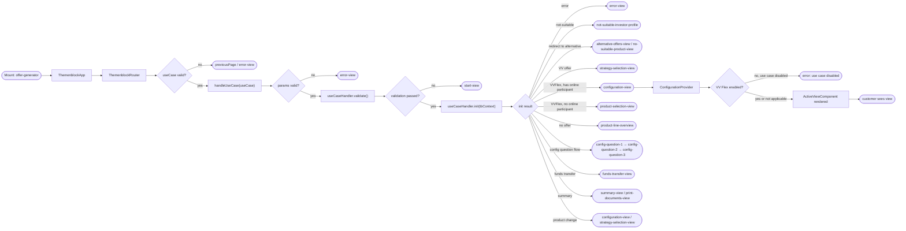
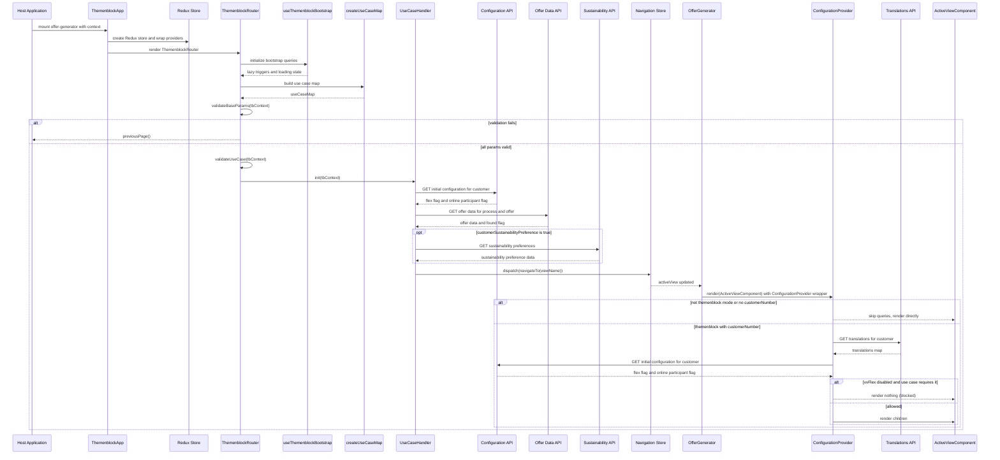

# Chain — offer-generator · Mount: offer-generator

<!-- scaffold — phase 1 -->

- **Action point** — `offer-generator` themenblock mount (wpfe-am / ucc-offer-generator)
- **Kind** — themenblock-mount
- **Source** — `ucc-offer-generator/src/main/react/src/themenblock/offer-generator/index.tsx`
- **Handler** — `createThemenblockMount('offer-generator', …)` — `.../index.tsx:55`
- **Trigger** — Mount: offer-generator (contextPath: `/wpfe/am/offer-generator`)
- **Preconditions** — none observed; React store created lazily per mount lifetime
- **First hop** — none (Themenblock mount is a React entry point; API calls originate from within the React tree)

<!-- analysis — phase 2 -->

## Story

As a **retail customer using the offer generator within an advisory session**, I want my investment preferences and product configuration loaded so that the advisor can guide me through selecting modules, adjusting weights, and generating a final offer.

- **Given** a host application has mounted the `offer-generator` themenblock at `/wpfe/am/offer-generator` with a valid `tbContext` containing `useCase`, `technicalProcessId`, `scenario`, and `customerNumber`
- **When** the mount renders, it creates a Redux store, sets up providers, validates use-case parameters, bootstraps lazy API queries, navigates to the appropriate initial view, and renders that view inside a ConfigurationProvider
- **Then** the customer sees the first screen of their configured flow — whether that is configuration questions, product selection, strategy selection, funds transfer, or summary — depending on which `useCase` was passed in the context
- **Unless** required parameters are missing, the use case is invalid, investor profile checks fail, or a backend endpoint returns an error — in which case the customer is redirected to an error view or previous page

## Chain

**Views** — Product Selection → Strategy Selection → Configuration → Expert Line Configuration → Alternative Offers → Module Selection → Weight Adjustment → Summary → Knowledge Experience → Online Information → Funds Transfer → Investment Volume Adjustment → Print Documents

```text
Branch 1 · primary
  createThemenblockMount('offer-generator', …)
    index.tsx:55
  → ThemenblockApp (React.FC<ComponentData>)
    index.tsx:27
  → LayerManagerContextProvider + ErrorContextProvider + Provider + ThemenblockContextProvider
    index.tsx:31-46
  → ThemenblockRouter
    ThemenblockRouter.tsx:25
  → useThemenblockBootstrap()
    useThemenblockBootstrap.ts:20
  → createUseCaseMap(bootstrap queries, dispatch, store)
    useCaseDefinitions.ts:57
  → validateBaseParams(tbContext)
    ThemenblockRouter.tsx:63
  → validateUseCase(tbContext)
    ThemenblockRouter.tsx:81
  → handleUseCase(tbContext.useCase)
    ThemenblockRouter.tsx:92
  → useCaseHandler.init(tbContext) (varies by use case)
    useCaseDefinitions.ts:103
  → dispatch(navigateTo(viewName))
    ThemenblockRouter.tsx:128
  → OfferGenerator renders ActiveViewComponent(VIEWS[activeView])
    OfferGenerator.tsx:7
  → ConfigurationProvider wraps the view, loads translations + configuration
    ConfigurationProvider.tsx:16
  ⇒ [external]  REST endpoints via RTK Query lazy triggers (see Also reached by below)
```

- **Terminals reached** — `external` (backend REST endpoints via RTK Query lazy triggers), `none` (pure client-side computation and navigation)

## Diagrams

### Process flow — primary



### Sequence — primary



## Journey

When the host application mounts the `offer-generator` themenblock at `/wpfe/am/offer-generator`, the request enters at step 1 to create a mount-scoped React tree. Once that completes, the flow moves to step 2 because the router needs to determine which view to show based on the use case in the context.

1. **createThemenblockMount('offer-generator', renderCallback)** (wpfe-am / ucc-offer-generator)

   **Source.** `ucc-offer-generator/src/main/react/src/themenblock/offer-generator/index.tsx:55`

   **Role.** Registers the offer-generator mount with the host framework, passing a callback that renders the React application tree. This is the entry point — the only thing this chain does at registration time.

   **Effect.** The `createThemenblockMount` function stores the render callback and makes it available to the host for mounting/unmounting cycles.

2. **ThemenblockApp(tbContext, sendEvent)** (wpfe-am / ucc-offer-generator)

   **Source.** `ucc-offer-generator/src/main/react/src/themenblock/offer-generator/index.tsx:27`

   **Role.** Creates a mount-scoped Redux store using React.useState lazy initialization — the store is created once per mount lifetime and garbage collected when the host unmounts. Wraps the app in four context providers: LayerManagerContextProvider, ErrorContextProvider (with onError callback that sends errors to the host), Provider (Redux store), and ThemenblockContextProvider.

   **Preconditions.** `tbContext` must carry at minimum `technicalProcessId`, `scenario`, `useCase`, and `customerNumber` — validated in step 5.

   **Effect.** Each mount gets a fresh Redux store, removing the cross-session leakage that previously caused duplicate RTK Query cache entries and stale state reads on Themenblock re-entry (`index.tsx:27-30`).

3. **ThemenblockRouter()** (wpfe-am / ucc-offer-generator)

   **Source.** `ucc-offer-generator/src/main/react/src/themenblock/offer-generator/ThemenblockRouter.tsx:25`

   **Role.** Orchestrates the initial navigation flow: calls useThemenblockBootstrap to set up lazy API query triggers, builds a use-case map from those queries, validates base parameters and the use case itself, dispatches the appropriate init function for the matched use case, then navigates to the resulting view. Shows a LoadingSpinner while any bootstrap query is in flight.

   **Downstream.** Renders `<OfferGenerator />` once `isLoading` becomes false, or continues showing the spinner.

4. **useThemenblockBootstrap()** (wpfe-am / ucc-offer-generator)

   **Source.** `ucc-offer-generator/src/main/react/src/hooks/useThemenblockBootstrap.ts:20`

   **Role.** Sets up ten lazy RTK Query triggers — one for each backend endpoint the themenblock may need during its lifetime. These are NOT called yet; they return trigger functions that the use case init functions invoke when needed. The hook also computes a combined `isLoading` flag from all ten query loading states.

   **Steps.**

   - **4.1 Set up lazy user preferences query** · `useThemenblockBootstrap.ts:23`
     **Role.** Creates `[getPreferences, { isLoading }] = useLazyGetUserPreferencesQuery()` — trigger for GET /user-preferences.

   - **4.2 Set up lazy offer generator process query** · `useThemenblockBootstrap.ts:25`
     **Role.** Creates `[getOfferGeneratorProcess, ...]` — trigger for GET /offer-generator-process.

   - **4.3 Set up lazy offer data query** · `useThemenblockBootstrap.ts:27`
     **Role.** Creates `[getOfferData, ...]` — trigger for GET /offer-data with technicalProcessId and offerId parameters.

   - **4.4 Set up lazy modules query** · `useThemenblockBootstrap.ts:29`
     **Role.** Creates `[getModules, ...]` — trigger for GET /modules with productLine parameter.

   - **4.5 Set up lazy calculate aggregates query** · `useThemenblockBootstrap.ts:31`
     **Role.** Creates `[calculateAggregates, ...]` — trigger for POST /calculate-aggregates with moduleProportions and investmentAmount.

   - **4.6 Set up lazy sustainability preferences query** · `useThemenblockBootstrap.ts:33`
     **Role.** Creates `[getSustainabilityPreferences, ...]` — trigger for GET /sustainability-preferences with ownerBpkenn parameter.

   - **4.7 Set up lazy model contract by account query** · `useThemenblockBootstrap.ts:35`
     **Role.** Creates `[getModelContractByAccount, ...]` — trigger for GET /model-contract-by-account with technicalSecuritiesAccountNumber.

   - **4.8 Set up lazy latest offer query** · `useThemenblockBootstrap.ts:37`
     **Role.** Creates `[getLatestOffer, ...]` — trigger for GET /latest-offer with technicalProcessId and requiredDoc parameters.

   - **4.9 Set up lazy configuration query** · `useThemenblockBootstrap.ts:39`
     **Role.** Creates `[getConfiguration, ...]` — trigger for GET /initial-configuration with customerNumber parameter.

5. **createUseCaseMap(bootstrap queries, dispatch, store)** (wpfe-am / ucc-offer-generator)

   **Source.** `ucc-offer-generator/src/main/react/src/themenblock/offer-generator/use-case/useCaseDefinitions.ts:57`

   **Role.** Builds a map of use case names to their init functions and validation rules. Seven use cases are registered:

   - **start_customer_process** → returns 'config-question-1' directly after setting customer number
   - **product_line** → `getProductLineInit()` — fetches configuration, offer data, sustainability preferences; navigates to strategy-selection-view (VV), product-selection-view (no online participant), configuration-view (VVFlex with online participant), or product-line-overview (no existing offer)
   - **summary** → `getSummaryInit()` — fetches offer data and modules, calculates aggregates; navigates to summary-view or print-documents-view
   - **deposit / withdrawal** → `getFundsTransferInit()` — sets investment amount; navigates to funds-transfer-view
   - **product_config_change** → `getProductConfigChangeInit()` — checks investor profile, resolves product config; navigates to configuration-view, adjust-investment-volume-view, online-information-view, or alternative-offers-view
   - **product_line_change** → `getProductLineChangeInit()` — similar to product_config_change but also fetches configuration for VV Flex check

6. **validateBaseParams(tbContext)** (wpfe-am / ucc-offer-generator)

   **Source.** `ucc-offer-generator/src/main/react/src/themenblock/offer-generator/ThemenblockRouter.tsx:63`

   **Role.** Validates four required base parameters against BASE_USE_CASE_VALIDATION rules:

   - **6.1 Validate technicalProcessId** · `use-case/baseUseCase.ts:14`
     **Role.** Ensures technicalProcessId is a non-empty string.
     **On failure.** Logs error and calls ctx.previousPage().

   - **6.2 Validate scenario** · `use-case/baseUseCase.ts:15`
     **Role.** Checks that scenario is one of the allowed values (MODIFICATION, OPENING, etc.).
     **On failure.** Logs error and calls ctx.previousPage().

   - **6.3 Validate useCase** · `use-case/baseUseCase.ts:18`
     **Role.** Checks that useCase matches one of the registered use case values.
     **On failure.** Logs error and calls ctx.previousPage().

   - **6.4 Validate customerNumber** · `use-case/baseUseCase.ts:23`
     **Role.** Ensures customerNumber is a non-empty string.
     **On failure.** Logs error and calls ctx.previousPage().

7. **validateUseCase(tbContext)** (wpfe-am / ucc-offer-generator)

   **Source.** `ThemenblockRouter.tsx:81`

   **Role.** Checks that tbContext.useCase is present. If missing, logs an error and navigates to previous page.

8. **handleUseCase(tbContext.useCase)** (wpfe-am / ucc-offer-generator)

   **Source.** `ThemenblockRouter.tsx:92`

   **Role.** Looks up the use case handler from the map, validates its specific parameters if rules exist, runs the optional validate() function, then calls init() to determine the initial view. Dispatches navigation to the resulting view name.

   - **8.1 Look up use case handler** · `ThemenblockRouter.tsx:94`
     **Role.** Retrieves `useCaseMap[tbContext.useCase]`. If not found, dispatches navigateTo('start-view') and returns.

   - **8.2 Validate use-case-specific parameters** · `ThemenblockRouter.tsx:100`
     **Role.** Runs validateParams() against the use case's paramsValidationRules if present. Errors are logged and sent via ctx.error().

   - **8.3 Run optional validate() function** · `ThemenblockRouter.tsx:109`
     **Role.** Calls `useCaseHandler.validate?.(tbContext)` — defaults to true if absent. If false, dispatches navigateTo('start-view').

   - **8.4 Call init() and navigate** · `ThemenblockRouter.tsx:113`
     **Role.** Awaits the async init function, then dispatches either navigateTo(viewName) or navigateWithParams({view, params}) depending on whether init returns a string or an object.

9. **useCaseHandler.init(tbContext)** (wpfe-am / ucc-offer-generator)

   **Source.** Varies by use case — the most common path is `product_line` → `productLineInitialization.ts:30`

   **Role.** The init function for the matched use case. It performs all data fetching and business logic to determine which view to show first. For the product_line use case (the primary flow), this involves:

   - **9.1 Fetch configuration** · `productLineInitialization.ts:34`
     **Role.** Calls getConfiguration({customerNumber}) to check vvFlexEnabled flag and hasOnlineParticipant status.
     **Also reached by:** [get-initial-configuration-configuration-controller](../chain-traces/get-initial-configuration-configuration-controller.md)

   - **9.2 Set customer number in Redux** · `productLineInitialization.ts:36`
     **Role.** Dispatches setCustomerNumber() so ConfigurationProvider can use it for its own queries.

   - **9.3 Fetch and apply offer data** · `useCaseInitializationHelper.ts:107`
     **Role.** If tbContext.offerId is present, calls getOfferData() to load the existing offer into Redux state. Determines if this is a VV (standard) or VVFlex offer based on whether productLine exists in the response.
     - On success with VV type → navigates to strategy-selection-view
     - On success with VVFlex type → continues to sustainability check and configuration view decision
     - On no-offer status → falls back to getPreferences() for saved preferences
     - On error → returns 'error-view'
     **Also reached by:** [get-offer-data-by-offer-id-offer-generator-controller](../chain-traces/get-offer-data-by-offer-id-offer-generator-controller.md)

   - **9.4 Fetch and apply sustainability preferences** · `useCaseInitializationHelper.ts:30`
     **Role.** If tbContext.customerSustainabilityPreference is true, calls getSustainabilityPreferences() to load custom ESG preferences (mitigateAdverseEsgImpactsActive, sustainableEconomicActivitiesActive, pursueSustainabilityGoalsActive, biodiversity, climateChange, humanAndLabourRights, waterWasteConsumptionOfResources). Applies them to the investor profile slice.
     **Also reached by:** [get-custom-sustainability-preferences-offer-generator-controller](../chain-traces/get-custom-sustainability-preferences-offer-generator-controller.md)

   - **9.5 Check for non-suitable options** · `productLineInitialization.ts:48`
     **Role.** Reads selectIsNonSuitableOptionsSelected from Redux state. If true, returns 'not-suitable-investor-profile'.

   - **9.6 Check redirect to alternative offers** · `productLineInitialization.ts:53`
     **Role.** Reads selectRedirectToAlternativeOffersReason from Redux state. If non-NONE, redirects to either no-suitable-product-view (FK channel) or alternative-offers-view with sustainability redirect reason.

   - **9.7 Determine VV vs VVFlex path** · `productLineInitialization.ts:58`
     **Role.** If fetchDataResult.type is 'VV', returns strategy-selection-view with the productLineMandate parameter.

   - **9.8 Check vvFlexEnabled flag** · `productLineInitialization.ts:62`
     **Role.** If configuration.vvFlexEnabled is false, returns product-selection-view (standard VV flow).

   - **9.9 Check online participant status** · `productLineInitialization.ts:66`
     **Role.** If tbContext.hasOnlineParticipant is false, returns product-selection-view (no postbox, no offer generator, straight to product finder).

   - **9.10 Final view decision for VVFlex with online participant** · `productLineInitialization.ts:70`
     **Role.** Returns product-line-overview if there was no existing offer, or configuration-view if an offer exists.

10. **dispatch(navigateTo(viewName))** (wpfe-am / ucc-offer-generator)

    **Source.** `ucc-offer-generator/src/main/react/src/redux/slices/navigationSlice.ts` (inferred from dispatch usage at ThemenblockRouter.tsx:128)

    **Role.** Updates the Redux navigation slice's activeView field to the view name returned by init(). This triggers a re-render of OfferGenerator which reads activeView and renders the matching component.

11. **OfferGenerator()** (wpfe-am / ucc-offer-generator)

    **Source.** `ucc-offer-generator/src/main/react/src/OfferGenerator.tsx:7`

    **Role.** Reads activeView from Redux state, finds the matching view config in VIEWS array, and renders its component wrapped in ConfigurationProvider. The VIEWS array contains 24 registered views including start-view, configuration questions (1-3), not-suitable-investor-profile, product-line-overview, configuration-view, expert-line-configuration-view, alternative-offers-view, adjust-weighting-view, efficient-module-selection-view, exclusive-module-selection-view, summary-view, knowledge-experience-view, online-information-view, funds-transfer-view, adjust-investment-volume-view, adjust-investment-volume-summary-view, print-documents-view, error-view, no-suitable-product-view, product-selection-view, and strategy-selection-view.

12. **ConfigurationProvider()** (wpfe-am / ucc-offer-generator)

    **Source.** `ucc-offer-generator/src/main/react/src/providers/ConfigurationProvider.tsx:16`

    **Role.** Wraps the active view component with two RTK Query calls — useGetTranslationsQuery and useGetConfigurationQuery. Shows a spinner while either is loading. After configuration loads, checks if VV Flex is enabled for the current use case; if not (and the use case requires it), blocks rendering by showing nothing.

    - **12.1 Load translations** · `ConfigurationProvider.tsx:38`
      **Role.** Calls useGetTranslationsQuery with customerNumber. Skipped in non-themenblock mode or before customer number is set.

    - **12.2 Load configuration** · `ConfigurationProvider.tsx:40`
      **Role.** Calls useGetConfigurationQuery with customerNumber to confirm vvFlexEnabled and hasOnlineParticipant.
      **Also reached by:** [get-initial-configuration-configuration-controller](../chain-traces/get-initial-configuration-configuration-controller.md)

    - **12.3 Check VV Flex enablement** · `ConfigurationProvider.tsx:50`
      **Role.** Reads selectIsVVFlexEnabled from Redux state. If the current use case is in shouldBeBlockedWhenVVFlexDisabled() and vvFlexEnabled is false, dispatches an error event and blocks rendering.

    - **12.4 Render or block** · `ConfigurationProvider.tsx:60`
      **Role.** Shows a spinner while loading; renders children if allowed; renders nothing if use case is blocked by VV Flex disabled state.

13. **ActiveViewComponent()** (wpfe-am / ucc-offer-generator)

    **Source.** `ucc-offer-generator/src/main/react/src/OfferGenerator.tsx:9`

    **Role.** Renders the actual view component matching activeView — e.g., ConfigurationQuestion1View, ProductSelectionView, StrategySelectionView, SummaryView, FundsTransferView, etc. Each view may trigger additional lazy queries (e.g., getModules, calculateAggregates) as the user interacts with it.

    **Terminal — external** · The view components call their own RTK Query triggers which reach backend REST endpoints via the coaxial client at base path `/wpfe/am/offer-generator/v1`. These are:
    - GET /user-preferences → [get-user-preferences-data-offer-generator-controller](../chain-traces/get-user-preferences-data-offer-generator-controller.md)
    - GET /offer-generator-process → [get-offer-generator-process-offer-generator-controller](../chain-traces/get-offer-generator-process-offer-generator-controller.md)
    - GET /offer-data → [get-offer-data-by-offer-id-offer-generator-controller](../chain-traces/get-offer-data-by-offer-id-offer-generator-controller.md)
    - GET /modules → [get-modules-modules-controller](../chain-traces/get-modules-modules-controller.md)
    - POST /calculate-aggregates → [post-calculate-aggregates-calculate-aggregates-controller](../chain-traces/post-calculate-aggregates-calculate-aggregates-controller.md)
    - GET /sustainability-preferences → [get-custom-sustainability-preferences-offer-generator-controller](../chain-traces/get-custom-sustainability-preferences-offer-generator-controller.md)
    - GET /model-contract-by-account → [get-model-contract-by-account-model-contracts-controller](../chain-traces/get-model-contract-by-account-model-contracts-controller.md)
    - GET /latest-offer → [get-latest-offer-offer-generator-controller](../chain-traces/get-latest-offer-offer-generator-controller.md)
    - GET /initial-configuration → [get-initial-configuration-configuration-controller](../chain-traces/get-initial-configuration-configuration-controller.md)

14. **Pure client-side computation** (wpfe-am / ucc-offer-generator)

    **Source.** Multiple files — e.g., `useCaseInitializationHelper.ts:70` (setInvestorProfile), `productLineInitialization.ts:36` (setCustomerNumber), `ThemenblockRouter.tsx:128` (navigateTo)

    **Role.** Redux dispatches that update local state without any outbound calls — setting customer number, investment amount, investor profile data, temporary model contract, previous offer, and navigation. These are pure client-side operations.

    **Terminal — none**

## Data reached

- **external — backend REST endpoints via RTK Query lazy triggers (wpfe-am / ucc-offer-generator)**
  - Business problem solved — As the **offer generator themenblock**, I need customer data, offer state, module configurations, and sustainability preferences to be able to guide the advisor through the complete investment advisory flow. Therefore we call these REST endpoints at `GET /user-preferences?technicalProcessId={id}&customerNumber={num}`, `GET /offer-generator-process?{params}`, `GET /offer-data?technicalProcessId={id}&offerId={id}&customerNumber={num}`, `GET /modules?productLine={line}`, `POST /calculate-aggregates` with moduleProportions and investmentAmount body, `GET /sustainability-preferences?ownerBpkenn={bpkenn}&customerNumber={num}`, `GET /model-contract-by-account?technicalSecuritiesAccountNumber={accNum}`, `GET /latest-offer?technicalProcessId={id}&requiredDoc={bool}&customerNumber={num}`, and `GET /initial-configuration?customerNumber={num}` — all routed through the coaxial client at base path `/wpfe/am/offer-generator/v1` — to retrieve customer preferences, offer data, module configurations, sustainability preferences, model contracts, latest offers, and system configuration. Then we apply each response to Redux slices so that view components can read them from state (`useCaseInitializationHelper.ts:70`, `productLineInitialization.ts:34-70`).

  - **Request path** — all endpoints share the base path `/wpfe/am/offer-generator/v1` (inferred from `baseApi.ts:15`), with per-endpoint paths as listed above.

  - **Request body** — varies by endpoint; POST /calculate-aggregates carries `{ data: CalculateAggregatesRequest, metaData: {} }` (`calculateAggregatesApi.ts:20`).

  - **Response fields used** — inferred from DTO types and dispatch targets:
    ```json
    {
      "investmentVolume": "50000",
      "influence": true,
      "offerDataInformation": {
        "offerId": 12345,
        "productLine": "VVFlex",
        "productLineMandate": "CONSERVATIVE",
        "investmentVolume": 50000,
        "offensiveAssetShare": 0.6
      },
      "offerFound": true,
      "documentFound": false,
      "vvFlexEnabled": true,
      "hasOnlineParticipant": true,
      "mitigateAdverseEsgImpactsActive": true,
      "biodiversity": "HIGH",
      "climateChange": "MEDIUM"
    }
    ```
    Values inferred from DTO definitions at `GetUserPreferencesResponse.java`, `GetOfferDataResponse.java`, `GetConfigurationReponse.java`, and `GetSustainabilityPreferencesResponse.java`.

  - **Response fields discarded** — each endpoint returns more fields than consumed; for example, GetUserPreferencesResponse carries additional fields beyond investmentVolume and influence, and GetOfferDataResponse carries offerDataInformation with many fields not used by the init flow (e.g., productLineStrategyName, customerRiskProfile are only used in specific use cases like summary).

- **none — pure client-side Redux state updates**
  - Business problem solved — As the **offer generator themenblock**, I need to maintain a consistent application state across all views without making additional backend calls. Therefore we dispatch actions to setCustomerNumber, setInvestmentAmount, setQuestionairePreferences, setTemporaryModelContract, setInvestorProfile, setPreviousOffer, setIsFirstOffer, addSpecialApprover, setOnlineParticipant, and navigateTo — all within the Redux store created at mount time (`index.tsx:30`, `useCaseInitializationHelper.ts:70-95`).

  - **Argument** — values originate from tbContext (customerNumber, investmentVolume, scenario), backend responses (offerDataInformation, configuration), or computed defaults (DEFAULT_RISK_PROFILE, initialTemporaryModelContract).

## Acceptance Criteria

1. **Mount creates a fresh Redux store per mount lifetime** — Given the host mounts the offer-generator themenblock for the first time and then unmounts it, when the host remounts it again, then a new Redux store is created (not reused from the previous mount), so RTK Query caches do not leak between sessions.
   - Evidence: `index.tsx:27-30` — `const [store] = React.useState<AppStore>(() => createStore())`; useState initializer runs once per mount, creating a fresh store each time the component tree is mounted.
   - How to: mount the themenblock, verify the store instance ID; unmount and remount; verify the store instance ID differs from the previous one.

2. **Base parameter validation rejects missing or invalid tbContext fields** — Given a tbContext with an empty technicalProcessId, when the router renders, then it logs an error message to console.error and calls ctx.previousPage() instead of proceeding to init().
   - Evidence: `ThemenblockRouter.tsx:63-75` — validateBaseParams checks each field against BASE_USE_CASE_VALIDATION rules; on failure, forEach iterates errors calling sendEvent and ctx.previousPage().
   - How to: mount with tbContext where technicalProcessId is empty string; confirm console.error contains the validation error message and previousPage() was called.

3. **Use case determines initial view correctly** — Given a valid tbContext with useCase = 'product_line' and an existing offer for a VVFlex product, when handleUseCase runs init(), then it dispatches navigateTo('configuration-view') because the offer exists and hasOnlineParticipant is true.
   - Evidence: `productLineInitialization.ts:70` — final return statement returns 'configuration-view' when fetchDataResult.status === 'ok', type !== 'VV', vvFlexEnabled is true, and hasOnlineParticipant is true.
   - How to: mount with useCase='product_line', offerId pointing to a VVFlex offer, customerNumber set; confirm navigation.activeView becomes 'configuration-view'.

4. **VV offers navigate to strategy-selection-view** — Given an existing offer whose productLine field is null/absent (indicating a standard VV offer), when init() runs for the product_line use case, then it dispatches navigateTo('strategy-selection-view') with the productLineMandate parameter.
   - Evidence: `productLineInitialization.ts:58-61` — fetchDataResult.type === 'VV' returns strategy-selection-view with params containing productLineMandate from offerData.productLineMandate.
   - How to: mount with useCase='product_line', offerId pointing to a VV offer (no productLine in response); confirm navigation.activeView becomes 'strategy-selection-view'.

5. **No existing offer falls back to saved preferences** — Given a tbContext with an offerId that resolves to no matching offer, when init() runs fetchAndApplyOfferData(), then it calls onNoOfferInitWithPreferences which fetches user preferences via getPreferences() and applies investmentVolume and influence to Redux state.
   - Evidence: `useCaseInitializationHelper.ts:107-125` — if !tbContext.offerId?.trim(), delegates to onNoOffer(); `useCaseInitializationHelper.ts:143-156` — onNoOfferInitWithPreferences calls getPreferences() and dispatches setInvestmentAmount + setQuestionairePreferences.
   - How to: mount with useCase='product_line', offerId pointing to a non-existent offer; confirm user-preferences endpoint is called and investmentVolume/influence are set in Redux state.

6. **Sustainability preferences are loaded when customer has them** — Given tbContext.customerSustainabilityPreference is true, when init() runs for product_line use case, then getSustainabilityPreferences() is called with ownerBpkenn and customerNumber, and the response fields (mitigateAdverseEsgImpactsActive, sustainableEconomicActivitiesActive, pursueSustainabilityGoalsActive, biodiversity, climateChange, humanAndLabourRights, waterWasteConsumptionOfResources) are applied to investorProfile slice.
   - Evidence: `useCaseInitializationHelper.ts:30-56` — fetchAndApplySustainabilityPreferences checks customerSustainabilityPreference flag, calls getSustainabilityPreferences(), dispatches setInvestorProfile with all ESG fields mapped from the response.
   - How to: mount with useCase='product_line', customerSustainabilityPreference=true; confirm sustainability-preferences endpoint is called and investorProfile state contains the ESG fields.

7. **ConfigurationProvider blocks VV Flex use cases when disabled** — Given configuration.vvFlexEnabled is false, when a themenblock mount uses a use case that requires VV Flex (e.g., 'product_line'), then ConfigurationProvider dispatches an error event and renders nothing instead of the view.
   - Evidence: `ConfigurationProvider.tsx:48-56` — checks shouldBeBlockedWhenVVFlexDisabled(ctx.tbContext.useCase) && !isVVFlexEnabled; if true, dispatches ctx.error() with 'Use case currently disabled' message.
   - How to: mount with useCase='product_line', configure vvFlexEnabled=false in backend response; confirm error event is sent and no view component renders.

8. **Non-themenblock mounts skip all API queries** — Given the context is not a themenblock (isThemenblock = false), when ConfigurationProvider renders, then useGetTranslationsQuery and useGetConfigurationQuery receive skipToken and make no HTTP calls.
   - Evidence: `ConfigurationProvider.tsx:30-34` — shouldSkipQueries is true when !isThemenblock; both queries pass skipToken as their first argument.
   - How to: render the React tree outside a themenblock context (e.g., standalone app mode); confirm no API calls are made in network tab.

9. **Product config change resolves correctly with existing offer** — Given tbContext.useCase = 'product_config_change' and an existing offerId, when getProductConfigChangeInit runs, then it calls resolveProductChangeView which fetches offer data and returns either strategy-selection-view (VV) or configuration-view (VVFlex).
   - Evidence: `productConfigChangeInitialization.ts:38-40` — if tbContext.offerId?.trim(), delegates to resolveProductChangeView; `useCaseInitializationHelper.ts:127-141` — resolveProductChangeView returns strategy-selection-view for VV, configuration-view otherwise.
   - How to: mount with useCase='product_config_change', offerId pointing to a VVFlex offer; confirm navigation.activeView becomes 'configuration-view'.

10. **Funds transfer init sets investment amount and navigates** — Given tbContext.useCase = 'deposit' or 'withdrawal', when getFundsTransferInit runs, then it dispatches setCustomerNumber and setInvestmentAmount, and returns funds-transfer-view with the appropriate TransferType parameter.
    - Evidence: `fundsTransferInitialization.ts:16-24` — dispatches setCustomerNumber(tbContext.customerNumber) and setInvestmentAmount(toSafeNumber(tbContext.investmentVolume)), returns {viewName: 'funds-transfer-view', params: {transferType}}.
    - How to: mount with useCase='deposit'; confirm navigation.activeView becomes 'funds-transfer-view' and Redux state carries the investment amount.

11. **Summary init loads offer data, modules, and calculates aggregates** — Given tbContext.useCase = 'summary' with an existing offerId, when getSummaryInit runs, then it calls getOfferData(), applies the offer to Redux store, dispatches getModules() and calculateAggregates(), and returns summary-view or print-documents-view based on documentFound.
    - Evidence: `summaryInitialization.ts:20-68` — if offerId present, calls getOfferData(); determines VV vs VVFlex; for VV sets temporaryModelContract with offensiveAssetShare * 100 and productFinderData with selectedStrategy; dispatches setAggregatedKeyRiskIndicator; returns summary-view or print-documents-view based on documentFound.
    - How to: mount with useCase='summary', offerId pointing to an existing offer without a document; confirm modules and calculate-aggregates endpoints are called, and navigation.activeView becomes 'print-documents-view'.

12. **Error view renders when offer data fetch fails** — Given tbContext.useCase = 'product_line' and getOfferData() returns offerFound=false or no offerDataInformation, when init() runs, then it dispatches navigateTo('error-view') with headlineKey and messageKey params.
    - Evidence: `useCaseInitializationHelper.ts:118-120` — if !offerDataInformation || !data.offerFound, returns {status: 'error'}; `productLineInitialization.ts:43-49` — on fetchDataResult.status === 'error', returns error-view with headlineKey and messageKey.
    - How to: mount with useCase='product_line', offerId pointing to a non-existent or invalid offer; confirm navigation.activeView becomes 'error-view'.

## Business Takeaways

- **What this does for the business** — loads all customer data, offer state, module configurations, and sustainability preferences into a Redux store so that the advisor can guide the customer through product selection, strategy configuration, weight adjustment, and summary review in a single mounted session. The mount-scoped store prevents cross-session data leakage.

- **Depends on** — nine backend REST endpoints (user-preferences, offer-generator-process, offer-data, modules, calculate-aggregates, sustainability-preferences, model-contract-by-account, latest-offer, initial-configuration), all routed through the coaxial client at `/wpfe/am/offer-generator/v1`.

- **Ingredients** — tbContext (useCase, technicalProcessId, scenario, customerNumber, offerId, investmentVolume, hasOnlineParticipant, customerSustainabilityPreference, ownerBpkenn, customerRiskProfile, customerInvestmentHorizon, customerLossCapacity), plus the seven registered use cases that determine which data to fetch and which view to show.

- **Preparation** — validate base parameters (technicalProcessId, scenario, useCase, customerNumber); set up lazy API triggers; build use case map; run use-case-specific init function that fetches configuration, offer data, sustainability preferences, modules, and aggregates as needed; apply all responses to Redux state.

- **Dish** — the active view component rendered inside ConfigurationProvider, showing either configuration questions, product selection, strategy selection, module selection, weight adjustment, summary, funds transfer, investment volume adjustment, print documents, or an error screen depending on use case and data state.
