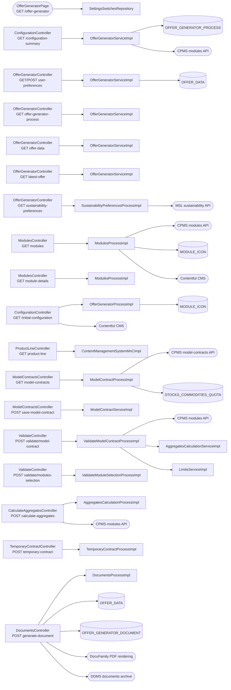
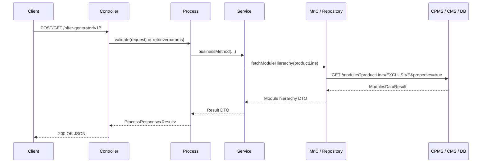

# Module Summary — ucc-offer-generator

| Field | Value |
|---|---|
| Module | ucc-offer-generator |
| Repository | wpfe-am (Content Provider) |
| Profile chain | wpfe → wpfe-am |
| Chains traced | 31 of 31 |
| Analysed at | `main` @ checkpoint not recorded (clean) |
| Date | 2026-08-09 |

## Business purpose

The `ucc-offer-generator` module is the investment-offer engine for the WPFE asset-management platform. It serves a React SPA and a themenblock through 31 triggers that cover three primary outcomes: **(1) configuring and validating** customer investment selections against CPMS-defined limits and regulatory rules; **(2) generating offer documents** as PDFs via DocuFamily with optional DDMS archival for compliance; and **(3) persisting** every stage of the advisory session to local database tables. The module reaches five external systems — CPMS (Portfolio Operations, Portfolio Details, modules data, product catalogue, model-contracts, investment operations), Contentful CMS, MSL sustainability API, DocuFamily PDF rendering, and DDMS document archive — plus six local database tables.

The chains cluster into four functional groups:

- **Session bootstrap** — [page load](chain-traces/page-initial-page-load-offer-generator-page.md) generates the technical process ID; [initial configuration](chain-traces/get-initial-configuration-configuration-controller.md) and [user preferences](chain-traces/get-user-preferences-data-offer-generator-controller.md) prepare the UI.
- **Product and module selection** — [modules hierarchy](chain-traces/get-modules-modules-controller.md), [product line details](chain-traces/get-details-product-line-controller.md), [model contracts](chain-traces/get-model-contracts-model-contracts-controller.md), and [product data filtering](chain-traces/post-retrieve-product-data-offer-generator-product-data-controller.md) populate the selection screens.
- **Validation and weight computation** — four validation endpoints ([model contract](chain-traces/post-validate-model-contract-validate-controller.md), [module selection](chain-traces/post-validate-selection-validate-controller.md), [customer risk-return](chain-traces/post-validate-customer-risk-return-validate-controller.md), [funds transfer](chain-traces/post-validate-customer-funds-transfer-validate-controller.md)) and two weight computation endpoints ([aggregates](chain-traces/post-calculate-aggregates-calculate-aggregates-controller.md), [reallocation](chain-traces/post-reallocate-modules-weights-model-contracts-controller.md)).
- **Document generation and persistence** — [generate document](chain-traces/post-generate-offer-generator-document-documents-controller.md) renders the PDF; [save model contract](chain-traces/post-save-model-contract-model-contracts-controller.md), [save temporary contract](chain-traces/post-save-temporary-contract-temporary-contract-controller.md), and [product config save](chain-traces/post-save-user-product-config-data-offer-generator-controller.md) persist the results.

The simulation endpoint ([compute-simulation](chain-traces/post-compute-simulations-simulation-controller.md)) is a stub throwing `NotImplementedException` — CPMS integration not yet wired. The [themenblock mount](chain-traces/tb-offer-generator.md) orchestrates all data loading into a Redux store for the advisor-facing flow.

## APIs used — why and how

| API client | Repository / module | Why | How | Reached by | Described in |
|---|---|---|---|---|---|
| `ModulesApiClient` | wpfe-shared / cpms | Retrieves the full module hierarchy with limits for product line filtering, slider constraint calculation, and validation | HTTP GET to CPMS modules endpoint with properties filter; handles 404 as empty | 5 chains | [modules](chain-traces/get-modules-modules-controller.md#journey) |
| `ModelContractsApi` | wpfe-shared / cpms | Fetches available model contracts for a product line, creates new contracts on save, and creates temporary contracts for performance lookup | HTTP GET/POST to CPMS portfolio-investment-operations endpoint | 3 chains | [model-contracts](chain-traces/get-model-contracts-model-contracts-controller.md#journey) |
| `InvestmentGuidelineApiClient` | wpfe-shared / cpms | Resolves a technical securities account number to its investment guideline (contract ID) via pseudonymized lookup | HTTP GET with pseudonymized account number | 2 chains | [model-contract-by-account](chain-traces/get-model-contract-by-account-model-contracts-controller.md#journey) |
| `ModelContractsApiClient` | wpfe-shared / cpms | Fetches full model contract details including proportions and properties by ID, or retrieves historical performance data | HTTP GET to CPMS Portfolio Details API with properties query parameter | 3 chains | [model-contract-by-account](chain-traces/get-model-contract-by-account-model-contracts-controller.md#journey) |
| `CalculateValueSeriesV2ApiClient` | wpfe-shared / cpms | Retrieves value series chart data (holding values over time) for performance visualization | HTTP GET to CPMS Portfolio Details API v2 `/holdings/value-series` endpoint with pseudonymized portfolio ID | 1 chain | [model-contract-performance](chain-traces/get-model-contract-performance-model-contracts-controller.md#journey) |
| `PortfolioGrowthV2ApiClient` | wpfe-shared / cpms | Retrieves per-year portfolio growth data for historical performance calculation | HTTP GET to CPMS Portfolio Details API v2 `/holdings/growth` endpoint, called once per yearly range (up to 5 times) | 2 chains | [model-contract-performance](chain-traces/get-model-contract-performance-model-contracts-controller.md#journey) |
| `TemporaryContractApiClient` | wpfe-shared / cpms | Creates a temporary contract in CPMS for historical performance lookup of selected module configurations | HTTP POST to CPMS Portfolio Investment Operations API with JSON body containing proportions and investment volume | 1 chain | [temporary-contract](chain-traces/post-save-temporary-contract-temporary-contract-controller.md#journey) |
| `ProductDataApiClient` | wpfe-shared / cpms | Retrieves the full asset management product catalogue for suitability filtering against customer profile | HTTP GET to CPMS product data endpoint with channel, requestId and authentication headers | 1 chain | [retrieve-product-data](chain-traces/post-retrieve-product-data-offer-generator-product-data-controller.md#journey) |
| `SustainabilityApiClient` | wpfe-shared / wpfe-shared-regulations | Fetches the customer's seven ESG and climate-related sustainability preference flags from MSL external system | HTTP GET to MSL sustainability preferences endpoint with pseudonymized owner BPKENN | 1 chain | [sustainability-preferences](chain-traces/get-custom-sustainability-preferences-offer-generator-controller.md#journey) |

**Repository terminals**

| Repository | Table | Why | Reached by |
|---|---|---|---|
| `OfferDataRepository` | OFFER_DATA | Persists and retrieves core offer data — investment volume, product line, risk profiles, quotas, model contract ID | 5 chains |
| `OfferGeneratorProcessRepository` | OFFER_GENERATOR_PROCESS | Manages the offer generation session state — process lifecycle, influence flag, scenario type | 4 chains |
| `ModuleProportionRepository` | MODULE_PROPORTION | Stores per-module weight allocations within an offer, keyed by composite (offerId + moduleId) | 3 chains |
| `OfferGeneratorDocumentRepository` | OFFER_GENERATOR_DOCUMENT | Stores rendered PDF bytes and archive reference for generated offer documents | 3 chains |
| `CustomerRiskReturnProfilePermissionsRepository` | CUSTOMER_RISK_RETURN_PROFILE_PERMISSIONS | Configuration table storing allowed stocks/commodities quota values per product line, mandate, and customer risk return profile | 2 chains |
| `ModuleIconRepository` | MODULE_ICON | Stores module icon entities with their translations (moduleId, icon bytes, name) — synced from Contentful CMS by scheduled job | 2 chains |

## Decision logic across the module

### [Session bootstrap](chain-traces/page-initial-page-load-offer-generator-page.md) — page load

- **Feature gate** — VV Flex enabled flag checked against `SETTINGS_SWITCHES`; if disabled, customer is redirected to access-denied page — [page load chain](chain-traces/page-initial-page-load-offer-generator-page.md#journey), AC 1.
- **Branch**: switch disabled → redirect; else → generate UUID technical process ID and render Thymeleaf page with React bundle path and translations.

### [Initial configuration](chain-traces/get-initial-configuration-configuration-controller.md) — startup config

- **Icon sync gate** — if `MODULE_ICON` table is empty (e.g., after deployment), the job fetches module icons from Contentful CMS for both locales (`de-DE`, `en-GB`) and upserts them before returning configuration.
- **Branch**: icon table empty → full CMS sync; else → return cached config directly.

### [User preferences](chain-traces/post-save-user-preferences-data-offer-generator-controller.md) — investment questionnaire

- **Minimum investment gate** — investment volume must be ≥ 100,000 EUR; rejected before any persistence occurs — [save user preferences chain](chain-traces/post-save-user-preferences-data-offer-generator-controller.md#journey), AC 1.
- **Branch**: below threshold → reject with validation error; else → dual writes to `OFFER_GENERATOR_PROCESS` (process record) and `OFFER_DATA` (offer data record) in one transaction.

### [Product configuration save](chain-traces/post-save-user-product-config-data-offer-generator-controller.md) — persist full config

- **Process existence gate** — for OPENING scenario, a process must already exist; rejected with `NO_PROCESS_FOUND` if not — [product config chain](chain-traces/post-save-user-product-config-data-offer-generator-controller.md#journey), AC 1.
- **Branch**: no process → reject; else → persist across four tables (`OFFER_GENERATOR_PROCESS`, `OFFER_DATA`, `MODULE_PROPORTION`, optionally `OFFER_DATA_KPI`) in one transactional operation.

### [Product data filtering](chain-traces/post-retrieve-product-data-offer-generator-product-data-controller.md) — suitability check

- **Seven-rule gate** — every product from CPMS is verified against residency, US relations, risk profile, return profile, sustainability preference, loss capacity, and investment horizon; each survivor carries denial flags or is included unflagged if eligible.
- **Branch**: any required field missing → `TechnicalException` before CPMS call; else → fetch all products, filter to new-customer-allowed only, sort by risk quota, apply seven suitability rules per product.

### [Modules hierarchy](chain-traces/get-modules-modules-controller.md) — module tree retrieval

- **Default limit enforcement** — any unbounded module class gets a default 100% allocation limit set before returning to the client — [modules chain](chain-traces/get-modules-modules-controller.md#journey), AC 3.
- **Branch**: icon or translation missing after retry → technical error; else → return enriched hierarchy with CMS icons and localized translations (de-DE, en-GB).

### [Model contracts listing](chain-traces/get-model-contracts-model-contracts-controller.md) — contract selection

- **Default contract gate** — when a risk-return profile is provided (and not in modification or product-line-change scenarios), one contract is marked as default by matching its offensive assets share against the configurable `STOCKS_COMMODITIES_QUOTA` table.
- **Branch**: no risk-return profile → return all contracts with no default; else → compare each contract's offensive share to quota and mark closest match as default.

### [Model contract performance](chain-traces/get-model-contract-performance-model-contracts-controller.md) — historical data

- **Mock data fallback** — if both `modelContractId` and `performanceCalculationStartDate` are absent, mock data is returned for development use; otherwise the date range is split into yearly segments (max 5 years).
- **Graceful degradation** — if any single year's CPMS call fails, the yearly performance list becomes empty but chart data and overall metrics are still returned; the entire request does not fail.

### [Calculate aggregates](chain-traces/post-calculate-aggregates-calculate-aggregates-controller.md) — portfolio composition

- **Product line mandate filter** — for EXPERT product line, the mandate (SUSTAINABLE / INDEX_SELECTION / ACTIVE_SELECTION) further narrows which modules are returned from CPMS; for EFFICIENT and EXCLUSIVE, only the product line filters.
- **Branch**: EXPERT with mandate → additional CPMS filter; else → standard product-line-only filter.

### [Compute simulations](chain-traces/post-compute-simulations-simulation-controller.md) — financial projections

- **Stub** — currently throws `NotImplementedException`; no simulation data is returned. CPMS integration not yet wired. This endpoint does not participate in any decision logic at present.

### [Generate document](chain-traces/post-generate-offer-generator-document-documents-controller.md) — PDF rendering

- **Archiving gate** — if the process is not a non-customer process, a copy of the rendered PDF is stored in DDMS with full compliance metadata (storage rules, document type ID, confidentiality level).
- **Branch**: archiving applies → write to DDMS and persist `dokId` back into `OFFER_GENERATOR_DOCUMENT.archivedDocumentDataId`; else → return PDF bytes only.

### [Save model contract](chain-traces/post-save-model-contract-model-contracts-controller.md) — persist to CPMS

- **Idempotency gate** — if a model contract was previously saved for this `offerId`, the call is skipped, `null` is returned, and no CPMS request is made.
- **Branch**: already saved → skip; else → POST to CPMS, store returned ID in `OFFER_DATA.modelContractId`.

### [Temporary contract](chain-traces/post-save-temporary-contract-temporary-contract-controller.md) — performance lookup setup

- **Cache optimization** — repeated identical calls are served from Redis cache via `@Cacheable`, reducing CPMS load for duplicate submissions.
- **Branch**: cached hit → return cached contract ID; else → POST to CPMS, persist new contract ID.

### [Reallocation](chain-traces/post-reallocate-modules-weights-model-contracts-controller.md) — WRL algorithm

- **WRL proportion validation** — the Weighting Reallocation Logic algorithm computes proportions for selected modules; if the result fails contract validation against slider limits, violations are returned instead of proportions.
- **Branch**: valid proportions → return `modelContractProportions`; else → return `violations` list with specific error objects.

### [Validate model contract](chain-traces/post-validate-model-contract-validate-controller.md) — structural rules

- **Five-rule validation** — every module weighting is checked against: (1) slider range limits, (2) group constraints, (3) class sum constraints, (4) offensive share match, (5) alternative investment minimum thresholds.
- **Branch**: `violations.isEmpty()` → `isValid: true`; else → `isValid: false` with specific violation details per module/class.

### [Validate modules selection](chain-traces/post-validate-selection-validate-controller.md) — quota feasibility

- **No-modules shortcut** — if no modules are selected, the response is immediately valid with zero errors.
- **Automatic swap suggestion** — when lower-limit-exceed-quota violations are detected, the system proactively suggests module swaps (individual securities → fund wrappers) in `modulesToBeSwitched` map to help the advisor reach a valid configuration without manual trial-and-error.

### [Validate customer risk-return](chain-traces/post-validate-customer-risk-return-validate-controller.md) — config-driven validation

- **Two independent checks** — the allocation check (quota-based: min/max bounds on stocks/commodities quota) and the calculated risk-return profile check (profile-based: whether the calculated profile is allowed for the customer's own profile) are performed sequentially; both must pass.
- **Fatal on missing config** — if no configuration row matches in `CUSTOMER_RISK_RETURN_PROFILE_PERMISSIONS`, a technical exception is thrown rather than returning a validation error. Missing configuration is treated as an operational problem, not a customer data problem.

### [Validate funds transfer](chain-traces/post-validate-customer-funds-transfer-validate-controller.md) — contract existence check

- **Stub logic** — returns success as soon as a model contract is found for the account; actual funds transfer validation (amount checks, balance verification) is not yet implemented. Two sequential external API calls: resolve investment guideline → fetch full contract from CPMS.

### [Allowed stocks/commodities quotas](chain-traces/get-allowed-stocks-commodities-quotas-validate-controller.md) — quota range lookup

- **Optional mandate handling** — when `productLineMandate` is null, all matching rows are returned regardless of their mandate value (including NULL mandates), using a NULL-safe comparison in the JPQL query.
- **Branch**: allowed=true rows found → return list of BigDecimal quota values; no match → return empty list (not null).

### [Sustainability preferences](chain-traces/get-custom-sustainability-preferences-offer-generator-controller.md) — ESG settings

- **Default-to-false** — if no preferences exist for the owner in MSL, all seven boolean flags default to `false`.
- **Seven-flag mapping** — three ESG profile categories (`sustainableEconomicActivitiesActive`, `pursueSustainabilityGoalsActive`, `mitigateAdverseEsgImpactsActive`) plus four principle adverse impact areas (`biodiversity`, `climateChange`, `humanAndLabourRights`, `waterWasteConsumptionOfResources`).

### [Product line details](chain-traces/get-details-product-line-controller.md) — CMS content retrieval

- **CMS entry ID mapping** — the product line enum + mandate is mapped to a specific CMS entry ID (`efficient-line`, `exclusive-line`, or one of three expert variants); no match → `IllegalArgumentException`.
- **Cacheable** — results are cached via Spring `@Cacheable` on `cmsProductLines`.

### [Global stocks distribution](chain-traces/get-global-stocks-distribution-modules-controller.md) — allocation display data

- **First-entry selection** — fetches all base module efficiency entries from Contentful CMS and takes the first one; no match → error returned.
- **Three weighting methods** — market capitalization weighted, GDP weighted, equally weighted distribution data.

### [Module details](chain-traces/get-module-details-modules-controller.md) — single module view

- **Performance is optional** — when either `portfolioId` is blank or `moduleStartDate` is absent, performance returns `null` while allocations and CMS content are still retrieved.
- **Portfolio history tolerance** — individual integration failures (value series or portfolio growth) return empty history without failing the request; unknown modules do not fail the request.

### [Model contract by account](chain-traces/get-model-contract-by-account-model-contracts-controller.md) — account-to-contract resolution

- **Pseudonymization gate** — the technical securities account number is pseudonymized before any external call to CPMS.
- **Branch**: no investment guideline found → technical exception; else → resolve contract ID and fetch full details from CPMS Portfolio Details API.

### [Configuration summary](chain-traces/get-configuration-summary-data-configuration-controller.md) — document data assembly

- **Process existence gate** — reject with `NO_PROCESS_FOUND` if no process exists for the given `technicalProcessId`.
- **Offer data gate** — reject with `NO_OFFER_DATA_FOUND` if no offer data matches the model contract ID.
- **Language mapping** — documents language parameter is mapped to an IETF locale tag for translation loading.

### [User preferences retrieval](chain-traces/get-user-preferences-data-offer-generator-controller.md) — pre-fill form

- **Latest-by-date** — loads the latest `OfferData` row for the process (by creation date); no data → technical exception indicating session has no saved state.
- **Two-field projection** — only `investmentVolume` and `influence` are returned; all other offer fields are discarded.

### [Offer generator process](chain-traces/get-offer-generator-process-offer-generator-controller.md) — full session state

- **Process existence gate** — reject with technical exception if no offer data exists for the given `technicalProcessId`.
- **Enriched response** — all offer data records are enriched with their module proportions in a single JOIN FETCH query.

### [Offer data by ID](chain-traces/get-offer-data-by-offer-id-offer-generator-controller.md) — specific offer snapshot

- **First-offer rejection** — if the offer is still in its initial (first-offer) state with no risk-return profile set, both `offerFound` and `documentFound` flags are `false`.
- **Three-table read** — OFFER_DATA (core fields), MODULE_PROPORTION (allocations), OFFER_GENERATOR_DOCUMENT (document presence).

### [Latest offer](chain-traces/get-latest-offer-offer-generator-controller.md) — most recent offer

- **Optional document filter** — when `requiredDoc` is true, the query filters to offers that have associated documents; otherwise returns the latest regardless of document status.
- **21-field response** — `GetLatestOfferResponse` carries investment volume, module proportions, risk profiles, quotas, strategy details, and two boolean flags.

### [Themenblock mount](chain-traces/tb-offer-generator.md) — Redux store bootstrap

- **Use case routing** — seven registered use cases determine which data to fetch and which view to show: configuration questions, product selection, strategy selection, module selection, weight adjustment, summary review, funds transfer, investment volume adjustment, print documents, or error screen.
- **Nine lazy API triggers** — user-preferences, offer-generator-process, offer-data, modules, calculate-aggregates, sustainability-preferences, model-contract-by-account, latest-offer, initial-configuration; all routed through the coaxial client at `/wpfe/am/offer-generator/v1`.

## Process flow

A module-level diagram — one node per **distinct component**, not per hop. Several triggers converge on shared processes and services, which this diagram captures:

## Module structure (UML)

A structural diagram — static dependencies only, never call order or branching. Stereotypes come from each hop's own layer; arrows come from the calls established across all chain traces.

```mermaid
classDiagram
    class OfferGeneratorPage { <<controller>> }
    class ConfigurationController { <<controller>> }
    class OfferGeneratorController { <<controller>> }
    class ModulesController { <<controller>> }
    class ProductLineController { <<controller>> }
    class ModelContractsController { <<controller>> }
    class ValidateController { <<controller>> }
    class CalculateAggregatesController { <<controller>> }
    class SimulationController { <<controller>> }
    class DocumentsController { <<controller>> }
    class TemporaryContractController { <<controller>> }

    class OfferGeneratorProcessImpl { <<process>> }
    class OfferGeneratorServiceImpl { <<service>> }
    class ModulesProcessImpl { <<process>> }
    class ModulesServiceImpl { <<service>> }
    class ModelContractProcessImpl { <<process>> }
    class ModelContractServiceImpl { <<service>> }
    class ValidateModelContractProcessImpl { <<process>> }
    class ValidateModelContractServiceImpl { <<service>> }
    class LimitsServiceImpl { <<service>> }
    class AggregatesCalculationProcessImpl { <<process>> }
    class AggregatesCalculationServiceImpl { <<service>> }
    class DocumentsProcessImpl { <<process>> }
    class OfferDocumentServiceImpl { <<service>> }

    class ContentManagementSystemMnCImpl { <<mnc>> }
    class ModulesDataMnCImpl { <<mnc>> }
    class ModelContractsMnCImpl { <<mnc>> }
    class AssetManagementProductMnCImpl { <<mnc>> }
    class DocumentRenderMnCImpl { <<mnc>> }

    class ModulesApiClient { <<integration>> }
    class ProductDataApiClient { <<integration>> }
    class ModelContractsApi { <<integration>> }
    class SustainabilityApiClient { <<integration>> }
    class MSL_API { <<external>> }

    class OfferDataRepository { <<repository>> }
    class ModuleProportionRepository { <<repository>> }
    class CustomerRiskReturnProfilePermissionsRepository { <<repository>> }

    OfferGeneratorController --> OfferGeneratorProcessImpl
    OfferGeneratorController --> OfferGeneratorServiceImpl
    ModulesController --> ModulesProcessImpl
    ModulesController --> ModulesServiceImpl
    ModelContractsController --> ModelContractProcessImpl
    ModelContractsController --> ModelContractServiceImpl
    ValidateController --> ValidateModelContractProcessImpl
    ValidateController --> ValidateModelContractServiceImpl
    CalculateAggregatesController --> AggregatesCalculationProcessImpl
    DocumentsController --> DocumentsProcessImpl

    OfferGeneratorServiceImpl --> ContentManagementSystemMnCImpl
    ModulesServiceImpl --> ModulesDataMnCImpl
    ModelContractServiceImpl --> ModelContractsMnCImpl
    ValidateModelContractServiceImpl --> AggregatesCalculationServiceImpl
    ValidateModelContractServiceImpl --> LimitsServiceImpl
    DocumentsProcessImpl --> DocumentRenderMnCImpl

    ContentManagementSystemMnCImpl --> ModulesApiClient
    ModulesDataMnCImpl --> ModulesApiClient
    ModelContractsMnCImpl --> ModelContractsApi
    AssetManagementProductMnCImpl --> ProductDataApiClient
    SustainabilityApiClient --> MSL_API

    OfferGeneratorServiceImpl --> OfferDataRepository
    ModulesServiceImpl --> ModuleProportionRepository
    ValidateModelContractServiceImpl --> CustomerRiskReturnProfilePermissionsRepository
```

## Sequence — typical request lifecycle

The temporal companion to `## Process flow`. The most common path across the majority of chains follows this shape:

Exceptions to this shape, named by chain:
- **Page load** (`GET /offer-generator`) — no process or service layer; controller reads `SETTINGS_SWITCHES` directly and renders Thymeleaf.
- **Configuration summary** — the service assembles data from multiple sources (process repository, offer data filter, CPMS modules API, translation loading) rather than delegating to a single MnC.
- **Generate document** — the process calls both `OfferDocumentServiceImpl` and `DocumentRenderMnCImpl`, which in turn calls DocuFamily and optionally DDMS; three external systems are reached sequentially.
- **Model contract performance** — two distinct CPMS v2 endpoints are called (value series + portfolio growth), with the latter called once per yearly range up to 5 times.
- **Scheduler job** (`ModuleIconSyncJob`) — enters directly at `ModuleIconServiceImpl` without a controller or process layer; performs full-diff sync against Contentful CMS and MODULE_ICON table.

## Q&A recipes

Assembled from the chains' Acceptance Criteria — what the module can be asked to do, with evidence and a verification path.

**Q: How do I get the current module hierarchy for a product line?**

1. Call `GET /offer-generator/v1/modules?productLine=EXCLUSIVE` — [modules chain](chain-traces/get-modules-modules-controller.md#journey), Journey step 3.
2. The `ModulesApiClient` fetches from CPMS modules data API with properties filter — [modules chain](chain-traces/get-modules-modules-controller.md#data-reached).
3. Module icons are enriched from the local `MODULE_ICON` table; missing icons trigger a Contentful CMS fallback — [modules chain](chain-traces/get-modules-modules-controller.md#journey), step 5.

Final answer: the response is a nested list of AssetCategory objects with modules enriched by icon bytes and localized translations (de-DE, en-GB) — [AC 1](chain-traces/get-modules-modules-controller.md#acceptance-criteria).

**Q: How are module weight limits enforced?**

1. Fetch the full module hierarchy from CPMS — [calculate-aggregates chain](chain-traces/post-calculate-aggregates-calculate-aggregates-controller.md#journey), Journey step 2.
2. `AggregatesCalculationServiceImpl` computes proportions and absolute values at every level (model contract → asset category → asset class → module class → module) — [calculate-aggregates chain](chain-traces/post-calculate-aggregates-calculate-aggregates-controller.md#journey), step 4.
3. `LimitsServiceImpl` calculates enforceable slider limits for each module based on CPMS-defined constraints — [validate-model-contract chain](chain-traces/post-validate-model-contract-validate-controller.md#journey), Journey step 8.

Final answer: slider limits are returned as part of `CalculatedAggregates`, constraining the UI's weight adjustment controls at every hierarchy level — [AC 1](chain-traces/post-calculate-aggregates-calculate-aggregates-controller.md#acceptance-criteria).

**Q: How is a model contract validated before saving?**

1. Call `POST /offer-generator/v1/validate/model-contract` with product line, mandate, offensive share, investment amount, and module proportions — [validate-model-contract chain](chain-traces/post-validate-model-contract-validate-controller.md#journey), Journey step 1.
2. The system fetches the CPMS module hierarchy filtered to proposal modules — [validate-model-contract chain](chain-traces/post-validate-model-contract-validate-controller.md#journey), step 3.
3. `AggregatesCalculationServiceImpl` calculates aggregates for every proposed weighting with slider limits — [validate-model-contract chain](chain-traces/post-validate-model-contract-validate-controller.md#journey), step 7.
4. Each module is checked against: slider range, group constraints, class sum, offensive share match, alternative investment minimum — [validate-model-contract chain](chain-traces/post-validate-model-contract-validate-controller.md#journey), step 9.

Final answer: `isValid = violations.isEmpty()` with specific violation details per module/class if any rule is breached — [AC 1](chain-traces/post-validate-model-contract-validate-controller.md#acceptance-criteria).

**Q: How are customer suitability rules applied to products?**

1. Call `POST /offer-generator/v1/productdata` with pre-computed customer data (residency, US relations, risk profile, return profile, sustainability preference, investment horizon, loss capacity) — [retrieve-product-data chain](chain-traces/post-retrieve-product-data-offer-generator-product-data-controller.md#journey), Journey step 2.
2. `AssetManagementProductMnCImpl` fetches the full CPMS product catalogue — [retrieve-product-data chain](chain-traces/post-retrieve-product-data-offer-generator-product-data-controller.md#journey), step 3.
3. Products are filtered to new-customer-allowed only, sorted by neutral risk quota then strategy name — [retrieve-product-data chain](chain-traces/post-retrieve-product-data-offer-generator-product-data-controller.md#journey), step 4.
4. Each survivor is verified against seven suitability rules: residency, US relations, risk profile, return profile, sustainability preference, loss capacity, investment horizon — [retrieve-product-data chain](chain-traces/post-retrieve-product-data-offer-generator-product-data-controller.md#journey), step 5.

Final answer: `List<AssetManagementProductDto>` sorted by risk quota, each carrying denial flags (`deniedByTargetMarketOrResidency`, `deniedByUSRelations`, `deniedBySustainabilityPreference`) or included unflagged if eligible — [AC 1](chain-traces/post-retrieve-product-data-offer-generator-product-data-controller.md#acceptance-criteria).

**Q: How is an offer document generated and archived?**

1. Call `POST /offer-generator/v1/generate-document` with technical process ID, offer ID (optional), documents language, and rendering option flags — [generate-document chain](chain-traces/post-generate-offer-generator-document-documents-controller.md#journey), Journey step 1.
2. The system resolves the latest offer data from `OFFER_DATA` and the process record for risk profile/scenario from `OFFER_GENERATOR_PROCESS` — [generate-document chain](chain-traces/post-generate-offer-generator-document-documents-controller.md#journey), steps 2-3.
3. `DocumentRenderMnCImpl` assembles the document XML with sender info, shipment address, salutations, ex-ante disclosures, and VV-Flex-specific data — [generate-document chain](chain-traces/post-generate-offer-generator-document-documents-controller.md#journey), step 5.
4. DocuFamily renders the PDF from template 100CB0390037; bytes are persisted to `OFFER_GENERATOR_DOCUMENT` — [generate-document chain](chain-traces/post-generate-offer-generator-document-documents-controller.md#journey), step 6.
5. If archiving applies (not a non-customer process), DDMS stores the document with full compliance metadata and returns `dokId`, which is persisted back to `OFFER_GENERATOR_DOCUMENT.archivedDocumentDataId` — [generate-document chain](chain-traces/post-generate-offer-generator-document-documents-controller.md#journey), step 7.

Final answer: `ReadDocumentResponse(documentName, pdfBytes, renderingError)` with optional DDMS archival side effect — [AC 1](chain-traces/post-generate-offer-generator-document-documents-controller.md#acceptance-criteria).

## Not yet answerable

- "How are simulation KPIs and fractile graphs computed?" — the `compute-simulation` endpoint throws `NotImplementedException`; CPMS integration for value series and portfolio growth is wired in the graph but not functional at runtime.
- "What happens when a customer resubmits a rejected contract?" — no chain traces a resubmission flow; the validation chains return errors but no re-submission path was traced.
- "How are module swap suggestions computed in detail?" — the `validate-modules-selection` chain mentions automatic swap suggestions (individual securities → fund wrappers) but does not trace the algorithm that determines which modules to suggest as replacements.
- "What is the exact scope of funds transfer validation?" — the `customer-funds-transfer` chain returns success when a contract is found; actual amount checks and balance verification are not yet implemented, so the expected behavior for non-compliant transfers is unknown.

### [Module icon sync job](chain-traces/module-icon-sync-job-sync-module-icons.md) — scheduled CMS sync

- **Full-diff sync** — the job fetches all "module" content type entries from Contentful CMS for both locales (`de-DE`, `en-GB`), consolidates by moduleId, and performs a full diff against MODULE_ICON: creates new icons, updates existing ones with fresh image bytes and merged translations, deletes orphaned entries no longer present in CMS.
- **Locale failure tolerance** — if a CMS retrieval fails for one locale, that locale's data is silently skipped with an error logged; other locales continue processing.
