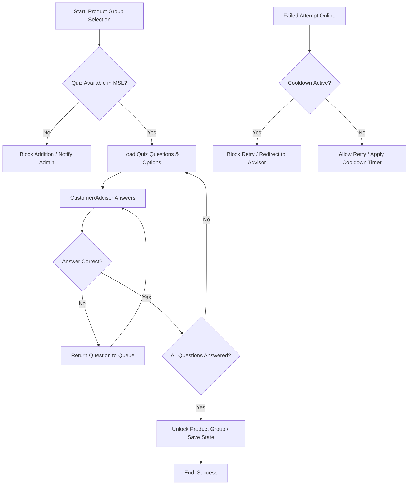

# Product Group Plausibility Quiz

Deep extraction of the audit-driven shift from checkbox acknowledgment to a mandatory interactive
plausibility quiz for every product group, in both the online and branch channels. Expands section
4.3 of [[knowledge]]. Applies across product groups (Equity, O&F, OTC), not only to AVD.

## 1. Scope

The organisation is responding to regulatory audit findings requiring a mandatory, interactive
plausibility check (quiz) for **all** product groups, not just complex ones. Previously advisors
could bypass verification with simple checkboxes. Both online customers and branch advisors must now
actively complete a system-driven quiz before a product group can be added to a portfolio.

A secondary, optional enhancement proposes a cooldown mechanism preventing online users from
repeatedly retrying failed quizzes within a short timeframe. Implementation is heavily
frontend-focused, relies on centralised content delivery from MSL, and requires careful sequencing
alongside technical debt remediation in the K&E-Personen module.

## 2. Business Context

Financial product distribution is subject to strict suitability and documentation obligations.
Internal and external audits identified that the plausibility verification process was too lax,
allowing procedural bypasses rather than substantive customer understanding checks.

To mitigate compliance risk and strengthen audit trails, the business must move from passive
acknowledgment (checkboxes) to active verification (interactive quizzes). This affects both digital
and branch channels, standardising the customer experience while increasing operational friction
that must be managed through clear UI/UX design and advisor training.

## 3. Key Concepts

| Concept | Business Definition |
|---------|---------------------|
| **Product group** | A categorised bundle of financial products requiring suitability verification before onboarding. |
| **Plausibility check / quiz** | An interactive, multi-question validation step ensuring the customer understands product characteristics and risks. |
| **MSL** | Master data/content system. Centralised repository providing standardised quiz questions and answer options to frontend systems. |
| **Cooldown mechanism** | A state-persistence feature temporarily blocking online retry attempts after a failed quiz, to prevent gaming. |
| **K&E-Personen module** | Core customer and portfolio management module currently carrying technical debt; requires refactoring before new features are safely integrated. |

## 4. Business Process

1. **Trigger:** customer or advisor initiates adding a product group to a portfolio/account.
2. **Content retrieval:** the system fetches quiz data (questions and answer options) from MSL.
3. **Execution:** online, the customer answers interactively; in branch, the advisor guides the
   customer through the system-based interaction, with no manual checkbox override allowed.
4. **Validation loop:** an incorrect answer returns the question to the queue for retry. All
   questions must be answered correctly.
5. **State transition:** on pass, the product group is unlocked and added to the portfolio and the
   success state is persisted. On fail with cooldown active (online), access is blocked for a defined
   period and the customer is directed to a branch advisor for assisted onboarding.
6. **Completion:** the process ends with either successful product addition, or a temporary block
   with advisory referral.

## 5. Business Rules

- **Mandatory coverage:** every product group must include a quiz, regardless of complexity tier.
- **No bypass allowed:** advisors cannot mark plausibility as complete without interactive
  completion.
- **Multi-question support:** product groups may contain multiple questions; all must be answered
  correctly before progression.
- **Retry logic:** incorrect answers loop back to the question queue until resolved.
- **Channel parity:** quiz execution is required in both the online and branch channels.
- **Cooldown policy (optional):** failed online attempts trigger a time-based block (e.g. 24h–7
  days) to prevent rapid retries; the duration may be configurable.

## 6. Decision Logic

## 7. Actors & Roles

| Actor | Role & Responsibilities |
|-------|-------------------------|
| **Customer** | Completes the quiz interactively; must demonstrate understanding before product addition. |
| **Branch advisor / expert** | Guides the customer through the system quiz; cannot bypass with manual overrides; ensures compliance documentation. |
| **System (frontend)** | Renders the quiz UI, manages answer validation, handles retry loops, enforces cooldown timers. |
| **MSL content team** | Provides standardised question/answer data per product group; responsible for content accuracy and delivery timing. |
| **Compliance / audit** | Defines plausibility requirements; validates that interactive checks replace procedural checkboxes. |

## 8. Important Objects

- **Product group:** parent entity requiring verification; owns quiz metadata.
- **Quiz instance:** runtime container holding active questions, answer states and completion status.
- **Question and answer option:** atomic validation units; stored centrally in MSL, consumed by the
  frontend.
- **Customer session / state record:** tracks attempt history, pass/fail outcomes and cooldown
  expiration timestamps.
- **Portfolio/account:** target entity receiving the product group on successful verification.

## 9. Inputs / Outputs

| Type | Description |
|------|-------------|
| **Inputs** | MSL quiz payload (questions + options), customer answers, session context, channel type (online/branch) |
| **Outputs** | Pass/fail state, product group unlock/block signal, audit log entry, cooldown timer activation, UI feedback messages |

## 10. Dependencies

- **MSL content delivery:** quiz data must be available and correctly structured before frontend
  implementation can proceed.
- **K&E-Personen refactoring:** high technical debt in the core module increases regression risk;
  refactoring is strongly recommended but may delay or run parallel to the quiz rollout.
- **Test automation suite:** Playwright/Selenium tests need updating to reflect interactive quiz
  flows instead of checkbox states.
- **Database/session storage:** required for cooldown persistence and attempt tracking, currently
  missing in the online flow.

## 11. Regulatory Aspects

- **Audit compliance:** a direct response to regulatory and internal audit findings on lax
  plausibility checks.
- **Suitability documentation:** interactive quizzes create verifiable evidence of customer
  understanding, aligning with MiFID II / KYC suitability obligations.
- **Channel standardisation:** eliminates the compliance gap between digital and branch channels
  where manual overrides were previously permitted.

## 12. Assumptions

| Assumption | Confidence | Rationale |
|------------|------------|-----------|
| MSL will deliver quiz data in a consistent, listable format automatically consumed by the frontend. | High | Discussed as the standard integration pattern; no custom mapping required if structured correctly. |
| ~40+ product groups exist across Equity, O&F and OTC categories. | Medium | Estimated from internal metrics; the exact count may vary but does not affect the architectural approach. **Consistent with the vault**: [[knowledge]] section 8 also records ~40+ product groups. |
| Cooldown duration (7 days vs 24h) is business-configurable rather than hardcoded. | High | Explicitly requested for flexibility; aligns with compliance risk management practice. |
| Refactoring K&E-Personen will not break existing quiz logic if done concurrently. | Medium | Developers acknowledge the complexity but believe modular refactoring can coexist with feature development. |

## 13. Missing Information

- Exact data schema/contract between MSL and the frontend for quiz payloads.
- Current state persistence architecture (session vs database) determining the cooldown
  implementation path.
- Regulatory mandate text specifying minimum plausibility standards or retention periods.
- Advisor training materials or process updates required for branch channel execution.
- Performance SLAs for quiz loading and rendering across 40+ product groups.

## 14. Risks

| Risk | Impact | Mitigation |
|------|--------|------------|
| **Technical debt regression** | High | Prioritise K&E-Personen refactoring; isolate quiz logic in modular components; extensive integration testing. |
| **MSL delivery delays** | Medium | Decouple frontend implementation from content availability; use mock data for development; establish an SLA with the MSL team. |
| **Customer friction / drop-off** | Medium | Optimise the quiz UX; provide clear guidance; allow branch fallback for failed attempts. |
| **Test suite breakage** | Low-Medium | Update Playwright/Selenium early; shift from checkbox assertions to interactive state validation. |
| **Cooldown bypass via session manipulation** | Medium | Store cooldown state server-side or in secure persistent storage; validate on every attempt. |

## 15. Open Questions

- What is the exact data contract and update frequency for MSL quiz content?
- Should cooldown be enforced per customer, per session, or per product group? ([[knowledge]] open
  question 4 asks the closely related question of whether the 7-day block is mandatory or
  configurable per product group/market; the vault answers neither.)
- How will failed attempts be logged for audit and compliance reporting?
- Will advisors receive system prompts or training aids to guide customers through quizzes?
- Is there a regulatory deadline for implementing the mandatory quiz across all channels?

## 16. Suggested Next Investigation Areas

1. **MSL integration specification:** review API contracts, payload structure and error handling for
   quiz data retrieval.
2. **State management architecture:** evaluate current session vs database persistence to design the
   cooldown implementation securely.
3. **Compliance documentation requirements:** clarify audit trail expectations (timestamps,
   IP/device logs, advisor signatures).
4. **UX/accessibility review:** assess the quiz flow for mobile/desktop parity and branch usability
   constraints.
5. **Refactoring impact analysis:** map K&E-Personen module boundaries to determine safe integration
   points for the new quiz logic.

## 17. Big Picture

A strategic shift from **procedural compliance** (checkboxes, manual overrides) to **substantive
verification** (interactive, auditable customer understanding checks). It touches the core product
onboarding workflow, requiring coordinated changes across frontend UI, content management (MSL),
state persistence and testing infrastructure.

Though technically frontend-heavy, the business impact is significant: it strengthens the regulatory
posture, standardises cross-channel execution, and introduces new state-dependent behaviours
(cooldowns) that influence customer journeys and advisor workflows. Successful delivery depends on
disciplined sequencing with the K&E-Personen refactoring, robust MSL integration, and clear
compliance documentation practice. The optional cooldown feature, while lower priority, addresses a
real vulnerability in the current online flow where rapid retries could undermine the plausibility
check's integrity.

## See also

- [[knowledge]] — the AVD summary report this note expands (section 4.3)
- [[recommendation-compliance-orchestration]] — market knowledge capture and the signature trigger
- [[mifid-wphg-banking-notes]] — the generic MiFID II suitability obligations behind the audit finding

---
*Reconstructed from a development discussion transcript. Assumptions and confidence levels are
recorded above as the source stated them; not yet validated against official documentation.*
