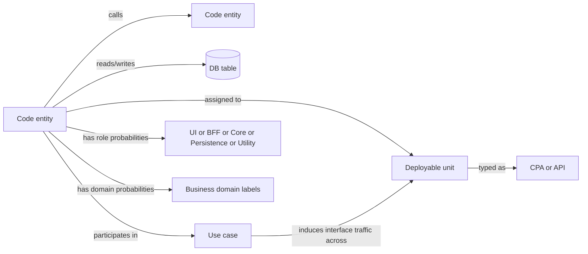
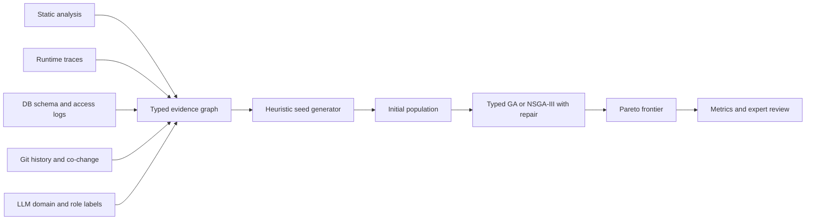

# Genetic Algorithms for Automated Monolith Decomposition into Frontend and Back-End Applications and API Services

## Executive summary

Automated monolith decomposition is a hard combinatorial design problem rather than a simple clustering exercise. The search space grows exponentially with the number of code entities, and the field still lacks universally accepted datasets, metrics, and fully integrated toolchains. Recent reviews and independent comparisons show clear progress, but also strong fragmentation: most approaches optimise only a subset of the problem, usually on Java back-end monoliths, with inconsistent benchmarks and uneven reproducibility. citeturn4search9turn10view0turn8view0

A genetic algorithm is a defensible core optimiser for this problem because the target architecture must satisfy multiple interacting goals at once: high cohesion, low coupling, bounded-context purity, data ownership, sensible service size, limited inter-service chatter, and client-specific front-end/back-end constraints. The literature already contains successful evolutionary formulations for legacy-to-microservice extraction, including NSGA-II and indicator-based evolutionary search, and a recent NSGA-III formulation specifically emphasises database-aware decomposition. citeturn13view0turn24search0turn12search0

However, the research evidence also suggests that a GA should not be used alone. Stronger results are obtained when structural evidence is combined with runtime traces, semantic information, and database dependencies; recent work adds AI-guided dependency analysis, reinforcement learning, and LLM-derived embeddings to improve boundary quality. A publishable contribution is therefore most likely to come from a **typed, multi-objective GA** that operates on a **heterogeneous dependency graph**, uses **LLM-assisted semantic labels** to estimate business-domain purity and architectural role, and starts from **heuristically strong initial populations** rather than from pure randomness. citeturn23view0turn26view0turn14view0turn2search0

For the specific target in this report, the most important novelty is to model **two deployment-unit families explicitly**:  
**content-provider applications**, which contain a front-end plus client-specific back-end orchestration or BFF logic; and **API services**, which expose reusable back-end capabilities. This is not how most current decomposition tools are framed. That gap is visible in the literature and benchmark culture: most evaluated tools work at the class or method level on back-end Java systems, while BFF and micro-frontend guidance comes mainly from architecture practice rather than automated-decomposition papers. This conclusion is partly an inference from the evidence base and should be stated as such in any paper. citeturn9view0turn9view1turn27view0turn27view3

The strongest research design is therefore:  
a typed heterogeneous graph, a constrained GA or NSGA-III optimiser, LLM-based domain and role probabilities, heuristic seeding from bounded contexts and use-case traces, and evaluation against both algorithmic baselines and reference decompositions where available. The paper should emphasise not only architectural quality metrics, but also **front-end/back-end correctness, database ownership discipline, API stability risk, and expert acceptability**. citeturn12search0turn27view1turn27view2turn19search0

## Problem statement and scope

The problem can be defined as follows. Given a monolithic system with code entities, runtime interactions, database accesses, change history, and semantic descriptions, find a partition of the system into deployable units such that each unit is coherent, loosely coupled to others, aligned to business boundaries, and feasible to operate. In a microservice setting, current guidance consistently stresses bounded contexts, single business capability, private data ownership, and avoidance of chatty or tightly coupled service interactions. citeturn28view0turn27view1turn27view2

For this report, the target architecture is broader than “plain microservices”. It contains two unit types:

- **Content-provider applications**: front-end assets plus client-specific back-end logic, typically following a BFF-style pattern.
- **API services**: reusable back-end services exposing business capabilities and owning their data.

This distinction is architecturally well-motivated. Azure’s BFF guidance recommends separate client-specific back-end layers when multiple interfaces have materially different requirements, and Fowler’s micro-frontends framing treats front-end decomposition as an independently deployable concern aligned to team and business domains. At the same time, domain guidance warns against mixing multiple bounded contexts or leaking core domain logic into inappropriate client-facing layers. citeturn27view0turn27view3turn27view1turn18search0

A practical formalisation is a typed graph or hypergraph:

\[
M = (V, E, R, D, U, T)
\]

where \(V\) is the set of software entities, \(E\) the dependency edges, \(R\) architectural-role metadata, \(D\) business-domain semantics, \(U\) use cases or user journeys, and \(T\) database tables or logical entities. A candidate decomposition is a partition

\[
\Pi = \{S_1,\dots,S_K\}
\]

with a type mapping

\[
\tau(S_k) \in \{\text{CPA}, \text{API}\}
\]

where CPA denotes a content-provider application and API denotes an API service. Some formulations can also include optional duplication or read-replica decisions for carefully restricted edge components, but core business logic should remain singly owned. That last point is especially important because the database-per-service and bounded-context literature emphasise service ownership and encapsulation, even though recent overlapping-clustering work argues that selective duplication of some components may sometimes improve decomposition quality. citeturn27view2turn28view0turn20search7

The central research scope should be stated narrowly and honestly. Most current automated methods optimise **back-end service boundaries**; they do not directly solve the typed FE/BFF/API decomposition problem. The independent ASE comparison found that the evaluated tools mostly operate on class- or method-level Java artefacts and optimise goals such as code modularity, business-use-case purity, database transaction purity, or team independence. Extending that landscape to explicitly typed front-end/application/API extraction is therefore a credible and non-trivial research contribution. citeturn9view0turn8view0



## Candidate-solution formalisation and chromosome design

A good chromosome for this task must represent three things simultaneously: entity grouping, deployable-unit type, and architecture-specific repair logic. The literature offers useful precedents. Software clustering and modularisation work established assignment-based encodings and modularity objectives long ago; monolith-decomposition work then adapted them to microservices, first with graph clustering, then with multi-objective evolutionary search. citeturn22search7turn13view0turn24search0

The two most defensible chromosome families are shown below.

| Chromosome design | Encoding | Strengths | Weaknesses | Best-suited operators |
|---|---|---|---|---|
| **Typed assignment vector** | One gene per entity \(v_i\), storing service id \(g_i\); one gene per service storing type \(\tau \in \{\text{CPA}, \text{API}\}\); optional genes for DB owner or replication flags | Simple, scalable, easy to repair, easy to align with most baselines and evaluation metrics; works naturally with class- or method-level entities | Suffers from label permutation during crossover; can fragment domains if crossover is naive | Label-aligned uniform crossover, domain-block crossover, move mutation, split/merge mutation, type-flip with repair |
| **Edge-cut or community chromosome** | Genes encode which dependency edges are cut, or indirectly encode communities in the graph | Preserves graph structure; natural for call-graph and co-change evidence; close to community-detection baselines | Harder to enforce typed FE/BFF/API constraints and DB-ownership rules directly; repair can be expensive | Cut-set crossover, local edge-toggle mutation, SCC repair, data-ownership repair |
| **Hybrid decoder chromosome** | Genome stores seed centres, cluster prototypes, or domain anchors; a decoder assigns entities by multi-evidence similarity and type constraints | Useful when strong priors exist from bounded contexts, traces, or LLM labels; often produces better initial feasibility | More complex and less transparent; decoder quality can dominate results | Prototype crossover, anchor swap mutation, decoder-guided local search |

**Sources and rationale:** assignment-based modularisation has long roots in software clustering research, while modern extraction papers use class- and method-level grouping informed by structure, runtime, semantics, and evolution. Evolutionary microservice extraction papers use class grouping directly, and recent work explores the limits of hard clustering and the value of overlapping assignments. citeturn22search7turn13view0turn24search0turn20search7

For the user’s target architecture, the **typed assignment vector** is the safest primary design. It supports explicit architectural rules:

\[
\pi(v_i) = S_k,\qquad \tau(S_k)\in\{\text{CPA},\text{API}\}
\]

with role-aware admissibility constraints such as:

\[
r(v_i)=\text{UI} \Rightarrow \tau(\pi(v_i))=\text{CPA}
\]

and

\[
r(v_i)\in\{\text{Core},\text{Persistence}\} \Rightarrow \tau(\pi(v_i))=\text{API}
\]

unless an explicit whitelist allows client-specific orchestration. This fits BFF guidance, bounded-context guidance, and database-per-service discipline. citeturn27view0turn27view1turn27view2

The most useful mutation operators are architecture-aware rather than purely random:

- **Move mutation**: move one entity to another existing unit.
- **Swap mutation**: exchange entities across units when domain purity or size balance is poor.
- **Split mutation**: split an oversized or impure unit along weak internal cuts.
- **Merge mutation**: merge two highly chatty or semantically close units.
- **Type mutation**: flip a unit from CPA to API or vice versa, followed by repair.
- **DB-owner mutation**: reassign the ownership of a contested table to the dominant writer unit.
- **Trace-coherent mutation**: move a small set of entities that co-occur strongly in one user journey.
- **Bridge-duplication mutation**: only for whitelisted adapter or DTO-like entities, create a duplicated wrapper if it reduces cross-unit chatter without violating data or domain ownership.

Similarly, the most effective crossover operators should preserve architecture structure. A good default is **label-aligned domain-block crossover**: first align parent service labels by maximum overlap, then exchange whole domain-consistent blocks rather than random genes. This reduces destructive recombination, a known problem in grouping problems. That recommendation is consistent with both classic software modularisation experience and more recent decomposition work. citeturn22search11turn13view0turn24search0

## Fitness function and data inputs

The literature converges on an important lesson: no single signal is enough. Surveys and comparisons repeatedly distinguish static code structure, dynamic traces, database relations, linguistic or semantic similarity, and version-history information. Hybrid methods tend to outperform one-source approaches when they are implemented carefully, because static analysis offers broader coverage while dynamic analysis better reflects real interactions. citeturn10view0turn8view0turn23view0

A strong approach is to fuse evidence into a normalised weighted affinity matrix:

\[
w_{ij}=\alpha_s \bar{s}_{ij}+\alpha_t \bar{t}_{ij}+\alpha_d \bar{d}_{ij}+\alpha_c \bar{c}_{ij}+\alpha_m \bar{m}_{ij},
\qquad \sum \alpha = 1
\]

where \(\bar{s}\) is static structural affinity, \(\bar{t}\) runtime-trace affinity, \(\bar{d}\) database affinity, \(\bar{c}\) co-change affinity, and \(\bar{m}\) semantic or LLM affinity. The exact \(\alpha\) weights can either be fixed by scenario or tuned in an outer loop. This generalised fusion is strongly supported by the hybrid and AI-guided literature, even though exact formulations differ across papers. citeturn23view0turn26view0turn2search0

The proposed objective terms below are suitable for either a weighted single score or a many-objective GA.

| Fitness term | Proposed formula sketch | Interpretation | Typical inputs |
|---|---|---|---|
| **Cohesion** | \(\displaystyle Coh(\Pi)=\frac{1}{K}\sum_{s}\frac{\sum_{i<j:\pi(i)=\pi(j)=s} w_{ij}}{\binom{|s|}{2}+\epsilon}\) | Rewards dense internal relation strength | Static calls, traces, semantics, co-change |
| **Coupling** | \(\displaystyle Coup(\Pi)=\frac{\sum_{i<j:\pi(i)\neq\pi(j)} w_{ij}}{\sum_{i<j} w_{ij}+\epsilon}\) | Penalises cross-unit dependence | Same as above |
| **Domain purity** | \(\displaystyle Pur(\Pi)=\frac{1}{K}\sum_s\left(1-\frac{H(P_s)}{\log |D|}\right)\), where \(P_s(d)\) is the aggregated domain-label distribution for service \(s\) | Rewards bounded-context consistency and penalises mixing unrelated business concepts | LLM labels, package names, comments, use-case text |
| **Frontend/back-end correctness** | \(\displaystyle FB(\Pi)=1-\lambda_{ui}V_{ui}-\lambda_{bff}V_{bff}-\lambda_{core}V_{core}\), with \(V\)-terms counting invalid placements by role | Enforces that UI and BFF code stay in CPAs, and core/domain/persistence code generally stays in APIs | Architectural-role labels, UI routes, controller mapping |
| **Database ownership** | \(\displaystyle DB(\Pi)=1-aV_{multiwrite}-bV_{multiowner}-cV_{tx}\), where \(V_{multiwrite}\) counts tables written by multiple units and \(V_{tx}\) counts multi-unit transactional write flows | Rewards database-per-service discipline and discourages distributed transactions | ORM metadata, SQL logs, runtime traces |
| **Size balance** | \(\displaystyle Size(\Pi)=\frac{1}{K}\sum_s \max\left(0,1-\frac{\left||s|-\mu_{\tau(s)}\right|}{\delta_{\tau(s)}+\epsilon}\right)\) | Discourages units that are too tiny or too large for their type | Entity counts, service-type targets |
| **API stability proxy** | \(\displaystyle API(\Pi)=1-\frac{\sum_{e\in A_{pub}} cons(e)\cdot vol(e)}{\sum_{e\in A_{pub}} cons(e)+\epsilon}\) | Prefers stable public interfaces and reduces exposure of historically volatile components | Endpoint maps, consumer traces, commit history |
| **Penalty bundle** | \(\displaystyle Pen(\Pi)=\rho_1 Cycles+\rho_2 ForbiddenMix+\rho_3 Orphans+\rho_4 KDrift\) | Encodes hard constraints and invalid architectures | Dependency graph, type rules, target \(K\) |

**Theoretical grounding:** cohesion, coupling, bounded-context alignment, database ownership, and anti-chattiness are repeatedly emphasised in architecture guidance and decomposition work; recent practice studies also show that API evolution is burdened by backward-compatibility concerns, change-impact effort, and consumer lock-in. citeturn27view1turn28view0turn27view2turn19search0turn19search6

A scalar fitness can then be written as:

\[
F(\Pi)=
\omega_1 \widetilde{Coh}
+\omega_2 (1-\widetilde{Coup})
+\omega_3 \widetilde{Pur}
+\omega_4 \widetilde{FB}
+\omega_5 \widetilde{DB}
+\omega_6 \widetilde{Size}
+\omega_7 \widetilde{API}
-\widetilde{Pen}
\]

Alternatively, and preferably for a publishable paper, one can use a **many-objective formulation**:

\[
\max \{Coh, Pur, FB, DB, Size, API\}, \qquad \min \{Coup, Pen\}
\]

and let NSGA-II or NSGA-III yield a Pareto frontier. This is better aligned with the literature when the objectives are not naturally commensurate. Recent work already uses NSGA-II, IBEA, and NSGA-III for microservice extraction. citeturn13view0turn24search0turn12search0

Weighting should be handled explicitly, not hand-waved. Three defensible strategies are:

| Weighting strategy | Use case | Recommendation |
|---|---|---|
| **Scenario profiles** | When stakeholders care about different outcomes in different settings | Predefine profiles such as domain-first, operations-first, and UX-first |
| **AHP or SMART elicitation** | When expert architects can compare trade-offs | Use pairwise weighting on a pilot system, then freeze weights before the main experiment |
| **Adaptive schedule** | When feasibility is initially more important than fine optimisation | Start with heavier penalty weights and lighter purity terms; gradually rebalance after feasible solutions appear |

Normalisation should keep every term in \([0,1]\). Use theoretical bounds where they exist; otherwise use robust percentile scaling from a large random or heuristic warm-up sample:

\[
\widetilde{f}(x)=\text{clip}\left(\frac{f(x)-q_{05}}{q_{95}-q_{05}},0,1\right)
\]

This avoids domination by raw-count metrics and makes cross-system comparison more stable. Many-objective optimisation work on NSGA-III also underscores the importance of good objective-space normalisation. citeturn12search10turn12search5

The necessary input evidence is summarised below.

| Input source | What it contributes | Preprocessing essentials | Common failure mode |
|---|---|---|---|
| **Static call/dependency graph** | Coverage of structural relations, inheritance, package structure, variable or CRUD dependencies | Remove generated/vendor code; collapse utility noise; produce typed edges | Framework reflection and indirect calls can be missed |
| **Runtime traces or use-case executions** | Behaviourally realistic interaction patterns and user-journey boundaries | Instrument representative flows; aggregate by use case; de-noise startup calls | Incomplete coverage and test bias |
| **Database access and schema data** | Table ownership, read/write contention, transaction boundaries, foreign-key communities | Extract ORM mappings and SQL logs; distinguish read vs write | ORMs may obscure actual SQL and ownership |
| **Package names, comments, identifiers** | Lexical domain hints and semantic features | Split identifiers, lemmatise, remove framework stop-words | Naming quality varies sharply across systems |
| **Commit history and co-change** | Independent-evolution evidence and volatility | Filter mass-formatting and dependency-update commits; compute co-change windows | Historical accidents can encode bad architecture |
| **LLM semantic labels and embeddings** | Probabilistic business-domain labels and architectural roles such as UI, BFF, core, persistence, utility | Prompt with code plus nearby context; calibrate confidence; store probability vectors not hard labels | Hallucinated labels if prompts or context are weak |

**Evidence basis:** modern tool comparisons categorise decomposition signals into code structure, use-case similarity, linguistic similarity, data access, and code evolution; surveys also distinguish static, dynamic, model-based, and version-based evidence. Hybrid approaches and recent LLM-based work directly support this fused-evidence design. citeturn8view0turn10view0turn23view0turn2search0



## Baselines and literature review

The baseline set should be deliberately heterogeneous, because the strongest paper is not “GA versus one clustering method”; it is “GA versus the main families of decomposition search”. Surveys and comparisons show that decomposition tools in the literature mix clustering, graph partitioning, rule-based procedures, optimisation, and more recent AI methods. citeturn10view0turn8view0

| Baseline family | Representative form | Strengths | Weaknesses |
|---|---|---|---|
| **Random search** | Random valid partitions under the same \(K\) and type constraints | Essential minimum-information baseline; shows how much structure the optimiser actually exploits | Inefficient in exponential spaces; usually far from feasible high-quality architectures |
| **Greedy agglomerative or hierarchical clustering** | Merge-by-affinity until \(K\) groups or a stopping threshold | Fast, strong for local structure, easy to explain | Early erroneous merges are hard to undo |
| **Spectral graph partitioning** | Laplacian-based partitioning of the fused graph | Strong global graph signal, good for smooth partitions | Hard to encode rich hard constraints and service typing directly |
| **Community detection** | Louvain, Leiden, Girvan–Newman, Chinese Whispers | Scales well and often works well on modular graphs | Assumes graph communities correspond to deployable services; usually weak on type rules and DB ownership |
| **ILP or MILP** | Exact or bounded optimisation with structural and data constraints | Excellent when the formulation is trustworthy and the system is moderate in size; naturally handles hard constraints | Scalability becomes problematic; model engineering effort is high |
| **Simulated annealing** | Local-search metaheuristic with controlled uphill moves | Good optimisation baseline with simpler dynamics than a GA | Often sensitive to neighbourhood design and cooling schedule; weaker diversity than population-based search |

**Evidence basis:** community-detection and clustering methods underpin Service Cutter and several later approaches; spectral-clustering methods have recently been proposed for industrial legacy systems; MILP is central to Cromlech; simulated annealing remains a standard local-search reference class. citeturn1search8turn3search4turn29search3turn5view0turn3search21

The key academic and industry works most relevant to a publishable paper are summarised below.

| Work | Context and focus | Boundary and evidence | Main method and reported result | Main limitation |
|---|---|---|---|---|
| **Service Cutter** (Gysel et al., 2016) citeturn1search8 | Structured service decomposition support | Uses domain specifications and 16 coupling criteria | Graph representation plus clustering to suggest service cuts | Requires rich modelling input and is not a full code-driven automation pipeline |
| **Mazlami, Cito, Leitner** (2017) citeturn20search11turn5view0 | Early automated extraction from monoliths | Repository analysis, structural plus developer-contribution evidence | Graph-based extraction of candidate microservices | Limited direct support for front-end concerns and operational constraints |
| **Jin et al.** FoSCI, ICWS 2018 / TSE 2021 citeturn16search2turn16search3 | Functionality-oriented extraction from behaviour | Execution traces and use-case evidence | Trace clustering plus search-based grouping; includes evaluation suite using structure, concepts, and commits | Requires good trace collection and representative scenarios |
| **Taibi and Systa process-mining line** citeturn1search2turn1search10 | Runtime-driven microservice discovery | Log files and process-mining evidence | Suggests candidate slicing alternatives from runtime behaviour | Usually still requires significant human validation |
| **Mono2Micro** (IBM, 2021) citeturn17view0turn9view0 | Industrially motivated practical decomposition | Business-use-case traces plus runtime call relations | Hierarchical decomposition with strong practitioner focus; reported to outperform several baselines on selected metrics and to be useful in practice | Depends heavily on business-use-case traces and is still mainly back-end oriented |
| **MSExtractor with NSGA-II** (Saidani et al., 2019) citeturn13view0 | First strong evolutionary-search formulation | Structural source-code dependencies | Multi-objective search for cohesive, loosely coupled, coarse-grained services; outperformed three baselines on two systems | Limited evidence types and no explicit FE/BFF/API typing |
| **MSExtractor with IBEA** (Sellami et al., 2022) citeturn24search0turn24search1 | Improved evolutionary extraction | Structural and semantic dependencies | Indicator-based evolutionary algorithm for cohesive, loosely coupled, coarse-grained services | Still primarily back-end class grouping |
| **Hybrid static plus dynamic decomposition** (Sellami et al., 2022) citeturn23view0 | Evidence fusion | Static code plus runtime traces plus user input | Hybrid clustering improved coverage while keeping quality comparable or better than separate approaches | Coverage and tuning depend on good instrumentation and preprocessing |
| **CARGO** (ASE 2022) citeturn26view0 | AI-guided partition refinement | Context- and flow-sensitive static analysis with external-resource awareness | Unsupervised or seeded semi-supervised refinement; improved four partitioning techniques and reduced distributed DB transactions; reported latency and throughput gains on DayTrader | Primarily refinement of existing partitions rather than typed end-to-end search |
| **Cromlech** (2024) citeturn5view0 | Semi-automatic decomposition as optimisation | Operations and data entities in a YAML model | MILP balancing organisational and operational concerns; outperformed heuristics and selected alternatives in evaluation | Requires a high-level model rather than raw code alone |
| **RLDec** (2025) citeturn14view0 | Deep reinforcement learning for decomposition | Structural and semantic analysis of monoliths | Formulates recommendation as an MDP and uses quality metrics as reward | RL complexity, reward design, and reproducibility remain challenging |
| **MonoEmbed** (2026) citeturn2search0turn2search14 | LLM-augmented decomposition | LLM representations plus representation learning | Clusters monolithic components using LLM-derived embeddings, with contrastive learning and LoRA variants | Semantic representations are promising, but architecture constraints still need explicit handling |
| **ASE independent tool comparison** (Wang, Bornais, Rubin, 2024) citeturn8view0turn9view0turn9view1 | Cross-tool benchmark and critique | Four benchmark applications, eight tools, unified metrics | Identified strengths/weaknesses across tools; argued for differential treatment of element types, better granularity control, duplication decisions, and developer-in-the-loop workflows | Comparison is still mostly on Java back-end systems |
| **Systematic review** (Abgaz et al., TSE 2023) citeturn10view0 | Field-level synthesis | 35 studies across input, analysis, identification, optimisation, evaluation phases | Concluded the area is still early-stage, with missing integrations, benchmarks, metrics, and tool support | Review horizon predates the newest LLM-heavy work |

Industry guidance matters here because the research problem is architectural, not just algorithmic. Fowler’s bounded-context and micro-frontends guidance, Microsoft’s BFF and microservice-boundary guidance, and Richardson’s database-per-service pattern are especially relevant because they define the “correctness conditions” your optimiser should satisfy. citeturn18search0turn27view3turn27view0turn27view1turn27view2

## Proposed GA and LLM-assisted approach

The most promising contribution is a **typed, constraint-aware, many-objective genetic algorithm** that integrates **LLM-assisted semantic labelling** and **heuristic initialisation**.

The core idea is simple. Instead of asking the GA to discover architecture from scratch, use the LLM to provide **probability distributions**, not hard answers. For each entity, infer:

- business-domain probabilities, such as Customer, Order, Weather, Billing;
- architectural-role probabilities, such as UI, BFF, core domain, persistence, utility;
- optional explanations or evidence snippets for later interpretability.

This is more robust than asking the LLM for final service boundaries directly. Recent decomposition work using LLM representations suggests semantic signals are useful, while architecture-mapping work shows LLM vectors can outperform more traditional text-based approaches. But the literature does not yet remove the need for explicit structural and architectural constraints; those still need to be handled in the optimiser. citeturn2search0turn2search5

A rigorous pipeline would therefore be:

1. Build a typed heterogeneous graph from static analysis, traces, DB access, co-change, and language features.
2. Run LLM-assisted labelling to obtain domain and role probability vectors.
3. Generate a strong initial population from multiple seeders:
   - package and bounded-context heuristics,
   - use-case trace clusters,
   - DB ownership communities,
   - community detection partitions,
   - one or two exact or near-exact seeds from MILP on a reduced graph,
   - a smaller portion of random valid individuals for diversity.
4. Optimise with NSGA-III or constrained NSGA-II using typed crossover, role-aware mutation, and repair.
5. Explain the resulting Pareto frontier by decomposing each solution into fitness contributions and top evidence edges.

This combines the strengths of Mono2Micro-like use-case guidance, CARGO-like refinement of structural evidence, modern hybrid analysis, and MonoEmbed-like semantics, while directly modelling the typed architectural target that current tools generally leave implicit. citeturn17view0turn26view0turn23view0turn2search0

The heuristic initialisation deserves special emphasis. Purely random initial populations are useful as a baseline but are not a good default in publishable architecture search. A better population mix is:

- **40% structural seeds** from graph clustering or spectral partitioning,
- **20% runtime/use-case seeds**,
- **15% DB-centred seeds**,
- **15% semantic seeds** from LLM/domain similarity,
- **10% random valid partitions**.

These percentages are recommendations rather than facts of record, but the design principle is well supported by the literature: decomposition quality improves when multiple sources are combined, and the independent comparison stresses that element types and decomposition principles should be customised per application. citeturn23view0turn8view0

The following operator set is likely to be the differentiator in the paper:

| Operator | Architecture-specific behaviour | Why it matters |
|---|---|---|
| **Role-safe crossover** | Exchanges only blocks that do not place UI into API services or core persistence into CPAs | Maintains feasibility |
| **Domain-preserving crossover** | Cuts along high-confidence domain boundaries rather than arbitrary gene positions | Protects business purity |
| **Trace-coherent mutation** | Moves small connected components that strongly co-occur in a use case | Preserves behavioural integrity |
| **DB-ownership repair** | Reassigns multi-writer tables to a dominant owner and reroutes dependent components | Prevents distributed monolith outcomes |
| **Unit split/merge mutation** | Splits impure or oversized units; merges overly chatty pairs | Encodes architectural judgement directly |
| **Public-interface volatility repair** | Moves historically volatile code out of public API surfaces when possible | Improves API stability proxies |

This “typed repair” idea is especially important because recent practice studies on API evolution show that backward compatibility, coordination effort, change-impact analysis, and consumer lock-in are major challenges once a boundary becomes public. A decomposition that exposes volatile implementation clusters as public service interfaces is therefore architecturally risky, even if it looks good on cohesion alone. citeturn19search0turn19search6

## Experimental design, implementation, and artefacts

A publishable evaluation should cover both **recovery** and **brownfield** settings.

Recovery benchmarks are systems where a monolithic version and a reference microservice version both exist, allowing similarity-to-reference evaluation. The recent independent tool comparison used JPetStore, Spring-PetClinic, PartsUnlimitedMRP, and 7ep-demo, and recent RLDec work lists additional benchmark subjects such as DayTrader, AcmeAir, JForum, Roller, and SocialSoftware variants. These recent studies also confirm how difficult it is to find benchmark systems satisfying all tool input requirements. citeturn9view1turn14view0turn8view0

A strong experimental portfolio would therefore have two tracks:

| Track | Dataset idea | Main purpose |
|---|---|---|
| **Recovery track** | JPetStore, Spring-PetClinic, DayTrader, AcmeAir, Plants, or equivalents with known reference service boundaries | Compare against reference decompositions using similarity and architectural metrics |
| **Brownfield realism track** | 7ep-demo, PartsUnlimitedMRP, JForum, Roller, or an industrial case if available | Evaluate architectural quality, front-end/back-end correctness, and expert acceptability where no perfect ground truth exists |

The evaluation metric suite should mix internal quality, external similarity, and practical architecture checks:

| Metric family | Recommended metrics |
|---|---|
| **Architecture quality** | Cohesion, coupling, Structural Modularity, Inter-Partition Communication, Interface Number, Non-Extreme Distribution |
| **Domain correctness** | Domain purity entropy, use-case separation, forbidden-domain co-location count |
| **Typed correctness** | UI-in-API violations, core-in-CPA violations, BFF mismatch rate |
| **Data correctness** | Shared-write tables, distributed transaction flows, DB owner conflicts |
| **Reference similarity** | MoJoFM, NMI, ARI, service-count deviation |
| **Practicality** | Expert ranking, pairwise preference, rationale quality, number of edits needed to reach acceptance |

**Metric sourcing:** recent comparative work uses Structural Modularity, Interface Number, Inter-Partition Communication, and Non-Extreme Distribution; classic software-clustering work supports MoJoFM for similarity to a reference decomposition. citeturn15search15turn22search4

Ablation studies should be mandatory. The following are the highest value:

| Ablation | What it tests |
|---|---|
| **No LLM labels** | Whether semantic probabilities add value beyond static names and traces |
| **Random only initialisation** | Whether heuristic seeding materially improves search |
| **No trace evidence** | Contribution of behavioural information |
| **No commit-history evidence** | Contribution of co-change and volatility |
| **No DB term** | Whether database ownership discipline materially changes solutions |
| **Untyped GA** | Value of explicitly modelling CPA versus API |
| **No repair operators** | Value of architecture-aware feasibility handling |
| **Scalar GA versus many-objective GA** | Whether Pareto search materially improves trade-off quality |

The evaluation protocol should keep computational budgets fair. A strong default is **30 independent runs per stochastic method per system**, fixed evaluation budgets rather than fixed time alone, and a clean separation between **tuning systems** and **final test systems**. Recent empirical comparison practice in algorithm evaluation strongly supports non-parametric statistical tests such as the Wilcoxon signed-rank test for paired two-method comparisons and Friedman plus post-hoc testing for multiple methods across datasets. Effect sizes should always accompany p-values. citeturn25search0turn25search12turn25search2

Implementation-wise, a practical starting point is:

| Component | Recommendation |
|---|---|
| **Language and parsers** | Start with Java because the literature and benchmarks are heavily Java-centric; support class- and method-level modes |
| **Graph representation** | Typed weighted graph in Parquet or Arrow plus a graph library for fast neighbourhood updates |
| **GA engine** | NSGA-II for fewer objectives; NSGA-III when keeping many objectives explicit |
| **LLM subsystem** | Small code model or API model for embeddings and labels, with confidence thresholds and audit sampling |
| **Runtime data** | Use tests or manual user-journey recordings to define trace buckets |
| **Baselines** | Implement at least random, greedy agglomerative, Louvain/Leiden, spectral clustering, MILP on reduced instances, and simulated annealing |
| **Reproducibility** | Containerise the full pipeline, freeze seeds, log every configuration, and publish all intermediate extracted artefacts |

A sensible starting GA configuration for a medium-sized system is: population 100–300, crossover probability 0.7–0.9, mutation probability 0.05–0.20 at the gene level with additional split/merge events at lower frequency, elitism 2–10%, and termination on either a fixed evaluation budget or a patience criterion on Pareto hypervolume. These are proposed defaults, not field standards, and should be tuned on pilot systems before the main study.

Because no concrete dataset was provided, the artefact bundle below should be treated as the **recommended reproducibility package specification** for the paper:

```text
ga-llm-monolith-decomposition-repro-pack.zip
├── README.md
├── LICENSE
├── CITATION.cff
├── environment/
│   ├── conda.yml
│   ├── poetry.lock
│   └── Dockerfile
├── data/
│   ├── raw/
│   │   ├── source_snapshots/
│   │   ├── db_schema/
│   │   ├── traces/
│   │   └── git_logs/
│   ├── processed/
│   │   ├── static_graph.parquet
│   │   ├── runtime_graph.parquet
│   │   ├── db_access.parquet
│   │   ├── cochange_graph.parquet
│   │   └── labels_embeddings.parquet
│   └── benchmark_metadata.csv
├── configs/
│   ├── objective_profiles/
│   ├── baseline_configs/
│   └── dataset_configs/
├── src/
│   ├── extraction/
│   ├── preprocessing/
│   ├── llm_labelling/
│   ├── ga/
│   ├── baselines/
│   ├── evaluation/
│   └── visualisation/
├── notebooks/
│   ├── exploratory_analysis.ipynb
│   ├── fitness_sanity_checks.ipynb
│   ├── ablation_tables.ipynb
│   └── statistical_tests.ipynb
├── results/
│   ├── per_run_metrics.csv
│   ├── pareto_fronts/
│   ├── selected_architectures/
│   ├── significance_tests/
│   └── figures/
└── docs/
    ├── metric_definitions.md
    ├── prompt_templates.md
    ├── benchmark_selection.md
    └── threats_to_validity.md
```

The minimum open-source artefacts to publish are the full pipeline code, processed benchmark graphs, trace-generation instructions, prompt templates for semantic labelling, baseline implementations or wrappers, all raw run logs, all statistical notebooks, and the final architecture visualisations. The 2024 independent tool comparison explicitly argues that reproducibility has been a serious practical issue because many tools are not easy to run, not fully public, or require extensive manual configuration. citeturn9view4turn8view0

The most important sources to prioritise in a paper review or thesis chapter are these:

1. **Abgaz et al., “Decomposition of Monolith Applications Into Microservices Architectures: A Systematic Review”** for the field map and research gaps. citeturn10view0  
2. **Wang, Bornais, Rubin, “Microservice Decomposition Techniques: An Independent Tool Comparison”** for benchmark culture, common metrics, and current tool weaknesses. citeturn8view0turn9view0turn9view1  
3. **Gysel et al., “Service Cutter”** for structured service-decomposition criteria. citeturn1search8  
4. **Kalia et al., “Mono2Micro”** for industrially grounded use-case-aware decomposition. citeturn17view0  
5. **Saidani et al., “Towards Automated Microservices Extraction Using Multi-objective Evolutionary Search”** and **Sellami et al., “Improving microservices extraction using evolutionary search”** for the evolutionary baseline literature. citeturn13view0turn24search0  
6. **Cromlech** for MILP-based optimisation with operational concerns and replication trade-offs. citeturn5view0  
7. **RLDec** and **MonoEmbed** for the current AI frontier in decomposition. citeturn14view0turn2search0  
8. **Azure boundary/BFF guidance, Fowler bounded context and micro-frontends, Richardson database-per-service** for the architecture rules that justify the typed decomposition formulation in this report. citeturn27view0turn27view1turn27view2turn27view3turn18search0

**Open questions and limitations.** The biggest unresolved issue is not whether GAs can optimise partitions; it is whether the field has enough high-quality, typed, front-end-aware benchmarks to evaluate such an optimiser convincingly. Current evidence remains dominated by Java back-end systems, and much of the front-end/BFF guidance comes from architecture practice rather than automated-decomposition experiments. For that reason, any paper based on this proposal should explicitly frame typed FE/BFF/API decomposition as an extension to the current state of the art, not as a fully benchmarked problem already solved by the literature. citeturn8view0turn9view1turn27view0turn27view3