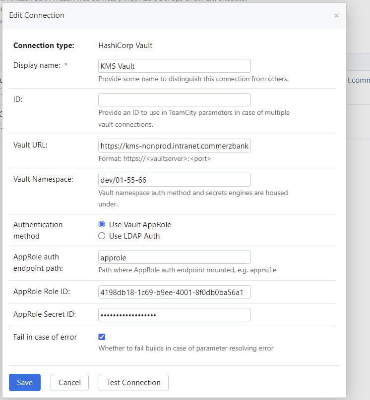
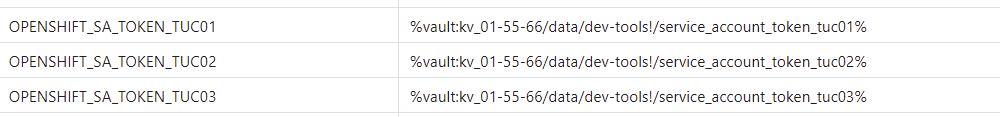

To use **connections** in TeamCity for integrating with **HashiCorp Vault**, follow these steps:

---

### **Step 1: Configure a HashiCorp Vault Connection in TeamCity**
1. **Navigate to Administration**:
   - Go to **Administration > Connections > Add Connection**.

2. **Select HashiCorp Vault**:
   - Choose the **HashiCorp Vault** option from the connection types.

3. **Fill in the Connection Details**:
   - **Vault Address**: Provide the URL of your HashiCorp Vault server (e.g., `https://vault.example.com`).
   - **Authentication Method**: Select the desired method:
     - **Token**: Use a pre-generated Vault token.
     - **AppRole**: Use an AppRole authentication mechanism.
     - **AWS IAM, Kubernetes, or others**: If enabled, provide respective credentials.

   - **Namespace** (if applicable): Provide a Vault namespace if you're using namespaces.

   - **Test Connection**: Validate the connection to ensure it works.

4. **Save the Connection**:
   - After validation, save the connection configuration.

---

### **Step 2: Use the Connection in Your Build**
1. **Enable the Connection for Your Project**:
   - Go to your TeamCity project settings.
   - Navigate to **Build Configuration > Parameters**.
   - Enable and reference the HashiCorp Vault connection.

2. **Fetch Secrets Dynamically**:
   - Use **%vault.<path_to_secret>%** to access secrets in the Vault.
   - For example:
     ```
     %vault.secret/data/teamcity/your-secret.key%
     ```
   - 
   The format in your example follows a typical structure for accessing secrets in HashiCorp Vault via TeamCity's parameterized references. Here's a breakdown of the format:

```
%vault:<mount-point>/data/<path>%
```

### Explanation:
1. **`%vault:`**  
   - This is the prefix that indicates the parameter is a Vault secret. It tells TeamCity to fetch the value from HashiCorp Vault.

2. **`kv_01-55-66`**  
   - This represents the **mount point** in HashiCorp Vault. In this case, it's a `kv` (Key-Value) engine, likely version 2, mounted at `kv_01-55-66`.

3. **`/data/`**  
   - This indicates that the secret resides in the `data` section of the Key-Value (KV) secrets engine. For KV version 2, secrets are stored under `/data/`.

4. **`dev-tools/`**  
   - This is the path inside the secrets engine that organizes secrets into logical groups, such as `dev-tools`.

5. **`maven-with-ccs-repo-settings`**  
   - This is the specific secret or key you want to retrieve from Vault. It's the actual identifier for the secret data.

### Full Example Context:
- **Vault Engine**: `kv` secrets engine (likely version 2).
- **Mount Point**: `kv_01-55-66`.
- **Path to Secret**: `dev-tools/maven-with-ccs-repo-settings`.

---

### How It Works in TeamCity:
- TeamCity uses this format to fetch the secret dynamically from Vault.
- When TeamCity encounters the placeholder `%vault:kv_01-55-66/data/dev-tools/maven-with-ccs-repo-settings%`, it connects to the specified Vault instance, navigates to the `data` path under `kv_01-55-66`, and retrieves the `maven-with-ccs-repo-settings` secret.


3. **Pass Secrets to Build Steps**:
   - Use the parameters in environment variables, build scripts, or directly in TeamCity's build steps.

---

### **Step 3: Securely Handle Secrets**
- TeamCity masks secrets retrieved from HashiCorp Vault automatically.
- Ensure sensitive secrets are not exposed in logs by marking them as secure parameters.

---

### Why Use Connections?
- **Simplified Integration**: No need for external scripts or CLI tools.
- **Centralized Management**: Manage credentials directly in TeamCity.
- **Security**: TeamCity handles secret masking and secure storage.

This method leverages TeamCity's native connection capabilities for streamlined and secure integration with HashiCorp Vault.