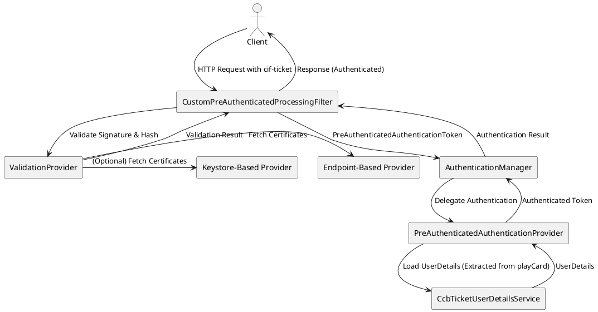

## Topics 


### **1. Spring Security Filter Chain**
- Configuration of the `securityFilterChain` bean.
- Role of filters in the chain and how they process requests.
- Focus on `CustomPreAuthenticatedProcessingFilter` and its impact on the authentication flow.

---

### **2. `CustomPreAuthenticatedProcessingFilter`**
- What it does in the authentication flow.
- How it decides if a request is authenticated.
- Object returned from `getPreAuthenticatedPrincipal` and its role in stopping further authentication flow.
- How the principal is passed through the security context.

---

### **3. Spring Security’s `Authentication` Interface**
- Key methods:
  - `getPrincipal()` for identity.
  - `getCredentials()` for authentication data.
  - `isAuthenticated()` to check the authentication status.
- How Spring Security uses the `Authentication` object in the flow.

---

### **4. `AuthenticationManager` and `CcbTicketUserDetailsService`**
- The role of `AuthenticationManager` in delegating authentication.
- The integration of `PreAuthenticatedAuthenticationProvider` with `CcbTicketUserDetailsService`.
- `CcbTicketUserDetailsService`’s responsibility to interpret the principal and fetch user details.

---

### **5. Interaction Between Filter, Token, and UserDetailsService**
- How `CustomPreAuthenticatedProcessingFilter` creates a `PreAuthenticatedAuthenticationToken`.
- Passing the token to `AuthenticationManager` and `PreAuthenticatedAuthenticationProvider`.
- `CcbTicketUserDetailsService` interpreting the principal to load user details.

---

### **6. Custom Principal Example**
- How to use a `CustomPrincipal` object as the principal for storing metadata.
- Example workflows demonstrating principal creation, token creation, and user details retrieval.

---


## **1. Spring Security Filter Chain Overview**
The filter chain in Spring Security is a sequence of filters that intercept and process HTTP requests before they reach the application’s logic (e.g., controllers). It serves as the core mechanism for handling authentication, authorization, session management, and other security tasks.

---

## **2. Components of the Security Filter Chain**
### **a. Filters**
- Filters are modular, reusable components that execute specific security-related logic.
- Examples:
  - `UsernamePasswordAuthenticationFilter`: Processes username/password-based authentication.
  - `BasicAuthenticationFilter`: Handles HTTP Basic authentication.
  - `CsrfFilter`: Applies CSRF protection.
  - Custom filters, like `CustomPreAuthenticatedProcessingFilter`, can be added for custom authentication mechanisms.

### **b. Filter Chain Order**
- The filters are executed in a specific order determined by Spring Security.
- The default order ensures that filters related to request matching, authentication, and session management are executed in a logical sequence.
- Custom filters can be inserted **before**, **after**, or **at a specific position** relative to standard filters.

---

## **3. `securityFilterChain` Bean**
The `securityFilterChain` bean defines and customizes the security filter chain using the `HttpSecurity` object. 

### **Code Walkthrough**
Here’s the key part of the `securityFilterChain` bean we analyzed:

```java
@Bean
public SecurityFilterChain securityFilterChain(HttpSecurity http, ...) throws Exception {
    http.authorizeHttpRequests(auth -> auth
        .requestMatchers(allPublicPaths).permitAll()
        .anyRequest().authenticated())
        .addFilterBefore(customPreAuthenticatedProcessingFilter, AbstractPreAuthenticatedProcessingFilter.class)
        .exceptionHandling(exceptionHandling -> exceptionHandling.authenticationEntryPoint(http401UnauthorizedEntryPoint))
        .csrf(csrf -> csrf.ignoringRequestMatchers("/invalidateSession"))
        .sessionManagement(session -> session.sessionCreationPolicy(SessionCreationPolicy.STATELESS));

    return http.build();
}
```

### **Key Steps**
1. **Define Public and Authenticated Endpoints**:
   - `requestMatchers(allPublicPaths).permitAll()`: Public endpoints that do not require authentication.
   - `anyRequest().authenticated()`: Secures all other endpoints, requiring authentication.

2. **Add Custom Filters**:
   - `addFilterBefore`: Adds `customPreAuthenticatedProcessingFilter` **before** `AbstractPreAuthenticatedProcessingFilter`.
   - Custom filters can:
     - Authenticate requests.
     - Stop further processing if the request is already authenticated.

3. **Exception Handling**:
   - Configures how exceptions are handled (e.g., `authenticationEntryPoint` for unauthorized access).

4. **CSRF Handling**:
   - Disables CSRF for specific endpoints, such as `/invalidateSession`.

5. **Session Management**:
   - `SessionCreationPolicy.STATELESS`: Disables sessions, relying on tokens for authentication.

---

## **4. Role of Filters in the Chain**
### **Filter Execution**
- Each filter processes the request, modifies it (if necessary), and either:
  - Passes it to the next filter in the chain.
  - Stops the chain if the request is handled (e.g., authentication is successful or an error is returned).

### **Focus on Custom Filters**
- Custom filters (like `CustomPreAuthenticatedProcessingFilter`) can:
  - Validate tokens or headers to authenticate requests.
  - Populate the `SecurityContext` with an `Authentication` object, skipping further authentication filters.

---

## **5. Stopping the Filter Chain**
The filter chain is **stopped** if:
1. **Authentication is Complete**:
   - If a filter authenticates the request (e.g., by populating the `SecurityContext` with a valid `Authentication` object), subsequent authentication filters are skipped.

2. **An Error Occurs**:
   - If a filter encounters an error (e.g., invalid token or unauthorized access), it can return an error response, terminating the chain.

3. **Filter Handles the Response**:
   - Some filters (e.g., `LogoutFilter`) may complete the response (e.g., returning a redirect or logout page).

---

## **6. Flow Example**
Let’s walk through the flow for a request:

1. **Request Reaches Filter Chain**:
   - The request enters the `SecurityFilterChain`.

2. **Custom Filter Executes**:
   - `CustomPreAuthenticatedProcessingFilter` intercepts the request.
   - It validates a token from the header and populates the `SecurityContext` if valid.

3. **Authentication Filter Skipped**:
   - Since the `SecurityContext` is already populated, filters like `UsernamePasswordAuthenticationFilter` are skipped.

4. **Authorization**:
   - If authenticated, the request is checked against authorization rules (e.g., role-based access control).

5. **Request Passes to Controller**:
   - If all filters pass, the request reaches the controller.

---

## **7. Benefits of Filter Chains**
- **Layered Security**: Each filter handles a specific security concern, making the chain modular and extensible.
- **Customizable**: You can add or replace filters to meet your application's unique needs.
- **Efficient**: The chain stops processing as soon as the request is authenticated or denied.

---

Here’s an in-depth explanation of **CustomPreAuthenticatedProcessingFilter** and its role in the Spring Security authentication flow:

---

### **1. What `CustomPreAuthenticatedProcessingFilter` Does in the Authentication Flow**
The `CustomPreAuthenticatedProcessingFilter` is a custom implementation of Spring Security’s `AbstractPreAuthenticatedProcessingFilter`. It is used when the application relies on **pre-authenticated requests**, meaning the authentication has already been performed outside the application (e.g., via SSO, API tokens, or external identity providers).

#### **Core Responsibilities:**
- Intercept HTTP requests and extract pre-authentication information (e.g., tokens, headers).
- Validate the pre-authenticated credentials (if necessary).
- Create a `PreAuthenticatedAuthenticationToken` and pass it to the authentication flow.

---

### **2. How It Decides If a Request Is Authenticated**
The `CustomPreAuthenticatedProcessingFilter` does not perform full authentication itself. Instead, it:
1. **Extracts the Principal**:
   - The `getPreAuthenticatedPrincipal(HttpServletRequest request)` method extracts the principal (e.g., username, user ID, or token) from the request.
   - If it returns `null`, the filter assumes the request is unauthenticated.

2. **Extracts the Credentials**:
   - The `getPreAuthenticatedCredentials(HttpServletRequest request)` method extracts credentials if required (often "N/A" for pre-authenticated scenarios).

3. **Passes the Authentication Token**:
   - The filter creates a `PreAuthenticatedAuthenticationToken` using the principal and credentials, and passes it to the `AuthenticationManager`.

4. **Relies on `AuthenticationManager`**:
   - The actual decision on whether the request is authenticated is made by the `AuthenticationManager`, which uses a `PreAuthenticatedAuthenticationProvider` and possibly a `UserDetailsService` to validate the token and load user details.

---

### **3. Object Returned from `getPreAuthenticatedPrincipal` and Its Role in Stopping Further Authentication Flow**

#### **How `getPreAuthenticatedPrincipal` Works:**
- This method is overridden in the custom filter to extract the **principal** from the request.
- Example:
  ```java
  @Override
  protected Object getPreAuthenticatedPrincipal(HttpServletRequest request) {
      return request.getHeader("Authorization-Token"); // Extract token from header
  }
  ```

#### **Role in the Authentication Flow:**
- If `getPreAuthenticatedPrincipal` returns:
  - **A valid principal**: The filter proceeds to create a `PreAuthenticatedAuthenticationToken`.
  - **`null`**: The filter does not create a token, and the request is treated as unauthenticated.

#### **Stopping the Filter Chain:**
- If the principal and token are valid:
  - The `SecurityContext` is populated with an authenticated `Authentication` object.
  - Downstream authentication filters (e.g., `UsernamePasswordAuthenticationFilter`) are **skipped**, as the request is already authenticated.

---

### **4. How the Principal Is Passed Through the Security Context**

#### **Principal Storage and Flow:**
1. **Principal in the Token**:
   - The `getPreAuthenticatedPrincipal` method returns the principal, which is stored in the `PreAuthenticatedAuthenticationToken`:
     ```java
     PreAuthenticatedAuthenticationToken token =
         new PreAuthenticatedAuthenticationToken(principal, credentials);
     ```

2. **Token Passed to the AuthenticationManager**:
   - The `PreAuthenticatedAuthenticationToken` is passed to the `AuthenticationManager`, which delegates authentication to the `PreAuthenticatedAuthenticationProvider`.

3. **Validated Principal in `UserDetailsService`**:
   - The `PreAuthenticatedAuthenticationProvider` uses the principal to load user details via a `UserDetailsService` (e.g., `CcbTicketUserDetailsService`).

4. **Principal in SecurityContext**:
   - Once the token is validated, the `Authentication` object (containing the principal) is stored in the `SecurityContext`:
     ```java
     SecurityContextHolder.getContext().setAuthentication(authentication);
     ```

5. **Access Principal in Application Logic**:
   - Application code (e.g., controllers) can retrieve the principal directly:
     ```java
     Authentication auth = SecurityContextHolder.getContext().getAuthentication();
     Object principal = auth.getPrincipal();
     ```

---

### **Example Workflow**
Let’s look at an example of how this works step by step:

#### **Custom Filter Implementation**
```java
public class CustomPreAuthenticatedProcessingFilter extends AbstractPreAuthenticatedProcessingFilter {

    @Override
    protected Object getPreAuthenticatedPrincipal(HttpServletRequest request) {
        return request.getHeader("X-Auth-Token"); // Extracts the token from the header
    }

    @Override
    protected Object getPreAuthenticatedCredentials(HttpServletRequest request) {
        return "N/A"; // No credentials needed for pre-authentication
    }
}
```

#### **Authentication Flow**
1. The filter intercepts the request and calls `getPreAuthenticatedPrincipal`.
2. If a token (e.g., `X-Auth-Token`) is present:
   - A `PreAuthenticatedAuthenticationToken` is created with the principal and credentials.
   - The token is passed to the `AuthenticationManager`.

3. The `AuthenticationManager` delegates authentication to the `PreAuthenticatedAuthenticationProvider`:
   - It validates the token using `CcbTicketUserDetailsService`.
   - If valid, it retrieves the user details and marks the token as authenticated.

4. The `SecurityContext` is updated with the authenticated token:
   - The principal is now available throughout the request lifecycle.

---

### **Summary**
- **Role of the Filter:** Intercept requests, extract the principal, and create a `PreAuthenticatedAuthenticationToken`.
- **Authentication Decision:** Delegated to the `AuthenticationManager`.
- **Stopping the Flow:** If the principal is valid and the token is authenticated, subsequent filters are skipped.
- **Principal in SecurityContext:** The principal is stored in the `SecurityContext` and is accessible throughout the application.

---

Here’s a detailed explanation of how to configure the `AuthenticationManager` and how it works with `PreAuthenticatedAuthenticationProvider` to authenticate users when `getPreAuthenticatedPrincipal` only returns a principal:

---

### **1. Configuring the `AuthenticationManager`**
The `AuthenticationManager` is a core part of Spring Security, responsible for delegating authentication requests to appropriate `AuthenticationProvider` implementations.

#### **Example Configuration**
Below is an example of how to configure the `AuthenticationManager` with a `PreAuthenticatedAuthenticationProvider`:

```java
@Bean
public AuthenticationManager authenticationManager(
    @Qualifier("CcbTicketUserDetailsService") AuthenticationUserDetailsService<PreAuthenticatedAuthenticationToken> userDetailsService) {
    
    // Create the PreAuthenticatedAuthenticationProvider
    PreAuthenticatedAuthenticationProvider provider = new PreAuthenticatedAuthenticationProvider();
    
    // Set the UserDetailsService for user validation
    provider.setPreAuthenticatedUserDetailsService(userDetailsService);
    
    // Return a ProviderManager with the PreAuthenticatedAuthenticationProvider
    return new ProviderManager(provider);
}
```

#### **Explanation:**
1. **PreAuthenticatedAuthenticationProvider**:
   - This provider is specifically designed to handle `PreAuthenticatedAuthenticationToken`.
   - It uses the `CcbTicketUserDetailsService` (an implementation of `AuthenticationUserDetailsService`) to load user details based on the principal.

2. **ProviderManager**:
   - The `ProviderManager` is a concrete implementation of `AuthenticationManager`.
   - It delegates authentication to the `PreAuthenticatedAuthenticationProvider`.

3. **Dependency Injection**:
   - The `CcbTicketUserDetailsService` is injected using the `@Qualifier` annotation.

---

### **2. How the AuthenticationManager Knows the User is Authenticated**

The `AuthenticationManager` itself does not authenticate users. It relies on an `AuthenticationProvider` (in this case, the `PreAuthenticatedAuthenticationProvider`) to validate the `PreAuthenticatedAuthenticationToken` and decide if the user is authenticated.

Here’s how it works:

#### **Step 1: Principal Extraction**
- The `CustomPreAuthenticatedProcessingFilter` extracts the **principal** (e.g., a username or token) and creates a `PreAuthenticatedAuthenticationToken`:
  ```java
  PreAuthenticatedAuthenticationToken token =
      new PreAuthenticatedAuthenticationToken(principal, credentials);
  ```

#### **Step 2: Passing to AuthenticationManager**
- The token is passed to the `AuthenticationManager`:
  ```java
  Authentication authentication = authenticationManager.authenticate(token);
  ```

#### **Step 3: Delegation to AuthenticationProvider**
- The `AuthenticationManager` delegates the token to the `PreAuthenticatedAuthenticationProvider`:
  ```java
  Authentication result = provider.authenticate(token);
  ```

#### **Step 4: User Details Validation**
- The `PreAuthenticatedAuthenticationProvider` performs the following steps:
  1. Extracts the **principal** from the token.
  2. Calls the `CcbTicketUserDetailsService` to load user details using the principal:
     ```java
     UserDetails userDetails = userDetailsService.loadUserDetails(preAuthToken);
     ```

- The `loadUserDetails` method in `CcbTicketUserDetailsService` might look like this:
  ```java
  @Override
  public UserDetails loadUserDetails(PreAuthenticatedAuthenticationToken token) throws UsernameNotFoundException {
      String principal = (String) token.getPrincipal();
      
      // Example: Validate the principal (e.g., token) and fetch user details
      User user = userRepository.findByToken(principal);
      if (user == null) {
          throw new UsernameNotFoundException("User not found for token: " + principal);
      }

      return new org.springframework.security.core.userdetails.User(
          user.getUsername(),
          "N/A", // No password required for pre-auth
          user.getAuthorities() // User roles and permissions
      );
  }
  ```

#### **Step 5: Marking the Token as Authenticated**
- If the `UserDetails` object is successfully loaded, the `PreAuthenticatedAuthenticationProvider` creates a new authenticated `PreAuthenticatedAuthenticationToken`:
  ```java
  PreAuthenticatedAuthenticationToken authenticatedToken =
      new PreAuthenticatedAuthenticationToken(userDetails, token.getCredentials(), userDetails.getAuthorities());
  authenticatedToken.setDetails(token.getDetails());
  ```

- This authenticated token is returned to the `AuthenticationManager`:
  ```java
  return authenticatedToken;
  ```

#### **Step 6: Updating the SecurityContext**
- The `SecurityContext` is updated with the authenticated token:
  ```java
  SecurityContextHolder.getContext().setAuthentication(authentication);
  ```

---

### **3. Why `getPreAuthenticatedPrincipal` Doesn't Authenticate**
The `getPreAuthenticatedPrincipal` method is not responsible for performing authentication. It only extracts the **identity** (principal) of the user from the request. The actual authentication is performed by the following components:
1. **`PreAuthenticatedAuthenticationProvider`:**
   - Validates the principal and credentials using the `UserDetailsService`.

2. **`UserDetailsService`:**
   - Loads user details (e.g., username, roles) and validates the user’s existence or permissions based on the principal.

3. **Result:**
   - If the principal is valid and user details are loaded successfully, the user is considered authenticated.

---

### **4. Complete Flow Example**
#### **Custom Filter**:
```java
@Override
protected Object getPreAuthenticatedPrincipal(HttpServletRequest request) {
    return request.getHeader("Authorization-Token"); // Extract token from the request header
}

@Override
protected Object getPreAuthenticatedCredentials(HttpServletRequest request) {
    return "N/A"; // Credentials are not required for pre-authentication
}
```

#### **AuthenticationManager Configuration**:
```java
@Bean
public AuthenticationManager authenticationManager(
    @Qualifier("CcbTicketUserDetailsService") AuthenticationUserDetailsService<PreAuthenticatedAuthenticationToken> userDetailsService) {
    
    PreAuthenticatedAuthenticationProvider provider = new PreAuthenticatedAuthenticationProvider();
    provider.setPreAuthenticatedUserDetailsService(userDetailsService);
    
    return new ProviderManager(provider);
}
```

#### **UserDetailsService Implementation**:
```java
public class CcbTicketUserDetailsService implements AuthenticationUserDetailsService<PreAuthenticatedAuthenticationToken> {

    @Override
    public UserDetails loadUserDetails(PreAuthenticatedAuthenticationToken token) throws UsernameNotFoundException {
        String tokenValue = (String) token.getPrincipal();

        // Validate token and fetch user details
        User user = userRepository.findByToken(tokenValue);
        if (user == null) {
            throw new UsernameNotFoundException("Invalid token: " + tokenValue);
        }

        return new org.springframework.security.core.userdetails.User(
            user.getUsername(),
            "N/A",
            user.getAuthorities()
        );
    }
}
```

---

### **Summary**
- The `AuthenticationManager` is configured with a `PreAuthenticatedAuthenticationProvider`.
- The `getPreAuthenticatedPrincipal` method in the custom filter only extracts the principal (identity) but doesn’t authenticate.
- The `PreAuthenticatedAuthenticationProvider` and `CcbTicketUserDetailsService` validate the user based on the principal and decide if the user is authenticated.
- If valid, an authenticated `Authentication` object is stored in the `SecurityContext`.

---

### **1. How `provider.authenticate(token)` Works**

The `provider.authenticate(token)` method is part of the **`PreAuthenticatedAuthenticationProvider`**, which is a built-in implementation provided by Spring Security. You **do not need to implement this method** if you are using the standard `PreAuthenticatedAuthenticationProvider`.

Here’s what happens inside this method:
1. **Token Validation**:
   - The `PreAuthenticatedAuthenticationProvider` checks if the provided `Authentication` object (e.g., `PreAuthenticatedAuthenticationToken`) is of the correct type.
   
2. **Load User Details**:
   - It calls the configured `AuthenticationUserDetailsService` (e.g., `CcbTicketUserDetailsService`) to load user details based on the principal in the token.
   - Example:
     ```java
     UserDetails userDetails = userDetailsService.loadUserDetails(preAuthToken);
     ```

3. **Authentication Decision**:
   - If the user details are successfully loaded:
     - It creates a new `PreAuthenticatedAuthenticationToken` that is **marked as authenticated** and contains the `UserDetails`.
     - Example:
       ```java
       return new PreAuthenticatedAuthenticationToken(userDetails, token.getCredentials(), userDetails.getAuthorities());
       ```
   - If loading fails (e.g., user not found), it throws an `AuthenticationException`.

---

### **2. Do You Need to Implement `authenticate(token)`?**

No, you typically do not implement the `authenticate(token)` method unless you are building a completely custom `AuthenticationProvider`.

If you use **`PreAuthenticatedAuthenticationProvider`**, you only need to:
1. Provide an `AuthenticationUserDetailsService` that can load user details based on the token's principal.
2. Ensure that the token is created properly by the custom filter.

---

### **3. Example: Using `PreAuthenticatedAuthenticationProvider`**

Here’s how it works with minimal setup:
1. Configure the `PreAuthenticatedAuthenticationProvider`:
   ```java
   @Bean
   public AuthenticationManager authenticationManager(
       AuthenticationUserDetailsService<PreAuthenticatedAuthenticationToken> userDetailsService) {
       
       PreAuthenticatedAuthenticationProvider provider = new PreAuthenticatedAuthenticationProvider();
       provider.setPreAuthenticatedUserDetailsService(userDetailsService);
       
       return new ProviderManager(provider);
   }
   ```

2. Provide an implementation for `AuthenticationUserDetailsService`:
   ```java
   @Override
   public UserDetails loadUserDetails(PreAuthenticatedAuthenticationToken token) throws UsernameNotFoundException {
       String principal = (String) token.getPrincipal();
       return userService.loadUserByUsername(principal);
   }
   ```

This approach delegates the heavy lifting of authentication to Spring Security.

---

### **4. What If You Use Keycloak?**

If you are using **Keycloak**, you don’t need to manually configure or implement `PreAuthenticatedAuthenticationProvider` or a custom `AuthenticationManager`. Instead, you leverage Keycloak’s built-in integration with Spring Security.

#### **Steps to Integrate Keycloak**

1. **Add Dependencies**
   Add the required dependencies for Keycloak in your `pom.xml`:
   ```xml
   <dependency>
       <groupId>org.keycloak</groupId>
       <artifactId>keycloak-spring-boot-starter</artifactId>
       <version>YOUR_KEYCLOAK_VERSION</version>
   </dependency>
   ```

2. **Configure Keycloak Adapter**
   Add Keycloak configuration in your `application.yml`:
   ```yaml
   keycloak:
     auth-server-url: http://your-keycloak-server/auth
     realm: your-realm
     resource: your-client-id
     credentials:
       secret: your-client-secret
   ```

3. **Enable Keycloak Security**
   Use `@KeycloakConfiguration` to enable Keycloak integration:
   ```java
   @KeycloakConfiguration
   public class SecurityConfig extends KeycloakWebSecurityConfigurerAdapter {

       @Override
       protected void configure(HttpSecurity http) throws Exception {
           super.configure(http); // Apply Keycloak configurations
           http.authorizeRequests()
               .antMatchers("/public/**").permitAll() // Public endpoints
               .anyRequest().authenticated();        // Secured endpoints
       }

       @Bean
       public KeycloakAuthenticationProvider keycloakAuthenticationProvider() {
           return new KeycloakAuthenticationProvider();
       }

       @Bean
       public KeycloakConfigResolver keycloakConfigResolver() {
           return new KeycloakSpringBootConfigResolver();
       }
   }
   ```

4. **Authentication Flow with Keycloak**
   - Keycloak handles authentication via JWT or OAuth2/OpenID Connect tokens.
   - The `KeycloakAuthenticationProvider` validates the token and loads user details into the Spring Security context.
   - You do not need to write custom filters or configure a `PreAuthenticatedAuthenticationProvider`.

#### **How It Replaces `PreAuthenticatedAuthenticationProvider`**
When using Keycloak:
- The `KeycloakAuthenticationProvider` authenticates tokens and loads user details.
- You don’t need `CustomPreAuthenticatedProcessingFilter` or `PreAuthenticatedAuthenticationProvider`.

---

### **5. Comparison: `PreAuthenticatedAuthenticationProvider` vs. Keycloak**

| Feature                               | `PreAuthenticatedAuthenticationProvider`                | Keycloak                                |
|---------------------------------------|---------------------------------------------------------|-----------------------------------------|
| **Token Validation**                  | Custom logic via `AuthenticationUserDetailsService`.    | Handled by Keycloak server.             |
| **User Details Loading**              | Custom `UserDetailsService` implementation required.    | Keycloak automatically fetches details. |
| **SecurityContext Population**        | Manually handled by Spring Security.                    | Automatically handled by Keycloak.      |
| **Ease of Integration**               | Requires custom configuration.                         | Out-of-the-box integration.             |

---

### **6. Conclusion**
1. If you're not using Keycloak:
   - Use `PreAuthenticatedAuthenticationProvider` with an `AuthenticationUserDetailsService` to load user details based on a pre-authenticated principal.
   - You don’t need to implement `authenticate(token)` manually; it is handled by the provider.

2. If you’re using Keycloak:
   - Replace custom filters and providers with Keycloak’s built-in integration.
   - Leverage Keycloak’s OAuth2/OpenID Connect token handling for authentication and user details retrieval.

---

Here’s a deep dive into Spring Security’s **`Authentication` interface**, its key methods, and how it is used in the security flow.

---

## **1. Overview of the `Authentication` Interface**
The `Authentication` interface in Spring Security is the central representation of an authenticated or unauthenticated user. It is used throughout the security framework to manage the user’s identity, credentials, and authorities.

---

## **2. Key Methods of the `Authentication` Interface**

### **a. `getPrincipal()`**
- **Purpose**: Returns the identity of the user (also known as the principal).
- **What It Represents**:
  - Typically, the `principal` is a `String` (e.g., username) or a custom object (e.g., `UserDetails`).
  - For pre-authenticated tokens, it may be a token string or a custom object like `CustomPrincipal`.

- **Example Usage**:
  ```java
  Authentication authentication = SecurityContextHolder.getContext().getAuthentication();
  Object principal = authentication.getPrincipal();
  
  if (principal instanceof UserDetails) {
      String username = ((UserDetails) principal).getUsername();
  } else {
      String username = principal.toString();
  }
  ```

---

### **b. `getCredentials()`**
- **Purpose**: Returns the credentials of the user (e.g., a password, token, or "N/A" for pre-authenticated users).
- **What It Represents**:
  - The authentication data used to prove the user’s identity (e.g., password or API key).
  - For pre-authenticated tokens, it is often `"N/A"`, as the credentials are validated externally.

- **Example Usage**:
  ```java
  Object credentials = authentication.getCredentials();
  System.out.println("Credentials: " + credentials);
  ```

---

### **c. `isAuthenticated()`**
- **Purpose**: Indicates whether the user is authenticated or not.
- **What It Represents**:
  - `false`: The user is not authenticated.
  - `true`: The user is authenticated, and the `Authentication` object contains valid details.
- **How It Works**:
  - Initially, `isAuthenticated()` is `false` until the `AuthenticationManager` or `AuthenticationProvider` validates the credentials.
  - After validation, it is set to `true` by calling `setAuthenticated(true)`.

- **Example Usage**:
  ```java
  boolean isAuthenticated = authentication.isAuthenticated();
  System.out.println("Is Authenticated: " + isAuthenticated);
  ```

---

### **d. Other Methods**
- **`getAuthorities()`**:
  - Returns the list of authorities (roles/permissions) granted to the user.
  - Example:
    ```java
    Collection<? extends GrantedAuthority> authorities = authentication.getAuthorities();
    authorities.forEach(authority -> System.out.println(authority.getAuthority()));
    ```

- **`getDetails()`**:
  - Returns additional information about the authentication request (e.g., IP address, session ID).
  - Example:
    ```java
    Object details = authentication.getDetails();
    System.out.println("Details: " + details);
    ```

- **`setAuthenticated(boolean isAuthenticated)`**:
  - Sets the authenticated state. It can throw an exception if called manually.

---

## **3. How Spring Security Uses the `Authentication` Object**

### **a. During Authentication**
1. **Creation**:
   - When a user submits a request (e.g., login or pre-authenticated), an `Authentication` object (e.g., `UsernamePasswordAuthenticationToken` or `PreAuthenticatedAuthenticationToken`) is created with the user-provided principal and credentials.

   Example:
   ```java
   Authentication authentication = new UsernamePasswordAuthenticationToken("username", "password");
   ```

2. **Validation**:
   - The `AuthenticationManager` passes the `Authentication` object to the appropriate `AuthenticationProvider`.
   - If authentication is successful:
     - The `Authentication` object is updated with user details (e.g., `UserDetails`) and marked as authenticated (`isAuthenticated() = true`).
     - The updated `Authentication` object is returned.

   Example:
   ```java
   AuthenticationManager authenticationManager = getAuthenticationManager();
   Authentication authenticated = authenticationManager.authenticate(authentication);
   ```

3. **Storage in SecurityContext**:
   - The authenticated `Authentication` object is stored in the `SecurityContext`:
     ```java
     SecurityContextHolder.getContext().setAuthentication(authenticated);
     ```

---

### **b. During Authorization**
1. **Access Control**:
   - The `Authentication` object stored in the `SecurityContext` is used to enforce access control.
   - The user’s authorities (roles/permissions) are checked against the resource being accessed.

   Example:
   ```java
   @PreAuthorize("hasRole('ROLE_ADMIN')")
   public void someAdminFunction() {
       // Code that requires admin access
   }
   ```

2. **Principal Retrieval**:
   - Controllers or services can access the principal using the `SecurityContextHolder` to get user information.

   Example:
   ```java
   @GetMapping("/user")
   public String getUserInfo() {
       Authentication auth = SecurityContextHolder.getContext().getAuthentication();
       return "Logged in user: " + auth.getPrincipal();
   }
   ```

---

### **c. SecurityContext Lifecycle**
1. **Request Start**:
   - The `SecurityContext` is populated with the `Authentication` object when the filter chain processes a request.

2. **During the Request**:
   - The `Authentication` object remains available in the `SecurityContext` for the entire request lifecycle.

3. **Request End**:
   - The `SecurityContext` is cleared, ensuring no leakage of authentication details between requests.

---

## **4. Example Workflow**

1. **User Sends a Request**:
   - A login or token-based request is received.

2. **Authentication Object Created**:
   - A filter (e.g., `UsernamePasswordAuthenticationFilter` or `CustomPreAuthenticatedProcessingFilter`) creates an `Authentication` object.

3. **AuthenticationManager Validates the Object**:
   - The `AuthenticationManager` uses an `AuthenticationProvider` to validate the credentials and load user details.

4. **Authenticated Object Stored**:
   - The validated `Authentication` object is stored in the `SecurityContext`.

5. **Authorization Checks**:
   - The `Authentication` object is used for role-based access control during the request.

---

### **Summary**

- The `Authentication` interface provides methods to retrieve user identity (`getPrincipal()`), credentials (`getCredentials()`), authorities (`getAuthorities()`), and authentication status (`isAuthenticated()`).
- During the security flow:
  - It starts unauthenticated and is validated by an `AuthenticationProvider`.
  - Once authenticated, it is stored in the `SecurityContext` and used for authorization checks.
- The principal (identity) and authorities (roles) stored in the `Authentication` object are central to Spring Security's mechanism for managing user authentication and access control.

---

Here’s a detailed explanation of **`AuthenticationManager` and `CcbTicketUserDetailsService`**, their roles, and how they interact in Spring Security’s authentication flow:

---

### **1. The Role of `AuthenticationManager` in Delegating Authentication**

#### **What is `AuthenticationManager`?**
- The `AuthenticationManager` is a central interface in Spring Security that handles authentication requests.
- It delegates authentication tasks to one or more **`AuthenticationProvider`** implementations.

#### **How It Works**
1. A request (e.g., login or pre-authentication) generates an `Authentication` object.
2. The `AuthenticationManager` receives the `Authentication` object and delegates it to appropriate `AuthenticationProvider`s until one of them successfully authenticates the request.

#### **Configuration Example**
When using pre-authentication:
```java
@Bean
public AuthenticationManager authenticationManager(
        @Qualifier("CcbTicketUserDetailsService") AuthenticationUserDetailsService<PreAuthenticatedAuthenticationToken> userDetailsService) {
    // Configure PreAuthenticatedAuthenticationProvider
    PreAuthenticatedAuthenticationProvider provider = new PreAuthenticatedAuthenticationProvider();
    provider.setPreAuthenticatedUserDetailsService(userDetailsService);

    // Return a ProviderManager with the PreAuthenticatedAuthenticationProvider
    return new ProviderManager(provider);
}
```

#### **Key Responsibilities**
1. **Delegate to Providers**:
   - The `AuthenticationManager` forwards the `Authentication` object to its configured providers for processing.
2. **Handle Success or Failure**:
   - If a provider successfully authenticates, the manager returns an authenticated `Authentication` object.
   - If all providers fail, an `AuthenticationException` is thrown.

#### **Flow Example**
1. A filter (e.g., `CustomPreAuthenticatedProcessingFilter`) creates a `PreAuthenticatedAuthenticationToken`.
2. The token is passed to the `AuthenticationManager`.
3. The manager delegates the token to `PreAuthenticatedAuthenticationProvider`.

---

### **2. Integration of `PreAuthenticatedAuthenticationProvider` with `CcbTicketUserDetailsService`**

#### **What is `PreAuthenticatedAuthenticationProvider`?**
- It is a built-in `AuthenticationProvider` in Spring Security.
- Specifically designed to handle `PreAuthenticatedAuthenticationToken`.
- It validates the principal (e.g., username, token) and fetches user details using a `UserDetailsService` (or its variant).

#### **Integration with `CcbTicketUserDetailsService`**
- The `PreAuthenticatedAuthenticationProvider` works with a custom `AuthenticationUserDetailsService` implementation like `CcbTicketUserDetailsService`.
- The `CcbTicketUserDetailsService` is responsible for interpreting the principal and fetching user details.

#### **Example Configuration**
```java
@Bean
public PreAuthenticatedAuthenticationProvider preAuthenticatedAuthenticationProvider(
        @Qualifier("CcbTicketUserDetailsService") AuthenticationUserDetailsService<PreAuthenticatedAuthenticationToken> userDetailsService) {
    PreAuthenticatedAuthenticationProvider provider = new PreAuthenticatedAuthenticationProvider();
    provider.setPreAuthenticatedUserDetailsService(userDetailsService);
    return provider;
}
```

#### **Workflow**
1. The `PreAuthenticatedAuthenticationProvider` receives a `PreAuthenticatedAuthenticationToken` from the `AuthenticationManager`.
2. It extracts the principal from the token and passes it to the `CcbTicketUserDetailsService`.
3. If `CcbTicketUserDetailsService` successfully retrieves user details:
   - The provider creates a new authenticated `PreAuthenticatedAuthenticationToken` with the `UserDetails`.
4. The provider returns the authenticated token to the `AuthenticationManager`.

---

### **3. `CcbTicketUserDetailsService`’s Responsibility**

#### **What is `CcbTicketUserDetailsService`?**
- It is a custom implementation of the `AuthenticationUserDetailsService` interface.
- Responsible for interpreting the principal (identity) from the token and fetching the corresponding user details from the data source.

#### **Key Responsibilities**
1. **Interpret the Principal**:
   - Extract and validate the principal from the `PreAuthenticatedAuthenticationToken`.
2. **Fetch User Details**:
   - Retrieve user information (e.g., roles, permissions) from a database, API, or another source.
3. **Return a `UserDetails` Object**:
   - The fetched user details are returned as a `UserDetails` object, which is the standard format used by Spring Security.

#### **Implementation Example**
```java
public class CcbTicketUserDetailsService implements AuthenticationUserDetailsService<PreAuthenticatedAuthenticationToken> {

    @Override
    public UserDetails loadUserDetails(PreAuthenticatedAuthenticationToken token) throws UsernameNotFoundException {
        // Extract principal from the token
        String principal = (String) token.getPrincipal();

        // Fetch user details from the database or other source
        User user = userRepository.findByToken(principal);
        if (user == null) {
            throw new UsernameNotFoundException("User not found for token: " + principal);
        }

        // Return user details in the format expected by Spring Security
        return new org.springframework.security.core.userdetails.User(
            user.getUsername(),
            "N/A", // No password required for pre-authenticated tokens
            user.getAuthorities() // List of roles/permissions
        );
    }
}
```

---

### **4. Full Workflow: From Token to UserDetails**

#### **Step-by-Step**
1. **Filter Creates Token**:
   - A filter (e.g., `CustomPreAuthenticatedProcessingFilter`) extracts the principal (e.g., token, username) from the request and creates a `PreAuthenticatedAuthenticationToken`.

2. **Token Sent to AuthenticationManager**:
   - The token is passed to the `AuthenticationManager`.

3. **Manager Delegates to Provider**:
   - The `AuthenticationManager` delegates the token to the `PreAuthenticatedAuthenticationProvider`.

4. **Provider Uses UserDetailsService**:
   - The provider extracts the principal from the token and passes it to `CcbTicketUserDetailsService`.

5. **UserDetailsService Fetches User Info**:
   - The `CcbTicketUserDetailsService` loads user details (e.g., roles, permissions) based on the principal.

6. **Provider Marks Token as Authenticated**:
   - The provider creates a new authenticated `PreAuthenticatedAuthenticationToken` with the user details.

7. **SecurityContext Updated**:
   - The authenticated token is stored in the `SecurityContext`.

---

### **5. Key Interactions**

| Component                       | Responsibility                                        |
|---------------------------------|------------------------------------------------------|
| **`AuthenticationManager`**     | Delegates authentication to `AuthenticationProvider`. |
| **`PreAuthenticatedAuthenticationProvider`** | Validates the token and retrieves user details using `CcbTicketUserDetailsService`. |
| **`CcbTicketUserDetailsService`** | Interprets the principal and fetches user details.  |

---

### **6. Summary**
- **`AuthenticationManager`**:
  - Central orchestrator of authentication requests.
  - Delegates tasks to `AuthenticationProvider` instances.
- **`PreAuthenticatedAuthenticationProvider`**:
  - Handles `PreAuthenticatedAuthenticationToken` and integrates with `CcbTicketUserDetailsService`.
  - Validates the token and returns authenticated tokens.
- **`CcbTicketUserDetailsService`**:
  - Interprets the principal from the token and fetches user details from the database or other sources.
  - Returns a `UserDetails` object for Spring Security to use in authorization and role-based access control.

---

### **5. Interaction Between Filter, Token, and UserDetailsService**

---

#### **How `CustomPreAuthenticatedProcessingFilter` Creates a `PreAuthenticatedAuthenticationToken`**

1. **Intercepting Requests**:
   - The `CustomPreAuthenticatedProcessingFilter` intercepts HTTP requests to extract authentication information.
   
2. **Extracting Principal and Credentials**:
   - The filter overrides `getPreAuthenticatedPrincipal()` and `getPreAuthenticatedCredentials()` to extract the required data:
     - **Principal**: Identifies the user (e.g., username, token, or custom object).
     - **Credentials**: Optional data for verification (often "N/A" in pre-authentication scenarios).

3. **Creating the Token**:
   - A `PreAuthenticatedAuthenticationToken` is created using the extracted data:
     ```java
     PreAuthenticatedAuthenticationToken token =
         new PreAuthenticatedAuthenticationToken(principal, credentials);
     ```

---

#### **Passing the Token to `AuthenticationManager`**

1. **Sending the Token**:
   - The filter passes the `PreAuthenticatedAuthenticationToken` to the `AuthenticationManager` for validation:
     ```java
     Authentication authentication = authenticationManager.authenticate(token);
     ```

2. **Delegation to Provider**:
   - The `AuthenticationManager` delegates the token to an appropriate `AuthenticationProvider` (e.g., `PreAuthenticatedAuthenticationProvider`).

---

#### **How `PreAuthenticatedAuthenticationProvider` Uses `CcbTicketUserDetailsService`**

1. **Extracting Principal**:
   - The `PreAuthenticatedAuthenticationProvider` extracts the principal from the token:
     ```java
     Object principal = token.getPrincipal();
     ```

2. **Fetching User Details**:
   - The provider calls `CcbTicketUserDetailsService` with the token to load user details:
     ```java
     UserDetails userDetails = userDetailsService.loadUserDetails(token);
     ```

3. **Returning Authenticated Token**:
   - If the user details are valid, the provider returns a new authenticated `PreAuthenticatedAuthenticationToken`:
     ```java
     return new PreAuthenticatedAuthenticationToken(
         userDetails,
         token.getCredentials(),
         userDetails.getAuthorities()
     );
     ```

4. **Updating the SecurityContext**:
   - The authenticated token is stored in the `SecurityContext`:
     ```java
     SecurityContextHolder.getContext().setAuthentication(authenticatedToken);
     ```

---

#### **Example Workflow**

1. **Request Intercepted**:
   - `CustomPreAuthenticatedProcessingFilter` intercepts a request and extracts the token:
     ```java
     String token = request.getHeader("Authorization");
     ```

2. **Token Creation**:
   - The filter creates a `PreAuthenticatedAuthenticationToken`:
     ```java
     PreAuthenticatedAuthenticationToken token =
         new PreAuthenticatedAuthenticationToken(token, "N/A");
     ```

3. **Token Validation**:
   - The `AuthenticationManager` delegates the token to `PreAuthenticatedAuthenticationProvider`.

4. **User Details Loading**:
   - The `CcbTicketUserDetailsService` loads user details using the principal (e.g., token or username).

5. **Authenticated Token Returned**:
   - The provider returns an authenticated token with the user’s authorities.

---

### **6. Custom Principal Example**

---

#### **Why Use a `CustomPrincipal`?**
- A `CustomPrincipal` allows you to store additional metadata about the user (e.g., email, roles, or other attributes).
- It provides more flexibility than using a simple `String` for the principal.

---

#### **Example: `CustomPrincipal` Class**

```java
public class CustomPrincipal {
    private String username;
    private String email;
    private String token;

    // Constructor
    public CustomPrincipal(String username, String email, String token) {
        this.username = username;
        this.email = email;
        this.token = token;
    }

    // Getters and Setters
    public String getUsername() {
        return username;
    }

    public String getEmail() {
        return email;
    }

    public String getToken() {
        return token;
    }
}
```

---

#### **Using `CustomPrincipal` in the Filter**

```java
@Override
protected Object getPreAuthenticatedPrincipal(HttpServletRequest request) {
    String token = request.getHeader("Authorization");
    String username = extractUsernameFromToken(token); // Custom method to extract username
    String email = extractEmailFromToken(token);       // Custom method to extract email

    // Return a CustomPrincipal object
    return new CustomPrincipal(username, email, token);
}

@Override
protected Object getPreAuthenticatedCredentials(HttpServletRequest request) {
    return "N/A"; // No additional credentials needed for pre-authentication
}
```

---

#### **Using `CustomPrincipal` in `CcbTicketUserDetailsService`**

```java
@Override
public UserDetails loadUserDetails(PreAuthenticatedAuthenticationToken token) throws UsernameNotFoundException {
    CustomPrincipal principal = (CustomPrincipal) token.getPrincipal();

    // Example: Fetch user details from the database
    User user = userRepository.findByUsername(principal.getUsername());
    if (user == null) {
        throw new UsernameNotFoundException("User not found: " + principal.getUsername());
    }

    // Return user details
    return new org.springframework.security.core.userdetails.User(
        user.getUsername(),
        "N/A",
        user.getAuthorities()
    );
}
```

---

#### **Workflow with `CustomPrincipal`**

1. **Request Interception**:
   - The filter extracts the token and creates a `CustomPrincipal` with additional metadata (e.g., username, email).

2. **Token Creation**:
   - The `PreAuthenticatedAuthenticationToken` is created with the `CustomPrincipal`.

3. **Authentication**:
   - The `AuthenticationManager` validates the token via the `PreAuthenticatedAuthenticationProvider`.

4. **User Details Loading**:
   - The `CcbTicketUserDetailsService` retrieves user details based on the `CustomPrincipal`.

5. **SecurityContext Update**:
   - The `SecurityContext` is updated with the authenticated token containing the `CustomPrincipal`.

---

### **Summary**

#### **Interaction Between Components**
- **Filter**: Creates a `PreAuthenticatedAuthenticationToken` using extracted principal and credentials.
- **AuthenticationManager**: Delegates the token to `PreAuthenticatedAuthenticationProvider`.
- **UserDetailsService**: Interprets the principal and fetches user details.

#### **Custom Principal**
- Allows storing metadata such as username, email, and token.
- Enhances flexibility and makes user details retrieval more robust.

# Authentication Flow Diagram

The following diagram illustrates the interaction between the `CustomPreAuthenticatedProcessingFilter`, `AuthenticationManager`, `PreAuthenticatedAuthenticationProvider`, `CcbTicketUserDetailsService`, and the database.



---

### **2. ValidationProvider**

This provider validates the `playCard` signature and hash using one of two certificate providers.

```java
import java.util.Optional;

public class ValidationProvider {

    private final EndpointCertificateProvider endpointCertificateProvider;
    private final KeystoreCertificateProvider keystoreCertificateProvider;

    public ValidationProvider(EndpointCertificateProvider endpointProvider, KeystoreCertificateProvider keystoreProvider) {
        this.endpointCertificateProvider = endpointProvider;
        this.keystoreCertificateProvider = keystoreProvider;
    }

    public CustomPrincipal validateAndConvertPlayCard(String playCardXml) {
        // Validate the signature and hash
        boolean isValid = endpointCertificateProvider.validate(playCardXml)
                || keystoreCertificateProvider.validate(playCardXml);

        if (!isValid) {
            throw new RuntimeException("Invalid playCard signature or hash.");
        }

        // Extract user details from the playCard (assume XML parsing)
        return extractPlayCardDetails(playCardXml);
    }

    private CustomPrincipal extractPlayCardDetails(String playCardXml) {
        // Parse XML and extract user details
        String username = "extracted_username"; // Replace with actual XML parsing
        String email = "extracted_email";
        return new CustomPrincipal(username, email, playCardXml);
    }
}
```

---

### **3. Certificate Providers**

#### Endpoint-Based Provider

```java
import java.util.List;

public class EndpointCertificateProvider {

    public boolean validate(String playCardXml) {
        // Fetch certificates from endpoint
        List<String> certificates = fetchCertificatesFromEndpoint();

        // Use the first key to validate the playCard
        String primaryKey = certificates.get(0);
        return validateSignature(playCardXml, primaryKey);
    }

    private List<String> fetchCertificatesFromEndpoint() {
        // Simulated API call to fetch keys
        return List.of("key1", "key2", "key3", "key4");
    }

    private boolean validateSignature(String playCardXml, String key) {
        // Simulated signature validation logic
        return true;
    }
}
```

#### Keystore-Based Provider

```java
public class KeystoreCertificateProvider {

    public boolean validate(String playCardXml) {
        // Keystore is currently empty, always return false
        return false;
    }
}
```

---

### **4. CustomPrincipal**

A custom object to hold user metadata extracted from the `playCard`.

```java
public class CustomPrincipal {
    private final String username;
    private final String email;
    private final String playCardXml;

    public CustomPrincipal(String username, String email, String playCardXml) {
        this.username = username;
        this.email = email;
        this.playCardXml = playCardXml;
    }

    public String getUsername() {
        return username;
    }

    public String getEmail() {
        return email;
    }

    public String getPlayCardXml() {
        return playCardXml;
    }
}
```

---

### **5. CcbTicketUserDetailsService**

Loads user details from the `CustomPrincipal`.

```java
import org.springframework.security.core.userdetails.User;
import org.springframework.security.core.userdetails.UserDetails;
import org.springframework.security.web.authentication.preauth.PreAuthenticatedAuthenticationToken;

public class CcbTicketUserDetailsService implements org.springframework.security.core.userdetails.AuthenticationUserDetailsService<PreAuthenticatedAuthenticationToken> {

    @Override
    public UserDetails loadUserDetails(PreAuthenticatedAuthenticationToken token) {
        CustomPrincipal principal = (CustomPrincipal) token.getPrincipal();

        // Create UserDetails from the principal
        return User.builder()
                .username(principal.getUsername())
                .password("") // No password required
                .roles("USER") // Default role
                .build();
    }
}
```

---

### **6. AuthenticationManager Configuration**

Configures the authentication manager with the `PreAuthenticatedAuthenticationProvider`.

```java
import org.springframework.context.annotation.Bean;
import org.springframework.context.annotation.Configuration;
import org.springframework.security.authentication.AuthenticationManager;
import org.springframework.security.authentication.ProviderManager;
import org.springframework.security.web.authentication.preauth.PreAuthenticatedAuthenticationProvider;

import java.util.Collections;

@Configuration
public class SecurityConfig {

    @Bean
    public AuthenticationManager authenticationManager(CcbTicketUserDetailsService userDetailsService) {
        PreAuthenticatedAuthenticationProvider provider = new PreAuthenticatedAuthenticationProvider();
        provider.setPreAuthenticatedUserDetailsService(userDetailsService);
        return new ProviderManager(Collections.singletonList(provider));
    }
}
```

---

### **7. SecurityFilterChain Configuration**

Configures the security filter chain.

```java
import org.springframework.context.annotation.Bean;
import org.springframework.security.config.annotation.web.builders.HttpSecurity;
import org.springframework.security.web.SecurityFilterChain;

@Configuration
public class SecurityFilterChainConfig {

    @Bean
    public SecurityFilterChain securityFilterChain(HttpSecurity http, CustomPreAuthenticatedProcessingFilter customFilter) throws Exception {
        http.csrf().disable()
            .authorizeHttpRequests(auth -> auth
                .requestMatchers("/public/**").permitAll()
                .anyRequest().authenticated()
            )
            .addFilterBefore(customFilter, AbstractPreAuthenticatedProcessingFilter.class);

        return http.build();
    }
}
```

---
