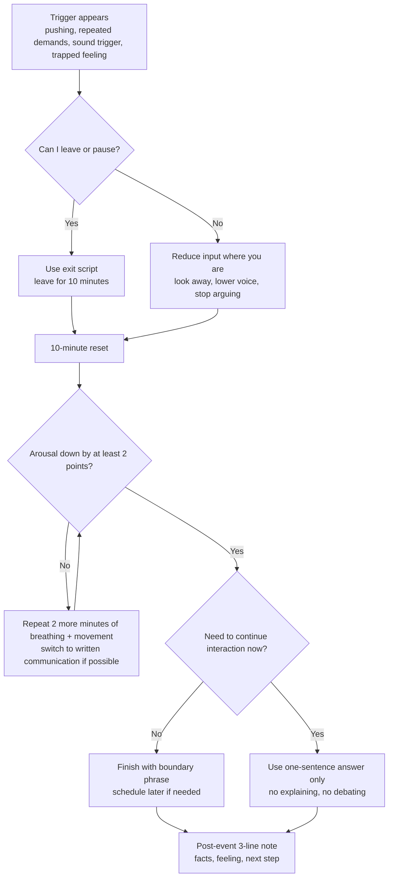
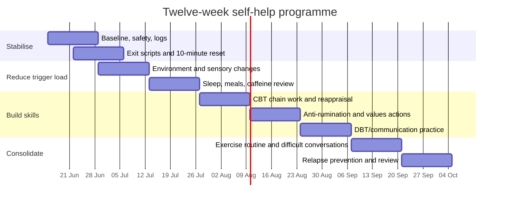

# Evidence-based self-help for ADHD-related emotional dysregulation, anger loops, misophonia and autonomy-sensitive stress

## Executive summary

For an adult with likely ADHD who gets fast, intense anger, feels trapped when people keep pushing, replays upsetting interactions for hours, and has misophonia-type rage to repeated sounds, the most useful self-help approach is usually **not one single technique**. The best-supported plan is a layered one: **environmental changes first**, then **brief in-the-moment down-regulation**, then **CBT-style work on trigger chains and rumination**, plus **DBT-informed distress-tolerance and boundary skills**, and finally **sleep, exercise, and regular meals** to reduce baseline irritability and overload. NICE and the Royal College of Psychiatrists both emphasise environmental adaptation and post-diagnostic psychoeducation for adult ADHD; when non-pharmacological treatment is indicated, NICE recommends a structured supportive psychological intervention focused on ADHD, often including CBT elements. citeturn8view1turn8view3turn31view3

Mechanistically, adult ADHD is strongly linked with emotional dysregulation: compared with healthy controls, adults with ADHD show markedly higher overall emotional dysregulation, especially emotional lability, and symptom severity correlates with poorer emotional regulation. Misophonia adds a second fast pathway: specific sounds can trigger disgust, anger, panic, autonomic arousal, and a strong feeling of being trapped or out of control when escape is not possible. Rumination then keeps the nervous system “online” after the event, prolonging anger and draining energy. citeturn37search0turn24view0turn22search9turn22search18

The highest-confidence self-help targets are these. First, **reduce exposure and friction before triggers happen**: quiet workspaces, written instructions, seating choices, headphones/masking, and pre-planned exits. Second, learn a **10-minute reset** that stops escalation without arguing with the trigger. Third, use **CBT chain analysis** to map what happens between “they pushed” and “I exploded”, and **anti-rumination routines** to stop replay loops. Fourth, use **short boundary scripts** that are pre-written, boring, and repeatable. Fifth, stabilise the body with **sleep regularity, daily movement, and regular meals**, because sleep loss, hunger, and sustained overload reliably worsen focus, irritability and reactivity. Misophonia-specific CBT has the best current evidence for that condition, but the overall treatment evidence base for misophonia is still small. citeturn24view0turn25search1turn23search2turn32view0turn29view0turn41view0turn42view0

## How the pattern works

**ADHD emotional dysregulation** means emotions rise faster, feel bigger, and are harder to modulate once activated. In adults with ADHD, the largest differences from controls are seen in global emotional dysregulation and emotional lability, and clinical guidance notes that mood instability and hyper-reactivity commonly dominate adult presentations. ADHD also makes it harder to use “top-down brakes” in the moment: working memory, inhibition, time-keeping, and self-monitoring are less reliable when stressed, so the gap between feeling anger and acting on it is shorter. citeturn37search0turn30view0turn29view0

**Anger in this pattern is usually a blocked-goal / low-control response, not just a “bad temper”.** Anger commonly arises when an important goal is blocked or when a person experiences pressure, challenge or frustration during goal pursuit. In your case, the blocked goal is often autonomy: “I already answered”, “I cannot help”, or “I need this to stop”, but the interaction continues. When escape is blocked, perceived control falls, arousal stays high, and anger becomes much harder to regulate. Misophonia clinics explicitly describe this trapped, helpless, out-of-control feeling when people cannot get away from trigger sounds. citeturn39search2turn39search16turn38search10turn24view0

**Rumination** is repetitive negative thinking: replaying a scene, mentally prosecuting the other person, imagining better comebacks, or trying to force closure after the fact. It is now treated as a transdiagnostic process across anxiety, depression and related problems. In anger specifically, rumination is one of the emotion-regulation patterns most consistently associated with stronger anger, whereas acceptance and cognitive reappraisal show the opposite pattern. This is why the mind can feel “stuck in court” long after the interaction ended. citeturn22search9turn22search18

**Misophonia** is a decreased tolerance to specific sounds, often eating, breathing, sniffing or repetitive tapping, producing intense anger, disgust, panic or distress, often with a fight-or-flight body reaction. Many people also react to associated visual cues such as fidgeting or mouth movements. The condition can cause anticipation, replaying of sounds afterwards, shame, avoidance, relationship strain and serious functional impairment. Current best evidence supports CBT-based treatment, but the total treatment literature remains small: one good RCT, one open-label trial, and many case reports/series. citeturn24view0turn25search1turn23search2turn28view0

These mechanisms tend to **multiply each other** rather than add up neatly. ADHD increases distractibility, frustration and recovery difficulty. Misophonia creates rapid sensory threat. Repeated pressure from other people creates blocked-goal anger. Rumination keeps the whole episode alive after it is over. Sleep problems then reduce emotional braking even further. That is why the plan below targets **escape, arousal, attention, interpretation, and recovery** together rather than trying to “think your way out” once fully escalated. citeturn37search0turn24view0turn42view0

## Evidence-based self-help tools

### The core intervention set

**CBT for adult ADHD and anger/rumination.** CBT has the strongest direct evidence among psychosocial treatments for adult ADHD. In a randomised trial of medicated adults with persistent symptoms, CBT beat relaxation plus education and gains were maintained over 12 months. More recent follow-up work also found CBT plus medication outperformed medication alone on ADHD symptoms, depression and psychological quality of life at one year. For misophonia, the first randomised clinical trial found group CBT produced significantly larger short-term symptom reductions than a waiting list, with benefits maintained at one year. In practice, the most useful self-help CBT pieces are: trigger-chain mapping, behavioural experiments, cognitive reappraisal, and rumination interruption. citeturn36search4turn36search3turn25search1

**DBT-informed skills for fast anger and overload.** Adult-ADHD DBT-based group treatment has shown superiority over treatment as usual for executive dysfunction, ADHD symptoms and quality of life, with effects lasting at six months; emotional regulation improved too, although sometimes more gradually than other outcomes. DBT is especially useful when the problem is “I know what I should do, but once I’m activated I cannot access it.” The most portable DBT skills here are: STOP (pause before acting), paced breathing, brief movement to discharge activation, and interpersonal effectiveness scripts that are short, clear and non-negotiating. Evidence is promising, but still smaller than for CBT. citeturn34view0turn12search1

**ACT and mindfulness for getting unstuck.** ACT is not the best-supported ADHD treatment in the same way CBT is, but it is highly useful for **anger + entrapment + rumination** because it targets cognitive fusion: getting welded to “they’re disrespecting me”, “I’m trapped”, “this must stop now”. The practical ACT move is not to like the feeling; it is to stop obeying it. Mindfulness evidence in adult ADHD is mixed but encouraging overall: meta-analytic work suggests benefits for ADHD symptoms, depression and executive problems, while at least one active-control RCT found mindfulness was **not superior** to structured psychoeducation even though both helped. That makes mindfulness best framed as an adjunct skill, not a magic bullet. citeturn33view1turn33view0turn14search16turn13search9

**Behavioural activation for replay loops.** Behavioural activation has robust evidence for depression and growing transdiagnostic relevance. Its practical use here is simple: once the anger event ends, do not leave the brain in an empty courtroom. Switch quickly into a small, concrete, value-linked action: walk, shower, email one necessary message, make food, tidy one surface, or start a pre-chosen low-friction task. This is not avoidance; it is redirecting attention and reward learning away from endless review. NHS self-help materials and NICE-backed depression guidance support behavioural activation as a pragmatic, structured action-first method. citeturn16search0turn16search1turn16search13

**Environmental design and stimulus control.** For adult ADHD, environmental adaptation is first-line in UK guidance. That means changing the surroundings so the brain needs less last-minute self-control: quiet space, written instructions, fewer open-ended demands, visible timers, one capture system for tasks, routine seating away from trigger sounds, and clear exit routes. For sleep, stimulus control has real evidence: the AASM recommends multicomponent CBT-I strongly, and stimulus control or sleep restriction as single-component options when needed. Sleep hygiene helps, but by itself it is not the strongest treatment for persistent insomnia. citeturn31view3turn30view3turn32view0

**Sensory and accommodation strategies for misophonia.** Misophonia treatment is still developing. Current evidence and specialist clinical practice support CBT-based approaches, while audiology reviews emphasise multidisciplinary management. For day-to-day self-help, the most defensible strategy is not brute-force self-exposure to full-strength triggers; it is **sane accommodation**: reduce trigger intensity, increase distance, use low-key masking if helpful, choose seating, eat separately when necessary, and explain the issue briefly without over-apologising. Oxford Health’s specialist service explicitly includes accommodations and communication tools as part of treatment. citeturn23search2turn25search1turn24view0turn28view0

**Sleep, movement and regular meals.** NHS adult ADHD advice recommends exercise, enough sleep, a regular bedtime, a quiet dark bedroom, avoiding screens/caffeine/sugar/alcohol close to bedtime, and regular mealtimes with a healthy balanced diet. Exercise is one of the most practical ways to reduce baseline tension and improve attention, mood and sleep. In adults with ADHD, recent meta-analyses suggest benefits for inhibitory control and core symptoms, and the START trial found clinically meaningful symptom improvement after 12 weeks of structured exercise. On diet, NICE recommends balanced nutrition and regular exercise, but not elimination diets as a general ADHD treatment; complementary-treatment evidence remains mixed. citeturn29view0turn32view0turn41view0turn19search2turn19search4turn8view1turn5search1

### ADHD-specific regulation tactics that work in real life

The following are **implementation tactics**: practical ways to make evidence-based methods more usable for an ADHD brain.

| Tactic | Exact method | Why it fits ADHD / misophonia | Evidence basis |
|---|---|---|---|
| Pre-commitment | Decide the exit rule **before** high-risk situations. Example: “If someone repeats a demand twice after I say no, I leave the conversation for 10 minutes.” | Removes the need to improvise under stress; protects autonomy before overload. | Environmental adaptation and structured supports are first-line in adult ADHD guidance. citeturn31view3turn30view3 |
| Environmental design | Quiet seat, written instructions, headphones, visual timer, one task list, no important conversations during meals or in noisy spaces. | Reduces trigger load and working-memory demand. | NICE / RCPsych emphasise environmental adaptation; NHS suggests quiet workspaces and written instructions. citeturn8view1turn29view0turn31view3 |
| Micro-breaks | 2 minutes every 60–90 minutes: stand, stretch shoulders/jaw/hands, 6 slow breaths, check hunger/thirst. | Prevents cumulative overload becoming “sudden anger”. | Practical extension of environmental adaptation, sleep/stress management and movement guidance. citeturn31view3turn41view0turn42view0 |
| Two-step help rule | Replace open-ended helping with: “I can do **one** of these two things.” | Controls greed/pushing dynamics; preserves autonomy. | CBT/DBT-informed boundary management; coaching-style structure is recommended in practice. citeturn31view2turn34view0 |
| Written follow-up | If verbal pressure is high: “Send it to me in writing.” | Slows pace, reduces impulsive responding, improves clarity. | Consistent with ADHD workplace-adjustment advice on written instructions. citeturn29view0 |
| Anti-replay timer | Set 10 minutes to write facts, feelings, next step, then switch tasks. | Rumination thrives on open-ended time. | Rumination is a transdiagnostic target; CBT and mindfulness interventions reduce it better than passive replay. citeturn22search9turn22search15 |

### Quick-reference comparison table

| Technique | Best use-case | Evidence strength | Time to first effect | Effort | ADHD-friendly | Misophonia-friendly |
|---|---|---:|---:|---:|---:|---:|
| CBT chain analysis + reappraisal | Repeated anger patterns, boundary conflict, replay loops | **Strong** for adult ADHD; **best available** for misophonia citeturn36search4turn25search1 | Days to weeks | Medium | High | High |
| DBT STOP + paced breathing + scripted exits | Fast escalation, urge to snap, “too late now” moments | **Moderate / promising** in adult ADHD citeturn34view0turn12search1 | Minutes to weeks | Low–medium | High | Medium |
| ACT defusion + values choice | “I’m trapped”, resentment, post-trigger obsession | **Moderate** overall; ADHD-specific evidence still limited citeturn14search16turn13search9 | Minutes to weeks | Medium | Medium | Medium |
| Mindfulness practice | Attention training, recovery after triggers | **Moderate** overall; ADHD trials mixed citeturn33view1turn33view0 | Minutes if practised; stronger after weeks | Medium | Medium | Medium |
| Behavioural activation | Replay loops, freeze/collapse after anger | **Strong** for depression; useful transdiagnostic tool citeturn16search0turn16search13 | Same day | Low | High | Indirect |
| Exercise reset | High arousal, irritability, restless anger | **Moderate** general mental health; **promising** adult ADHD citeturn41view0turn19search2turn19search4 | Minutes to weeks | Medium | High | Indirect |
| Environmental change / stimulus control | Predictable triggers, noisy settings, repeated pushiness | **Strong guideline support** for ADHD; pragmatic for misophonia citeturn31view3turn24view0 | Immediate | Low–medium | Very high | Very high |
| CBT-I / sleep stimulus control | Irritability worsened by poor sleep | **Strong** for chronic insomnia citeturn32view0turn42view0 | Days to weeks | Medium | High | Indirect |
| Sound masking / seating / brief accommodation | Specific sound triggers | **Limited but practical**; use as accommodation, not cure citeturn24view0turn23search2 | Immediate | Low | High | Very high |

## In-the-moment protocols

### Decision tree

### The 10-minute physical reset

This protocol is designed for **anger + overload**, not insight. The goal is only to get from “I am about to blow” to “I can choose my next move”.

**Minute 0–1: stop input**
1. Stop talking if possible.
2. Physically turn away or step out.
3. Remove one source of stimulation: eye contact, sound, phone notifications, argument.  
Script: **“I’m overloaded. I’m stepping away for 10 minutes so I don’t say something I regret.”**

**Minute 1–5: long, steady breathing**
1. Plant both feet.
2. Inhale gently through the nose for about 4–5 counts.
3. Exhale gently through the mouth for about 4–5 counts.
4. Keep going for at least 5 minutes, or for 10 slow breaths if 5 minutes is impossible.  
NHS breathing guidance uses this same basic slow-breath rhythm; slow breathing and structured breathwork have reasonable evidence for reducing stress and anxiety symptoms. citeturn40view0turn21search1

**Minute 5–8: move**
1. Walk briskly, climb stairs, or march in place.
2. Keep the rule: **move the body, do not rehearse the argument**.
3. Drop the shoulders, unclench the jaw, open the hands.  
NHS guidance recommends physical activity as a way to calm difficult emotions including anger and frustration, and adult-ADHD exercise trials suggest benefits for inhibition and symptoms. citeturn41view0turn19search2turn19search4

**Minute 8–10: ground and choose**
1. Name 5 things you can see, 4 feel, 3 hear, 2 smell, 1 taste.
2. Say one sentence only: **“This is a trigger, not an emergency.”**
3. Choose one next action: leave, reply in writing, return with one sentence, or postpone.  
Grounding is an NHS-endorsed way to reduce overwhelming stress and bring attention back to the present. citeturn40view1

### The 90-second desk reset

Use this when you cannot fully leave.

1. Look at one fixed point, not the other person.
2. Exhale longer than you inhale for 6 breaths.
3. Press both feet into the floor for 10 seconds.
4. Relax jaw, tongue and shoulders.
5. Say to yourself: **“Short answer, no explanations.”**
6. Use one script and stop.

### The anti-rumination reset

Use this when the event is over but the replay has started.

1. Set a timer for **10 minutes**.
2. Write only three lines:  
   - **Facts:** What happened, without courtroom language.  
   - **Meaning:** What boundary was crossed or what you needed.  
   - **Next step:** One concrete action in the next 24 hours.
3. When the timer ends, switch to a pre-chosen task or walk.  
This works because rumination is an unbounded process; it improves when converted into specific problem-solving or deliberately interrupted, rather than mentally recycled. citeturn22search9turn22search15

### Short scripts and exact wording

Use short scripts because long scripts invite debate.

**To stop repeated pushing**
- “I’ve answered. The answer is no.”
- “I don’t know.”
- “Repeating the question will not change my answer.”

**To exit before exploding**
- “I’m getting overloaded. I’m stepping away now.”
- “I need 10 minutes. I’ll come back at [time].”
- “I’m ending this conversation here.”

**To move the conversation out of the heat**
- “Send it to me in writing.”
- “I can talk about this later, not right now.”
- “I can help with X for 5 minutes. I cannot do Y.”

**For misophonia**
- “I’m sensitive to repetitive sounds. I’m going to move seats.”
- “I can’t do this conversation while eating sounds are happening.”
- “I need headphones / a quieter space to continue.”

**To protect autonomy without hostility**
- “I’m not available for more than that.”
- “I can offer one option, not three.”
- “I’ve hit my limit.”

## Daily routines and measurement

### The minimum viable daily routine

**Morning launch, 8 minutes**
1. Check sleep hours and current tension from 0–10.
2. Decide your **one non-negotiable boundary** for the day.  
   Example: “No difficult calls while hungry.”
3. Choose one reset slot: walk, gym, stretch, or 10-minute outside break.
4. Review today’s high-risk trigger situations and pre-select the script.

**Midday reset, 3 minutes**
1. Hunger, thirst, noise, and social pressure check.
2. If tension is above 5/10, take a micro-break now rather than later.
3. Re-read one script.

**Evening shutdown, 10–15 minutes**
1. Put tomorrow’s top 3 tasks in writing.
2. Log any major trigger once only.
3. Do **not** start a post-mortem after your cut-off time.
4. Reduce caffeine/screens late if sleep is fragile.  
Regular bed/wake times and a wind-down period are NHS-supported, and if insomnia becomes chronic, structured CBT-I is better supported than sleep hygiene alone. citeturn42view0turn32view0

### Relapse-prevention rules

Use rules, not intentions.

- **No serious conversations while eating, in cars, or in noisy places.**
- **No answering repeated pressure more than twice.**
- **No replay after the 10-minute timer.**
- **No boundary-setting when starving, exhausted, or already above 7/10 anger.**
- **If a trigger is above 8/10, leave first and think second.**

### What to measure

Track outcomes that matter in real life, not just feelings.

| Metric | How to score it | Target direction |
|---|---|---|
| Peak anger | Highest anger each day, 0–10 | Down |
| Time to recover | Minutes from trigger to “functioning again” | Down |
| Rumination time | Total replay time per day, minutes | Down |
| Exit success | Number of times you left before exploding | Up |
| Boundary use | Number of times you used a script without over-explaining | Up |
| Misophonia load | Number of severe trigger episodes, or average intensity 0–10 | Down |
| Sleep | Hours slept + bedtime consistency | Up |
| Exercise / movement | Minutes of purposeful movement | Up |
| Meal regularity | 0, 1, 2, 3 regular meals | Up |
| Aftermath cost | Arguments, apologising, lost work time, avoidance | Down |

### Templates

**Daily log**

| Date | Trigger | Peak anger 0–10 | Body signs | What I did in 10 mins | Recovery time | What helped most |
|---|---|---:|---|---|---:|---|
|  |  |  |  |  |  |  |

**Trigger map**

| Situation | Main trigger | Early warning signs | Exit option | Script | Sensory tool | Plan for next time |
|---|---|---|---|---|---|---|
|  |  |  |  |  |  |  |

**24-hour rumination tracker**

| Start time | Topic replayed | Duration | What kept it going | What stopped it | Useful next action |
|---|---|---:|---|---|---|
|  |  |  |  |  |  |

### Journal prompts that stop replay loops

Use these prompts only with a timer.

1. What **exactly** happened, in one paragraph with no insults?
2. What was the real threat: rejection, loss of control, overload, sound trigger, unfairness?
3. What did I need that I did not get?
4. What was in my control during the first 60 seconds?
5. What sentence would protect me faster next time?
6. What can I do in the next 24 hours that is better than replay?

## Twelve-week programme

### Timeline

### Week-by-week plan

| Week | Main goal | Exercises | Measurable outcome |
|---|---|---|---|
| 1 | Build baseline and safety | Start daily log; list top 5 triggers; write urgent-help contacts where visible | 5 days of logs completed |
| 2 | Learn the exit before the explosion | Practise 3 exit scripts aloud; do the 10-minute reset twice even when mildly stressed | Used one script in real life at least 3 times |
| 3 | Reduce predictable trigger load | Change seating, add headphones, request written instructions, remove one high-friction setting | 3 environmental changes made |
| 4 | Build a misophonia/sensory plan | Create sensory kit: headphones, acceptable masking, seat plan, meal/meeting rules | Severe sound-trigger episodes reduced by at least 1 |
| 5 | Map the anger chain | For 3 recent incidents, write trigger → thought → body → urge → action → cost | 3 chain maps completed |
| 6 | Add CBT reappraisal | Practise: “What else is true?” “What do I need?” “What is my next best move?” | Peak anger falls by 1 point on average, or recovery faster |
| 7 | Attack rumination directly | Use the 10-minute anti-replay timer after each significant trigger | Rumination minutes cut by 20% from baseline |
| 8 | Practise ACT defusion and values | When triggered, say: “I’m having the thought that…” then choose one valued action | At least 4 defusion reps completed |
| 9 | Improve sleep and meal regularity | Fixed wake time, wind-down alarm, regular meals, reduce late caffeine/screens | 5 days of consistent wake time and 3 meals/day target improved |
| 10 | Add movement as regulation | 10–20 minutes movement on 5 days; use walking reset after at least 2 triggers | 100+ minutes total movement this week |
| 11 | Rehearse hard conversations | Script 2 real conversations; use “one sentence, no defence” rule | 2 conversations completed with script use |
| 12 | Consolidate and relapse-proof | Review metrics; identify top 3 gains and top 3 relapse risks; create a 1-page plan | Written relapse plan completed |

### What success looks like by the end of 12 weeks

A realistic target is **not** “never get angry again”. It is:

- noticing escalation earlier,
- leaving before the point of explosion more often,
- cutting rumination time,
- recovering faster after triggers,
- reducing misophonia-related avoidance where possible,
- and using boundaries with less guilt and less explanation.  
Those are clinically meaningful functional changes, even if triggers still exist. citeturn24view0turn36search4turn34view0

## Resources, professional help and limitations

### Recommended books and practical resources

| Resource | Why it is useful | Notes |
|---|---|---|
| **Mary Solanto, _Cognitive-Behavioral Therapy for Adult ADHD_** | Manualised, practical CBT methods for organisation, time management and coping | More clinician-oriented, but highly usable if you like structured exercises. citeturn9search14 |
| **Susan Young & Jessica Bramham, _Cognitive-Behavioural Therapy for ADHD in Adolescents and Adults_** | UK-based ADHD CBT framework frequently cited in clinical guidance | More formal than a workbook, but grounded and practical. citeturn31view0 |
| **Eifert, McKay & Forsyth, _ACT on Life Not on Anger_** | Good for anger, defusion, acceptance and values-based action | Best if your main problem is replay, resentment and “I must fix this now”. citeturn13search3 |
| **NHS Every Mind Matters** | Free UK self-help for sleep, movement, stress and personalised wellbeing planning | Good starting point, especially for sleep and movement structure. citeturn41view0turn42view0 |
| **NHS Couch to 5K / Active 10** | Simple, free behaviour-activation and exercise scaffolds | Helpful because they externalise structure. citeturn41view0 |
| **ADHD UK / ADHD Adult UK** | UK peer support, diagnosis pathways, reasonable-adjustment information | Useful when you need practical navigation rather than theory. citeturn29view0 |
| **Oxford Health OHSPIC misophonia pages** | One of the clearest UK clinical descriptions of misophonia and how CBT helps | Especially useful for explaining the condition to others. citeturn24view0 |

### When to seek professional help

A **psychiatrist or ADHD specialist** is the right next step if ADHD symptoms are causing moderate or severe impairment at work, study or in relationships, or if you want assessment and discussion of medication. NHS guidance recommends seeing a GP for referral when symptoms are affecting life, and notes that adults with ADHD commonly also have anxiety, depression, addictions or learning difficulties. citeturn29view0turn7view0

A **psychologist or CBT therapist** is a strong option if the main problem is anger loops, shame after outbursts, repeated conflicts, or replaying incidents for hours. If the pattern feels more like “I lose access to myself when upset”, a **DBT-informed therapist** is a better fit. For misophonia that is causing major avoidance, relationship strain or inability to work/eat/rest, seek a clinician with **misophonia or OCD-spectrum CBT experience**, and where possible involve **audiology** as part of a team approach. citeturn8view3turn34view0turn24view0turn28view0

An **ADHD coach, occupational therapist, or practical skills group** can be especially helpful if you understand the tools but do not reliably implement them. UK professional guidance notes the usefulness of occupational therapy, coaching-style supports, psychoeducation and post-diagnostic support for adult ADHD. citeturn31view2turn31view3

Seek **urgent help** if you feel unable to keep yourself safe, if you have thoughts of ending your life, or if you are at serious risk of harming someone during rage episodes. NHS pages advise urgent support if you feel unable to cope or keep yourself safe, and note the higher suicide risk in adults with ADHD; the NHS also signposts urgent mental health help and Samaritans. citeturn42view0turn29view0turn5search2

### Open questions and limitations

The evidence base for **adult ADHD CBT** is good by psychotherapy standards, but the evidence base for **misophonia** is still much smaller than for ADHD, anxiety or insomnia. There is one strong misophonia CBT RCT and useful protocol papers, but not yet a large mature evidence base. Mindfulness and ACT are helpful for many people, but in ADHD they should be thought of as **adjuncts** rather than replacements for structured behaviour change or, where appropriate, medication. Exercise and sleep work well as **multipliers** of other skills, not standalone cures. citeturn25search1turn23search2turn33view0turn33view1turn19search4turn32view0

The most important practical conclusion is this: if your main trigger is **feeling trapped**, your plan must protect **exit, structure and autonomy** first. Once that is in place, CBT, DBT-style skills, anti-rumination routines and sensory accommodations become much more effective. citeturn24view0turn31view3turn39search16