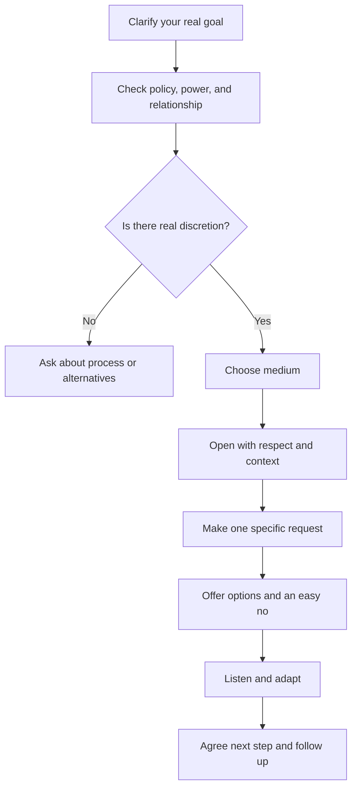

# Ethical Influence for Students

## Executive summary

**Assumptions.** This report assumes the audience is a college student and no specific cultural background has been provided. “Getting what I want” is treated here as **ethical influence**: increasing the chance of a voluntary yes, a constructive compromise, or a clear next step **without deception, coercion, or relationship damage**. That framing matters, because the evidence consistently points away from manipulation and towards a mix of **clear requests, high-quality listening, perspective-taking, appropriate assertiveness, and realistic preparation**. High-quality listening is strongly associated with better relationship quality and better outcomes; perspective-taking improves the ability to discover mutually beneficial agreements; direct requests are often more successful than requesters expect; and both under-assertiveness and over-assertiveness can backfire. citeturn24view0turn32view2turn23view1turn38view0turn24view4

For students, the biggest practical lesson is simple: **ask earlier, ask more specifically, and ask in a way that is easy to refuse**. Official university guidance on emailing faculty, requesting extensions, and asking for recommendation letters converges on the same pattern: be professional, brief, factual, specific about what you want, and proactive about timing. For networking and group work, the same pattern applies, but with extra emphasis on relationship-building, short first messages, team charters, peer accountability, and neutral conflict repair. citeturn16view0turn16view2turn16view8turn18view0turn17view3turn21view0turn21view1turn16view4turn16view5turn16view6

A robust working rule is this: **prepare privately, ask clearly, listen carefully, adapt openly, and close cleanly**. When there is a power imbalance, make the interaction safer by reducing pressure, naming process constraints, and showing that “no” is genuinely acceptable. When culture is uncertain, lead with respect, then adjust your directness based on the other person’s preferences and the norms of the setting. citeturn29view0turn31view0turn31view1turn34view0

## Core concepts and theory

In social psychology, **compliance** means acquiescence to a request, and broader **social influence** research shows that people are especially responsive when a request fits three recurrent motives: accuracy, affiliation, and a positive self-concept. In plain English, people are more likely to say yes when the ask makes sense, preserves the relationship, and lets them feel fair, competent, or generous. citeturn36search6turn36search11

**Negotiation** is what happens when you want something from someone whose goals are not perfectly aligned with yours, but who is interdependent with you. The central preparation concept is **BATNA**: your best alternative to a negotiated agreement. Knowing your BATNA reduces desperation, clarifies your walk-away point, and helps you ask for a better option without sounding needy or vague. citeturn29view0turn24view4

**Rapport** is not vague “good vibes.” Classic rapport theory describes it as a dynamic blend of **mutual attentiveness, positivity, and coordination**. That is why people who feel easy to work with usually do small things well: they pay attention, signal goodwill, and match the rhythm of the interaction. citeturn33view0

**Emotional intelligence** was originally defined as a set of skills involving the appraisal, regulation, and use of emotion in oneself and others. Meta-analytic evidence links emotional intelligence positively with job performance and other constructive outcomes, which helps explain why socially effective people tend to notice emotion early, regulate their own reactions, and respond without making the other person defensive. citeturn27view0turn28view1

**Reciprocity** is the social norm that benefits should be returned. Ethically, that means two things. First, people often respond well to genuine generosity, thanks, and follow-through. Second, reciprocity becomes unethical when it is used to create hidden debt, pressure, or guilt. In healthy relationships, reciprocity is best treated as a norm of mutual help, not a ledger. citeturn1search2

**Framing** is the way you present the same underlying option. Tversky and Kahneman showed that preference can shift when equivalent outcomes are presented as gains rather than losses. In practice, this means requests are often better received when framed as a concrete shared benefit, a reduced burden, or a clear next step rather than as pressure, blame, or catastrophe. citeturn26view1

**Active listening** is more than silence. High-quality listening is characterised by attention, understanding, and positive intentions. The evidence base is now substantial: listening is associated with stronger relationships and performance, and in disagreements it can reduce defensiveness and attitude extremity by increasing psychological safety and non-defensive self-reflection. citeturn24view0turn32view2turn23view8

**Boundary-setting** is assertiveness with respect. A recent review of interpersonal assertiveness argues that outcomes suffer both when people push too hard and when they do not push hard enough. The goal is neither passivity nor aggression, but clear expression of needs in situations of interdependence. citeturn24view4turn39search15

## What works best and why

The most reliable ethical method is not a single trick. It is a sequence:

That sequence is supported from multiple angles. BATNA and preparation improve judgement; listening improves the interaction; perspective-taking improves deal quality; and university communication guidance repeatedly stresses brevity, specificity, and realistic timing. citeturn29view0turn24view0turn23view1turn16view0turn18view1

The table below gives a practical comparison. **Effectiveness ratings are qualitative syntheses of the cited evidence**, not universal guarantees.

| Technique | Best contexts | Difficulty | Likely effectiveness | Evidence basis |
| --- | --- | --- | --- | --- |
| **Specific request with safe opt-out** | Extensions, favours, networking, group coordination | Low | High | People underestimate others’ willingness to comply with direct requests; faculty guidance also favours specific, concise asks. citeturn38view0turn24view2turn16view0turn18view1 |
| **High-quality listening** | Conflict, tense group work, friendships, networking | Medium | High | Listening predicts relationship quality and better outcomes; in disagreement it reduces defensiveness and depolarises attitudes. citeturn24view0turn32view2turn23view8 |
| **Perspective-taking** | Negotiation, conflict, role disputes, grade discussions | Medium | High | Perspective-taking improves discovery of hidden agreements and value creation more reliably than empathy alone in negotiation. citeturn23view1 |
| **BATNA and clear alternatives** | Any request with real constraints or stakes | Medium | High | BATNA clarifies leverage, acceptability, and when to walk away. citeturn29view0 |
| **Reasonable first proposal** | Role splits, deadlines, project scope, workplace asks | Medium | Conditional | First offers anchor outcomes, but overly ambitious first offers reduce deal likelihood and recipient experience. citeturn35view2turn35view1 |
| **Rapport and warm nonverbal behaviour** | First meetings, office hours, networking, repair conversations | Low | Moderate to high | Rapport depends on attentiveness, positivity, and coordination; responsive nonverbal cues support relationship outcomes. citeturn33view0turn7search0 |
| **Boundary-setting** | Friends, peers, recurring favour requests, workplace spillover | Medium | High | Too much or too little assertiveness is costly; the skill is saying what you can and cannot do without hostility. citeturn24view4turn39search15 |
| **Genuine reciprocity and thanks** | Friendships, peer support, recommendation requests, networking follow-up | Low | Moderate | Reciprocity is a durable social norm, but it should remain transparent and voluntary rather than debt-creating. citeturn1search2turn17view3turn21view2 |

A few additional evidence-based principles are especially useful for students. First, **ask early**. This is explicit official advice for extensions and recommendation letters, and it mechanically gives the other person more room to help. citeturn16view0turn16view2turn16view8turn18view0turn17view3

Second, **be concrete**. Caltech’s guidance says your message should contain the information the recipient needs to decide; Stanford says longer, more involved issues are often better handled in person; and Duke advises that networking outreach should be brief, specific, and framed around learning. citeturn18view1turn16view0turn21view1

Third, **prepare a target, but not an extreme anchor**. Meta-analytic evidence shows that goal difficulty predicts individual negotiation outcomes, and first offers do matter. But newer synthesis work also shows that ambitious first offers can reduce deal rates and worsen the recipient’s subjective experience, especially when they feel unreasonable. In recurring relationships like classes, projects, and friendships, that reputational cost often matters more than squeezing out a small advantage. citeturn24view1turn35view2turn35view1

## Scenario playbooks

### Asking a professor for an extension

The academic guidance is remarkably consistent. Check the syllabus first, ask as soon as possible, briefly explain the situation, name the exact assignment, propose a realistic new date, and avoid oversharing. If the request is more than a short exception, ask for a meeting or the proper process rather than improvising. citeturn16view0turn16view2turn16view8turn18view0turn18view1

A reliable script is:

> **Open**: “Dear Professor Ahmed, I hope you are well.”  
> **Context**: “I’m writing about the methods paper for POLS204 due on Thursday.”  
> **Reason, briefly**: “I’ve had an unexpected health issue this week and will not be able to finish to a proper standard by the deadline.”  
> **Specific ask**: “Would an extension to Monday at 4 pm be possible?”  
> **Credibility**: “I have completed the outline and sources, and the remaining work is drafting and revision.”  
> **Easy no / alternative**: “If that timing does not work within course policy, I would appreciate any alternative you can suggest.”  
> **Close**: “Thank you for considering it.”  

The psychology behind this is straightforward: you reduce ambiguity, lower the decision cost for the professor, and signal responsibility instead of panic. citeturn18view1turn16view0turn16view8

**Sample dialogue**

> **Student:** “Would Monday 4 pm work as an extension?”  
> **Professor:** “I can allow 24 hours, but not longer without dean approval.”  
> **Student:** “Understood. In that case, may I take the 24 hours and copy my dean if I need to request more?”  

That is a strong response because it converts a partial no into a process-based next step rather than an argument. Princeton’s guidance is especially useful here: faculty discretion often exists, but it is bounded by policy. citeturn16view2

### Asking a professor for a recommendation letter

Stanford’s advice is the clearest student-facing guide in the source set: ask someone who knows your work well, ask early, explicitly ask whether they can write a **strong** letter, provide materials, and follow up with thanks and updates. A detailed letter from someone who knows you is better than a famous but vague one. citeturn17view3

A strong script is:

> “Professor Lewis, I’m applying for the MSc in Public Policy at Bristol, and I wanted to ask whether you would feel able to write me a **strong recommendation letter**. I’m asking because your seminar on comparative institutions and my final paper with you shaped the direction of my application. The deadline is 2 December. If helpful, I can send my CV, transcript, draft statement, and the final paper.”

This works because it does three things at once: it makes the ask evaluable, it reminds the professor who you are, and it supplies the raw material for a specific letter. citeturn17view3turn18view1

**Sample dialogue**

> **Professor:** “I can write for you, but I need at least three weeks.”  
> **Student:** “That works. I’ll send the materials and submission instructions today, and I’ll keep you updated on the outcome.”  

### Negotiating group-project roles and grades

The research and teaching guidance on group work points to prevention first. Establish a **team charter** early, with roles, deadlines, communication norms, decision rules, accountability agreements, and an escalation path. Use mid-project peer evaluation, not just end-of-project complaints. Explain grading and contribution rules early. citeturn16view4turn16view5turn16view6turn8search15

A diplomatic role-negotiation script is:

> “I think we’ll avoid a lot of friction if we split work by strengths and time availability now. My proposal is that Maya leads the slides, Ben handles the data cleaning, I draft the methods section, and we all review the final argument on Sunday. If that split feels off, let’s adjust it now rather than after the deadline pressure starts.”

If one member is contributing less, switch from accusation to observable facts:

> “I want to keep this fair and keep us on schedule. At the moment, the literature summary and two references are still open, and that’s putting pressure on the rest of the timeline. What can you realistically complete by tomorrow 6 pm? If the workload needs to be redistributed, let’s do it openly.”

This style works because it lowers defensiveness, restores clarity, and keeps the conversation anchored to the project rather than personality. High-quality listening also matters here: if you learn that the issue is time, confidence, or misunderstanding rather than laziness, the remedy changes. citeturn24view0turn32view2turn16view5turn22view0

If the group cannot stabilise, the evidence-based move is **documentation and early escalation**, not silent resentment. Cornell and CMU both emphasise periodic peer and process evaluation because unresolved problems late in the term are much harder to fix fairly. citeturn16view4turn16view5

### Requesting favours from friends

The help-seeking research is surprisingly encouraging. Across multiple studies, people underestimate others’ willingness to comply with direct requests for help, sometimes by a large margin, and they also underestimate how positive helpers feel after helping. The practical meaning is not “ask for anything,” but rather that many people are more open to helping than your anxiety predicts. citeturn24view2turn24view3turn38view0

The best friend-favour script is short, specific, bounded, and easy to refuse:

> “Hey, could you do me a favour? I need someone to proofread 700 words tonight. It should take about 10 minutes. If you’re busy, genuinely no worries.”

The crucial parts are the **scope** and the **easy no**. Those reduce hidden cost and prevent the request from feeling like a trap. If the favour is larger, add a choice:

> “If tonight is bad, would tomorrow morning or just giving me comments on the introduction be easier?”

Reciprocity should appear as flexibility and appreciation, not pressure. A good closing is: “Thanks — and if you can’t, I still appreciate you reading this.” That preserves dignity on both sides. citeturn1search2turn24view2turn38view2

### Resolving conflicts without becoming difficult to work with

The best conflict script starts with **joint purpose**, not blame. Listening research suggests that when people feel genuinely heard, they become less defensive and more reflective. That gives you the best chance of solving the problem rather than merely winning the exchange. citeturn32view2turn23view8turn24view0

A strong repair script is:

> “I want us to sort this out well, because I’d rather fix it than let it drag. When the meeting started 25 minutes late yesterday and the task list changed, I felt blindsided and it made the work harder to plan. I may be missing part of the picture, so how did it look from your side? Could we agree one change each for the next meeting?”

That sequence matters. It starts with the relationship, names observable behaviour, explains impact, invites perspective, and ends with a concrete behavioural change. It avoids motives, labels, and courtroom language. citeturn32view2turn24view4

If the other person escalates, use boundary-setting instead of counterattack:

> “I want to continue this, but not if we are interrupting each other. I’m happy to carry on once we can each finish a point.”

That is assertive without being punitive. citeturn24view4turn39search15

### Networking without sounding transactional

The official university advice is consistent across Yale, Duke, Wellesley, and UT Austin: keep the first message short, personalise it, ask for a brief conversation, emphasise learning rather than jobs, and follow up politely if there is no reply. Duke recommends keeping the first outreach under about 150 words and sending one reminder after seven business days; UT advises not attaching a résumé in the very first email if the purpose is exploratory networking. citeturn21view0turn21view1turn16view3turn21view2

A reliable first outreach looks like this:

> “Dear Ms Patel, I’m a second-year economics student and came across your profile via the alumni network. Your work in climate-finance analysis stood out because I’m considering that area for internships. If you were open to it, I’d be grateful for 20–25 minutes to learn about your path and any advice you’d give someone preparing for this field. I know you’re busy, so I’m happy to fit your schedule.”

The hidden strength of this script is that it makes the request **small, specific, and identity-relevant** to the recipient. It is not “Can you help me get a job?” It is “Can I learn from your experience?” That is easier to say yes to. citeturn21view0turn21view1turn21view2

After the conversation, send a thank-you within 24–48 hours, mention one concrete insight, and state one action you will take because of it. That turns gratitude into credibility. citeturn21view2

### Role-play exercises

A short weekly role-play routine helps because communication skill is partly procedural, not just conceptual. CMU explicitly recommends role-playing responses to team conflict, and assertiveness training literature treats repeated practice as part of skill acquisition. citeturn22view0turn39search15

Use this simple format. One person plays the requester, one the recipient, one the observer. The observer scores each turn from 1 to 5 on: **clarity, specificity, listening, emotional control, and ease of refusal**. Rotate through these prompts:

- an extension request with a bounded policy  
- a recommendation request to a busy professor  
- a late-contributor group discussion  
- a favour request to a friend who might be overloaded  
- a networking call request to an alumnus  
- a conflict repair after a missed commitment  

## Ethics and contextual differences

The ethical line is not subtle: **influence becomes problematic when the other person cannot comfortably refuse, cannot evaluate the request clearly, or is being pushed by hidden pressure**. That matters especially in hierarchies. University policies and research-ethics guidance repeatedly warn that unequal power can compromise meaningful consent, create conflicts of interest, and make it difficult for the lower-power person to say no freely. citeturn31view0turn31view1turn30view0

For student life, that means three practical rules. With professors or staff, do not use guilt, repeated pressure, personal disclosure as leverage, or implied quid pro quo. With peers, do not hide contribution records or weaponise social approval. With friends, do not turn generosity into debt collection. In all three cases, aim for a request that is **transparent, proportionate, and realistically optional**. citeturn31view0turn31view1turn1search2

The college–workplace difference is mostly about **formal constraints and documentation**. In college, instructors may have some discretion but are often constrained by policy, course design, or departmental processes. In workplaces, comparable dynamics exist with supervisors and teams, but there are more explicit performance, legal, and HR constraints. The common principle is the same: when power is uneven, build in procedural fairness and a consequence-free route to refusal. citeturn16view2turn31view0turn31view1

Culture changes the *style* of ethical influence more than the *ethics* of it. The University of Florida’s intercultural communication guidance distinguishes **high-context** communication, which relies more on relationship, implication, tone, and nonverbal cues, from **low-context** communication, which relies more on direct and explicit verbal clarity. If you do not know the other person’s preference, start slightly warmer and more respectful than you think you need, then watch whether they respond better to concise directness or to more relational framing. citeturn34view0

In practice, that means a request to a low-context recipient should usually be quicker, more explicit, and more step-by-step. A request to a high-context recipient often benefits from a warmer opening, stronger relationship acknowledgement, and more room for discussion and face-saving. What should **not** vary is truthfulness, respect, and the ability to refuse without penalty. citeturn34view0turn31view0turn31view1

### Open questions and limitations

The evidence base here is strong enough for practice, but it is not perfect. Some underlying studies are workplace-based rather than student-based; some help-seeking work was conducted with U.S. participants; and listening scholars explicitly note that more work is needed outside Western settings. That means the broad principles are trustworthy, but the exact scripts should be adapted to your institution, relationship history, and cultural context. citeturn24view2turn23view8turn24view0

## Practical tools and metrics

### Phrase bank

The phrases below are syntheses of the evidence and the official university guidance above.

| Goal | Phrase |
| --- | --- |
| Warm opening | “I hope you are well.” |
| Brief context | “I’m writing about the [assignment / project / situation] due on [date].” |
| Specific ask | “The specific thing I’m asking for is…” |
| Option framing | “A realistic option would be…” |
| Easy refusal | “If that isn’t possible, I understand.” |
| Boundary | “I can do X by Y, but I can’t do Z this week.” |
| Repair | “I want to fix this rather than let it drag.” |
| Networking | “I’d be grateful for 20–30 minutes to learn about your path.” |
| Follow-up | “Just following up in case my earlier note got buried.” |
| Appreciation | “Thank you for considering it.” |

These phrases work because they reduce ambiguity, signal respect, and lower defensiveness. citeturn16view0turn18view1turn21view1turn21view2

### Body language cues

Rapport research suggests three useful aims: **mutual attentiveness, positivity, and coordination**. In ordinary student settings, that usually means a calm tone, moderate eye contact, visible hands, not interrupting, short nods while listening, and slight forward lean when the other person is speaking. The goal is not to “perform charisma,” but to make the other person feel safe, attended to, and not pushed. Because culture affects how direct gaze, distance, and warmth are read, treat these cues as adjustable rather than universal. citeturn33view0turn7search0turn34view0

### Timing and follow-up rules

For professors, the best time to ask is **before the deadline problem becomes an emergency**. For recommendations, aim for **at least three to four weeks**. For networking, keep the first message short, wait about **seven business days** before one polite follow-up, and send a thank-you within **24–48 hours** after a meeting. citeturn16view8turn18view0turn17view3turn21view1turn21view2

### Suggested metrics dashboard

The table below is a **student tracking tool**, not a published benchmark.

| Metric | How to measure it | Suggested interpretation |
| --- | --- | --- |
| **Reply rate** | Replies / total requests sent | Low reply rate usually signals weak targeting, poor timing, or vague asks |
| **Positive response rate** | Yes / total replies | Low rate often means the ask is too large, too late, or unclear |
| **Time-to-response** | Median hours or days until reply | Useful for choosing medium and follow-up timing |
| **Specificity score** | Self-rate 1–5: did I ask for one action, one date, one outcome? | Scores below 4 usually predict friction |
| **Relationship cost** | Self-rate 1–5 after each ask: did this interaction strengthen, preserve, or strain the relationship? | If outcomes improve but relationship cost worsens, your style is too sharp |
| **Conflict recovery time** | Time from tension to clear next step | Shorter is usually better if quality is preserved |
| **Group fairness index** | Peer ratings + documented contribution split | Helps detect free-riding early |
| **Networking conversion** | Replies → conversations → referrals / useful next steps | Shows whether your outreach is merely polite or actually useful |

Tracking matters because negotiation research repeatedly shows the value of clear goals, and group-work guidance stresses periodic process assessment rather than end-point guesswork. citeturn24view1turn16view4turn16view5

### Risks and mitigation

| Risk | Typical cause | Best mitigation |
| --- | --- | --- |
| Sounding manipulative | Hidden motives, flattery, guilt, urgency without basis | Be explicit about the ask and make no-pressure refusal possible |
| Sounding weak or vague | Long backstory, no concrete request, apologising without direction | Put the ask in one sentence; name the preferred date or option |
| Damaging a relationship | Extreme opening offer, blame, repeated pressure | Use perspective-taking, listening, and a moderate first proposal |
| Being ignored | Message too long, poor subject line, unclear reason for contact | Use a precise subject line and put who-you-are / what-you-need in the first paragraph |
| Unfair group outcomes | No charter, no peer evaluation, late escalation | Set expectations early and document contributions at the midpoint |
| Ethical overreach in hierarchy | Power imbalance, personal leverage, implied consequences | Ask about process, reduce pressure, and avoid personal inducement |

These mitigations are directly aligned with the evidence and official guidance already reviewed. citeturn35view2turn24view0turn23view1turn18view1turn16view4turn31view0turn31view1

## Implementation checklist and downloads

### Concise implementation checklist

Use this before any important request:

- **Clarify the real goal.** What exact action, date, or decision do you want?
- **Check the rules.** Is this a policy issue, a discretion issue, or a relationship issue?
- **Prepare alternatives.** What is your BATNA or second-best option?
- **Choose the medium well.** Email for clarity and records; conversation for nuance and rapport.
- **Open respectfully.** Warm, brief, professional.
- **Make one specific ask.** Not three.
- **Explain briefly why.** Facts, not emotional overloading.
- **Offer an easy no or alternative.**
- **Listen without interrupting.**
- **Close with a next step.** Deadline, follow-up, or confirmation.
- **Thank and document.** Especially for letters, group projects, and networking.

### Downloadable resources

- [Download the one-page cheat sheet](sandbox:/mnt/data/ethical_influence_cheat_sheet.md)
- [Download the templates and scripts pack](sandbox:/mnt/data/email_templates_and_scripts.md)
- [Download the two-week practice plan](sandbox:/mnt/data/two_week_practice_plan.md)
- [Download all resources as a zip file](sandbox:/mnt/data/ethical_influence_resources.zip)

These resources condense the practices supported in the report: early and specific requests, transparent negotiation, listening-led conflict repair, and reflective practice through role-play and self-scoring. citeturn16view0turn17view3turn16view4turn21view1turn24view1turn39search15