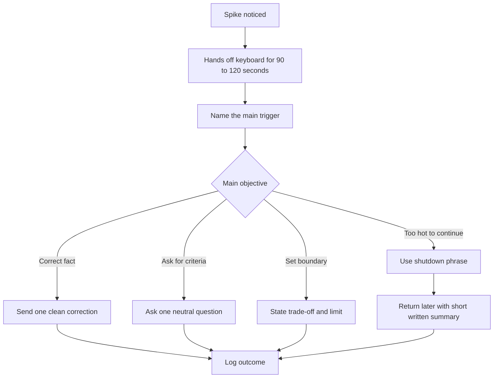
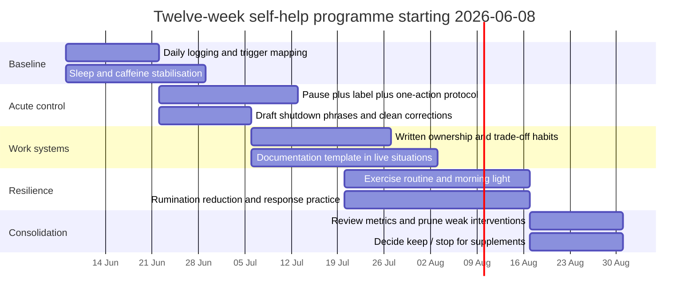
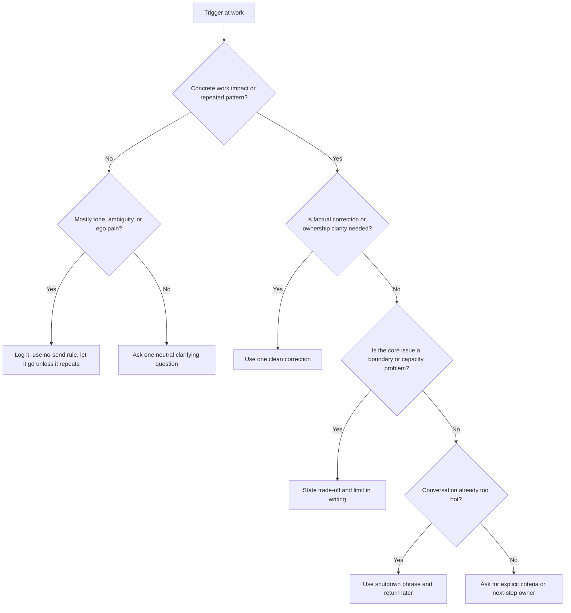

# Self-help report for unfair invalidation and perceived exploitation at work

## Executive summary

The strongest **working formulation** for the problem you described is not “just sensitivity” in the ordinary sense. It is more plausibly a **stacked trigger system**: an ADHD-like emotional amplification layer, plus **rejection/invalidation sensitivity**, plus **justice sensitivity** to unfairness, plus a work-context layer involving **boundary strain**, **competence threat**, and sometimes **coalition threat** when it feels as if others are aligning against you. In adult ADHD, emotional dysregulation is not a minor side issue: meta-analytic and systematic-review evidence suggests it is common, often large in magnitude relative to controls, and linked to symptom severity, executive functioning, and impairment. Rejection sensitivity in ADHD is also increasingly described in the literature, although the more popular label “RSD” is best treated as shorthand rather than as a settled standalone diagnosis. citeturn9view1turn35view0turn10view4

A key point is that **not every strong reaction means the unfairness is imaginary**. Research on justice sensitivity shows that people high on this trait are more likely to notice and strongly react to unfairness, to ruminate on it, and to experience anger, disappointment, helplessness, anticipation of future injustice, and sometimes social withdrawal. Separate work on emotional invalidation shows that feeling dismissed or misunderstood is itself associated with more distress, partly through emotion-regulation difficulties. And research on exclusion shows that even subtle or structural exclusion can quickly hit belonging, self-esteem, control, and mood. In other words, your nervous system may be reacting not only to “that was unfair,” but also to “I am being dismissed,” “I may lose standing,” and “I may lose control over what is taken from me.” citeturn34view0turn26view6turn26view7

The **best-supported self-help levers are psychological and behavioural**, not supplement-based. The highest-confidence options are: CBT-style problem-solving and reappraisal; metacognitive and work-structuring methods; mindfulness/acceptance skills; affect labelling; repeated-practice methods that reduce rumination and repetitive negative thinking; sleep stabilisation; and exercise. A recent network meta-analysis in adults with ADHD found CBT to be the strongest non-pharmacological option overall for core symptoms plus co-occurring anxiety/depression, while metacognitive approaches were also promising for core symptoms. Workplace-specific evidence is still sparse, but a work-focused metacognitive telehealth RCT found improvements in work performance, executive functions, and quality of life. citeturn24view0turn24view2turn10view0

Supplements are **secondary and weaker**. The evidence does **not** support chasing many vitamins or “nootropics” for this exact profile. Omega-3 is the main non-prescription supplement worth considering, but the effect is **modest/inconclusive**, tends to require time, and the evidence is stronger for **EPA-containing fish oil** than for **DHA-only oil**. Magnesium and L-theanine can be reasonable symptom-management trials for some people, especially around tension, sleep, and stress, but they are adjuncts, not core treatments. High-dose caffeine, stimulant-heavy pre-workouts, yohimbine, and megadosing zinc, iron, or B6 are more likely to worsen the picture or create new problems than to fix it. citeturn31view0turn32view1turn32view0turn10view13turn12view7turn12view4turn13view4turn12view10turn28search14

The most practical path is an **8–12 week self-help programme** that does four things at once: lowers spike intensity, shortens recovery time, improves discrimination between *actual* unfairness and *amplified* threat interpretations, and builds reliable work boundaries. The acute-response protocol should be brief and mechanical: pause, label the trigger, choose one objective, give one clean correction or one boundary, and disengage if the conversation is already too hot. The long-term programme should add routines, if–then plans, structured notes, controlled exposure to non-catastrophic invalidation, and simple measurement so that you can tell what is actually helping. citeturn26view4turn10view3turn33view0turn19search17turn7search2

## Problem formulation and mechanisms

A concise formulation is:

> **High sensitivity to unfair invalidation and perceived exploitation at work, amplified by fast emotional escalation, threat-biased meaning-making, and slow recovery once activated.**

That formulation can be broken into six interacting channels.

| Channel | What it feels like from the inside | What the literature suggests |
|---|---|---|
| **ADHD-like emotional amplification** | “This hit way harder than it should have.” | In adults with ADHD, emotion dysregulation is markedly elevated versus controls, with large overall effects; emotional lability is especially prominent. Adults with ADHD also report more maladaptive regulation strategies and less adaptive reappraisal. citeturn9view1turn9view0turn35view0 |
| **Invalidation sensitivity** | “They are not hearing me.” | Perceived emotional invalidation is associated with more distress, partly through emotion-regulation difficulty. Invalidation is not just disagreement; it is the felt experience of being dismissed or misread. citeturn26view6turn21search14 |
| **Injustice sensitivity** | “This is not fair.” | Justice-sensitive people show stronger anger, helplessness, rumination, anticipation of future injustice, and sometimes social withdrawal after unfair events. They are also more likely to interpret ambiguous situations as unjust. citeturn34view0 |
| **Perceived exploitation and boundary sensitivity** | “They want more from me than is fair.” | There is limited direct workplace-intervention evidence, but adult-ADHD work research points to the importance of external structure, self-awareness, work-goal clarity, and support around workload and boundaries. citeturn10view0turn24view2 |
| **Coalition threat** | “People have agreed against me.” | Social exclusion and ostracism quickly reduce belonging, control, self-esteem, and mood. When work situations feel like “the group has moved,” the body may react as though status and belonging are at risk. citeturn26view7 |
| **Competence threat** | “My warning/explanation was ignored, so maybe my competence is being discounted.” | In adult ADHD, emotional dysregulation is linked with executive-function difficulty and impairment. Criticism or having one’s expertise discounted can therefore land as both social threat and performance threat at once. citeturn35view0 |

This helps explain why **three superficially different triggers** can feel almost identical in the body:

- something is **unfair**,
- no one **understands** your warning or explanation,
- others seem to want **more labour, compliance, or emotional energy** than is fair.

They all compress into a common alarm: **loss of fairness + loss of voice + loss of control**. The emotional spike is often then maintained by **repetitive negative thinking**: replaying the event, defending yourself internally, anticipating future injustice, and drafting better explanations you never get to land. Interventions that reduce rumination and repetitive negative thinking have moderate effects in meta-analysis, which is why reducing the *after-shock loop* is as important as handling the original trigger. citeturn34view0turn33view0turn33view1

A final nuance matters. The phrase **“RSD-like”** is useful here only if it is used carefully. The peer-reviewed literature supports a pattern of intense rejection or criticism sensitivity in ADHD, including withdrawal, masking, and marked bodily reactions, but the current research base is much stronger for the broader constructs of **emotion dysregulation** and **rejection sensitivity** than for any single neat diagnostic label. So the rigorous move is to treat “RSD-like” as a **descriptive shorthand**, not as the whole explanation. citeturn10view4turn35view0

## Evidence-based self-help interventions

The most defensible overall strategy is to **prioritise skills and systems over substances**. NICE guidance recognises structured psychological intervention, especially CBT, as the main psychotherapeutic approach in ADHD, and more recent adult-ADHD evidence continues to favour CBT and metacognitive methods over more speculative options. citeturn8view1turn24view0turn24view1

### Intervention comparison

| Intervention | Main target | Strength of evidence | Likely effect size | Time to effect | Main risks / limitations |
|---|---|---|---|---|---|
| **CBT-style problem-solving and reappraisal** | Over-interpretation, all-or-nothing meaning, over-explaining, poor choice of response | Strongest non-pharmacological support in adult ADHD; recent NMA favours CBT, and a classic RCT showed better outcomes than an active control with gains maintained to 12 months. citeturn24view0turn24view1 | Moderate | Weeks | Requires repetition; can become over-intellectual if not paired with behaviour |
| **Metacognitive work structuring** | Workload confusion, fuzzy ownership, unjust drift of responsibilities | Promising adult-ADHD evidence, especially for work performance and executive function. Work-MAP improved work participation, executive functions, and quality of life in a work-focused RCT. citeturn24view2 | Moderate | Weeks | Workplace-specific research is still limited overall. citeturn10view0 |
| **Mindfulness and acceptance skills** | Emotional reactivity, urge to retaliate or defend, attentional capture | Meta-analysis in adults with ADHD found benefits for ADHD symptoms, depression, and dysexecutive problems; broader meta-analysis found small but significant benefits for mindfulness-based emotion-regulation strategies. In adult ADHD, acceptance looks less distress-prolonging than suppression. citeturn10view1turn10view3turn35view0 | Small to moderate | Minutes to weeks | Effects are usually smaller than full CBT; not a substitute for boundary action when something is genuinely unfair |
| **Affect labelling** | Acute spike intensity | Systematic review shows affect labelling is a low-effort regulation strategy across subjective, physiological, neural, and behavioural outcomes. citeturn26view4turn18search2 | Small but immediate | Minutes | Works best as a first step, not a full solution |
| **Rumination reduction and response practice** | Replay loops, argument rehearsals, future-injustice rehearsal | CBT approaches targeting repetitive negative thinking show moderate post-treatment effects that appear to persist at short follow-up. citeturn33view0turn33view1 | Moderate | Weeks | Requires deliberate practice; benefits drop if every trigger becomes another analysis session |
| **Exercise** | Inhibitory control, stress load, recovery | WHO/CDC recommend regular activity for physical and mental health; adult-ADHD evidence is promising but still limited, with systematic review/meta-analytic evidence showing benefit for inhibitory control. citeturn10view6turn12view2turn29search4 | Small to moderate | Same day to weeks | Adult ADHD trials remain relatively few and heterogeneous |
| **Sleep and circadian stabilisation** | Baseline reactivity, irritability, slow recovery | Sleep problems are common in adults with ADHD; adult-ADHD sleep review found preliminary evidence for morning light therapy and some support for melatonin and behavioural approaches, while CDC emphasises sleep as a major health behaviour. citeturn20search7turn12view1 | Indirect but important | Days to weeks | Helps the amplifier, not the fairness issue itself |
| **Self-compassion practice** | Shame after invalidation, self-attack after conflict | Work-related self-compassion interventions show promising but methodologically middling results. citeturn26view3 | Small to moderate | Weeks | Best as an adjunct, not a core intervention |

### What to prioritise first

If you want the **highest expected return**, start with a three-part stack:

1. **A cognitive method**: one-page CBT reappraisal/problem-solving for unfairness events.
2. **A behavioural method**: acute pause + affect-labelling + one-action rule.
3. **A work-system method**: explicit ownership, written boundaries, and documentation.

That stack is stronger than trying five supplements at once because it targets the three places this problem actually lives: **meaning**, **physiology**, and **workflow structure**. citeturn24view0turn24view2turn26view4turn19search17

### The highest-yield cognitive shifts

The most useful reappraisals are **not** “maybe it’s fine.” They are these:

- **From global to specific**: “This is one unfair event” instead of “they always do this.”
- **From mind-reading to criteria**: “What decision criterion is being used?” instead of “they agreed against me.”
- **From defence to objective**: “Do I need to correct facts, ask for criteria, or set a boundary?”
- **From justice to cost-benefit**: “Even if I am right, what response protects me best here?”

This is consistent with the broader literature: people high in justice sensitivity are more likely to ruminate and anticipate future injustice, while adaptive regulation strategies such as reappraisal are used less reliably in adult ADHD. citeturn34view0turn35view0

### The highest-yield behavioural shifts

The most useful behavioural changes are usually boring and mechanical:

- **Do not explain twice in one spike.**
- **Do not correct facts and motives in the same message.**
- **Do not argue fairness when criteria are still ambiguous.**
- **Put requests and workload trade-offs in writing.**
- **Use if–then plans** so the decision is made before the trigger happens.

Implementation intentions are one of the most robust self-regulation tools in the wider literature, with a medium-to-large effect on goal attainment, especially when the situation cue is specific. At work, they also appear to help new habits become more automatic. citeturn19search17turn19search16

## Acute spike protocol

The goal in an acute unfairness spike is **not** to decide the entire moral truth of the situation while you are activated. The goal is to **reduce preventable damage**: false escalation, over-explaining, angry wording, and self-disrespect. This matters because adult-ADHD evidence suggests that suppression is a commonly used but often counterproductive strategy, whereas acceptance and adaptive regulation appear less distress-prolonging. Affect labelling also has a low-cost regulatory effect. citeturn35view0turn26view4

### The acute sequence

1. **Pause physically before pausing mentally.**  
   Take your hands off the keyboard. Do not send anything for **about 90 seconds to 2 minutes**. Use the “90-second rule” as a **practical cue**, not as a scientifically special number. The point is to create a gap before the first outward move.

2. **Name the trigger in one short phrase.**  
   Use one label only:  
   **unfairness**, **invalidation**, **exploitation pressure**, **coalition fear**, **competence threat**, or **boundary breach**.  
   This is affect labelling, and it helps turn a flood into a category. citeturn26view4turn34view0turn26view6

3. **Choose one objective.**  
   Only one of these is allowed:
   - correct a fact,
   - ask for criteria,
   - set a boundary,
   - or disengage and revisit later.

4. **Deliver one clean correction if needed.**  
   One clean correction means **facts only, one risk only, one ask only**.  
   Do not defend your whole character. Do not explain your intention history. Do not append old grievances.

5. **If the conversation is hot, close it cleanly.**  
   Use a shutdown phrase, then move to written summary after the pause.

The sequence above is an evidence-informed synthesis built from affect labelling, mindfulness/acceptance, CBT problem-solving, and work-focused metacognitive interventions. citeturn26view4turn10view3turn24view2turn24view0

### Practical script forms for acute use

**One clean correction**  
> “Small factual correction: the risk I flagged was **X**, not **Y**. The impact is **Z**. My recommendation is **A**.”

**Neutral criteria question**  
> “Before we debate this further, what exact criterion is driving the decision?”

**Boundary line**  
> “I can deliver **A by Friday** or **A+B by Monday**. I can’t responsibly commit to both by Friday.”

**Shutdown phrase**  
> “I don’t think continuing this while I’m activated will improve the outcome. I’m going to pause and send a concise written summary.”

These are practical translations of the evidence-based principle that **brief, factual, goal-directed responses** outperform emotionally fused, repetitive responses when emotion is high. citeturn24view0turn24view2turn19search17

## Long-term resilience programme

The long-term target is not “never feel hurt.” It is to **reduce spike frequency**, **reduce peak intensity**, **shorten recovery time**, and **improve discrimination** between:

- an event that is actually unjust and needs action,
- an event that is invalidating but not strategically worth pursuing,
- and an event where the main problem is your after-shock loop, not the trigger itself.

That design fits the evidence: adult ADHD dysregulation involves maladaptive strategies, justice sensitivity increases rumination and threat interpretation, and interventions that reduce repetitive negative thinking have moderate effects. citeturn35view0turn34view0turn33view0

### Example twelve-week programme

This sequencing is a synthesis of evidence on CBT/metacognitive strategies, mindfulness-based regulation, rumination reduction, sleep, exercise, and single-case measurement. citeturn24view0turn24view2turn10view3turn33view0turn20search7turn12view2turn7search2

### The habits that matter most

**Build an unfairness journal, not a grievance diary.**  
For each event, write:
- what happened,
- what was actually said,
- which trigger label fits best,
- what you felt,
- what you did,
- whether the action improved the work outcome.

This uses the strengths of self-monitoring and affect labelling while preventing vague global narratives from taking over. Repeated measurement is also the basis of single-case experimental designs. citeturn26view4turn7search2

**Use exposure/response practice in low-stakes situations.**  
This means deliberately **not** doing the usual compensatory behaviour every time:
- do not send the second or third clarifying message,
- do not rewrite a correct explanation into a perfect explanation,
- do not correct tone + facts + motives all at once.

Instead, try: one sentence, then wait. This is the right kind of exposure because it targets the part that keeps the system alive: the urge to neutralise the discomfort immediately. The rationale fits both the rumination literature and mindfulness/acceptance findings. citeturn33view0turn10view3

**Move from internal memory to external structure.**  
At work, use:
- a written “owner / due date / definition of done” line for requests,
- explicit trade-offs,
- a running list of open decisions waiting for criteria,
- and a short template for warnings or concerns.

Workplace-adapted adult-ADHD evidence is limited, but the best available data point in this direction: external structure, self-awareness, and work-goal scaffolding matter. citeturn10view0turn24view2

**Treat sleep as amplifier management.**  
Sleep is not the explanation for injustice sensitivity, but it often determines how hard a trigger lands. Adult-ADHD sleep work suggests preliminary benefit from circadian-focused approaches such as morning light and behavioural sleep strategies, while public-health guidance consistently treats sleep as foundational. citeturn20search7turn12view1

**Exercise for recovery and inhibition, not for moral clarity.**  
A brisk walk, cardio session, or strength session will not tell you whether the meeting was fair. It can, however, lower general stress load and improve inhibitory control, which is often what stops a bad moment becoming a bad day. citeturn29search4turn12view2

## Supplements and substances

The evidence base here is much weaker than for behavioural and cognitive methods. A 2023 nutrition review concluded that recent evidence did **not** justify general recommendations for micronutrients, omega-3s, or probiotics for ADHD overall, and the NCCIH summary similarly describes omega-3 evidence as **inconclusive/modest** rather than decisive. That means supplements should be tested as **adjuncts**, not as the main plan. citeturn30view0turn31view0

### Practical supplement and substance matrix

| Item | Priority | Practical range | Why it might help or harm | Main cautions |
|---|---|---|---|---|
| **EPA-containing omega-3 fish oil** | **Reasonable trial** | Practical self-test range: **1–2 g/day combined EPA+DHA**, preferably EPA-containing, for **at least 8–16 weeks**; evidence suggests some studies need **4+ months**, and ≥**500 mg/day EPA** has been associated with better signal in some ADHD analyses. citeturn32view1turn32view0 | Best-supported supplement class, but still only modest/inconclusive overall. Fish oil/EPA appears more plausible than DHA-only. citeturn31view0turn32view1 | GI upset is the common issue; very high EPA/DHA intakes may increase bleeding time, and a youth trial suggested worse impulsivity in those with already high baseline EPA. citeturn13view6turn32view2 |
| **DHA-only oil** | **Lower priority** | No strong reason to prioritise it over EPA-containing fish oil | NCCIH notes fish oil may be more beneficial than DHA alone in preliminary ADHD research. citeturn31view0 | Likely not harmful at ordinary doses, but evidence is weaker for your target problem |
| **L-theanine** | **Reasonable low-risk trial** | **200–400 mg/day**; one RCT used **200 mg/day for 4 weeks**. citeturn10view13turn10view14 | Evidence suggests reduced stress/anxiety under stressful conditions; useful if your spikes include “wired but not focused.” citeturn10view13 | Evidence is not ADHD-specific and long-term data are limited |
| **Magnesium** | **Possible adjunct** | Keep **supplemental magnesium ≤350 mg/day**; a cautious self-help trial is often **100–200 mg elemental/day**, especially if diet is poor or tension/sleep issues are prominent. citeturn12view7 | Direct ADHD evidence is weak and inconsistent, but deficiency-related tension or poor intake can make it worth a limited trial. citeturn30view0 | High-dose supplemental magnesium commonly causes diarrhoea, nausea, and cramping. citeturn13view2 |
| **Vitamin D** | **Only if low is plausible** | No evidence-based dose for this exact problem found in the literature reviewed here; stay below the NIH adult upper limit of **4,000 IU/day** total unless you have a strong reason otherwise. citeturn12view8 | May matter if low, but evidence for direct benefit on this symptom cluster is not strong enough for a general recommendation. citeturn30view0 | High doses can cause toxicity, including hypercalcaemia and kidney issues. citeturn13view3 |
| **Vitamin B12** | **Only if intake risk exists** | B12-only supplements commonly contain **500–1,000 mcg**; B12 has **no established UL** and is generally safe. citeturn10view10turn13view0 | Relevant mainly if you are vegan, low in animal products, or otherwise plausibly low; not a direct anti-invalidation supplement. | Watch interactions with some medicines noted by NIH ODS. citeturn13view0 |
| **Iron** | **Do not trial casually** | Avoid empirical high-dose use; adult UL is **45 mg/day**. citeturn12view11 | Helpful only when low iron is genuinely part of the picture; otherwise a poor self-help gamble. citeturn30view0 | GI effects are common; high doses can be dangerous. citeturn12view11 |
| **Zinc** | **Do not megadose** | Adult UL is **40 mg/day**. citeturn12view9 | Evidence for direct benefit is weak; if used, keep it modest. citeturn30view0 | **50 mg/day or more for weeks** can impair copper absorption and lower HDL. citeturn13view4 |
| **High-dose vitamin B6 / aggressive B-complexes** | **Avoid megadoses** | The NIH adult UL for B6 is **100 mg/day**. citeturn12view10 | Little evidence for this problem, lots of supplement marketing noise | High doses can cause sensory neuropathy. citeturn12view10 |
| **Caffeine** | **Track carefully** | FDA says up to **400 mg/day** is safe for most adults, but “safe ceiling” is not the same as “best dose for emotional steadiness.” citeturn12view4 | Can help focus, but can worsen jitteriness, irritability, and especially sleep; sleep loss then worsens regulation. citeturn20search7turn12view1 | If your spikes track caffeine or late intake, reducing it may help more than adding supplements |
| **Energy drinks / stimulant-heavy pre-workouts** | **Usually avoid** | No sensible range recommended here | They combine high stimulation with sleep and arousal costs; often worse than plain caffeine for people with reactivity issues. citeturn12view4turn12view1 | Big variability in caffeine dose and added stimulants |
| **Yohimbine / yohimbe** | **Avoid** | Not recommended | Yohimbine is anxiogenic and activates stress-responsive systems. citeturn28search14turn28search3 | Poor fit for a problem defined by threat amplification |

### A simple supplement rule

If you only want a **clean hierarchy**, use this:

- **First tier**: sleep, caffeine timing, written boundaries, acute protocol, CBT-style review.
- **Second tier**: EPA-containing omega-3, maybe L-theanine, maybe magnesium.
- **Third tier**: everything else only if there is a **clear reason**.

That ranking fits the current evidence far better than a “more supplements = more control” mindset. citeturn24view0turn30view0turn31view0

## Workplace scripts, templates, and decision rules

The literature is clear that **workplace-specific adult-ADHD intervention research is still sparse**. So the scripts below are best understood as **evidence-informed synthesis** from the stronger literatures on CBT problem-solving, metacognitive work interventions, implementation intentions, and acceptance-based work distress reduction. citeturn10view0turn24view2turn26view2turn19search17

### Sample scripts

| Situation | Script | Why this works |
|---|---|---|
| **Your warning was ignored** | “For the record, the risk I flagged was **X**. The current impact is **Y**. My recommended next step is **Z**.” | Preserves facts without pleading for recognition |
| **You are being misrepresented** | “Small correction: I did not say **A**; I said **B**. If useful, I can summarise the decision points in writing.” | Corrects the record without escalating motive arguments |
| **You need criteria, not debate** | “What exact criterion are we optimising for here: speed, risk, cost, or ownership?” | Moves from emotional fusion to decision structure |
| **Someone wants more than is fair** | “I can take this on if we explicitly move **X** or **Y** off my plate. Without that trade-off, I’m over capacity.” | Converts exploitation-feel into capacity math |
| **The room is too hot** | “I don’t think this discussion is improving right now. I’m going to pause and send a concise written summary.” | Stops the spike from becoming a performance of distress |
| **You want acknowledgement without over-explaining** | “I want to mark that I raised this earlier so risk ownership is clear. I’m happy to focus now on the best next step.” | Protects self-respect and keeps the conversation forward-facing |

### Documentation template

Use a short template like this after significant events:

| Field | What to write |
|---|---|
| **Date and context** | Meeting, message thread, decision review |
| **Objective facts** | What was said or decided, with exact wording if possible |
| **My trigger label** | unfairness / invalidation / exploitation / coalition / competence / boundary |
| **My initial urge** | defend, explain, correct, withdraw, retaliate |
| **What I actually did** | pause, one clean correction, criteria question, boundary, shutdown |
| **Outcome after 24 hours** | improved, neutral, worse |
| **What this probably was** | real unfairness, ambiguity, or spike-amplified interpretation |

This template is valuable because it helps you separate **facts, trigger type, urge, and outcome**. That reduces retrospective distortion and turns the problem into something testable. citeturn26view4turn7search2

### Act versus let go decision tree

This decision tree is intentionally simple because complexity is the enemy during emotional activation.

## Measurement, safe testing, and source priorities

If you do not measure this, you will not know whether the main problem is:

- fewer triggers,
- smaller spikes,
- faster recovery,
- better boundaries,
- or simply better storytelling after the fact.

Repeated measurement is standard logic in single-case experimental design, which is the right mindset for an **A/B-style self-help programme**. citeturn7search2turn7search14

### Weekly measurement plan

| Metric | How to track | Why it matters |
|---|---|---|
| **Spike frequency** | Count daily “unfairness episodes” | Primary outcome |
| **Peak intensity** | 0–10 scale | Tells you whether the alarm is shrinking |
| **Recovery time** | Minutes until you feel back to baseline | Often the most meaningful change marker |
| **Rumination time** | Total minutes replaying the event that day | Captures the after-shock loop |
| **Corrective message count** | Number of follow-up explanations / corrections | Measures over-explaining and reassurance behaviour |
| **Sleep** | Hours slept + bedtime consistency | Sleep is a known amplifier variable. citeturn12view1turn20search7 |
| **Caffeine** | Total mg + last intake time | Helps identify stimulant-driven reactivity. citeturn12view4 |
| **Exercise** | Minutes and type | Tracks a plausible resilience variable. citeturn12view2 |
| **Supplement use** | Dose and timing | Needed for clean A/B interpretation |

A pragmatic success criterion over **8–12 weeks** would be any combination of:
- fewer weekly spikes,
- lower average peak intensity,
- shorter recovery time,
- fewer unnecessary corrective messages,
- and more “acted once and stopped” outcomes.

### Safe A/B testing rules

Use these rules:

1. **Run a 2-week baseline** before adding anything.
2. Change **one major variable at a time**.
3. Hold sleep and caffeine roughly steady when testing a supplement.
4. Test behavioural interventions for **at least 2 weeks** before judging them.
5. Test omega-3 for **at least 8–12 weeks**, ideally longer if you want a fair trial. citeturn32view1turn32view0
6. Stop a supplement if it clearly worsens sleep, GI comfort, agitation, or perceived impulsivity.
7. If a script or boundary tactic consistently worsens outcomes, revise the wording, not just the conviction.

### Prioritised sources

These were the most decision-relevant sources for this report:

| Source | Why it matters most |
|---|---|
| Adult ADHD non-pharmacological NMA, 2025 | Best overall comparison of CBT and metacognitive options in adults. citeturn24view0 |
| Emotion dysregulation in adults with ADHD meta-analysis | Establishes the size and centrality of emotional dysregulation. citeturn9view1turn9view0 |
| Adult ADHD emotion-dysregulation systematic review | Clarifies maladaptive strategies, severity links, and acceptance vs suppression themes. citeturn35view0 |
| Justice sensitivity study | Explains why unfairness especially triggers rumination, anger, helplessness, and social withdrawal. citeturn34view0 |
| Work-MAP RCT | Rare direct evidence on work-focused metacognitive intervention in adult ADHD. citeturn24view2 |
| Mindfulness-based intervention meta-analyses | Support for small-to-moderate emotion-regulation benefits. citeturn10view1turn10view3 |
| CBT on repetitive negative thinking meta-analysis | Strong rationale for targeting the replay loop, not just the trigger. citeturn33view0turn33view1 |
| NCCIH and NIH ODS fact sheets | Best practical balance of supplement evidence and safety warnings. citeturn31view0turn12view7turn12view8turn12view9turn12view10turn12view11 |

### Open questions and limitations

The most important limitations are these. First, **workplace-specific ADHD self-help evidence is still thin**, so some of the scripts and boundary tactics are evidence-informed synthesis rather than directly trialled interventions. citeturn10view0 Second, much of the supplement literature is **mixed, low-certainty, or mostly in younger samples**, so those recommendations are necessarily cautious. citeturn31view0turn30view0 Third, the exact popular **“90-second rule”** is best treated as a mnemonic pause tool rather than as a precisely validated threshold. Finally, the label **“RSD-like”** is clinically useful but narrower and less established than the broader evidence base on **emotion dysregulation, rejection sensitivity, invalidation, and justice sensitivity**. citeturn10view4turn35view0turn34view0turn26view6